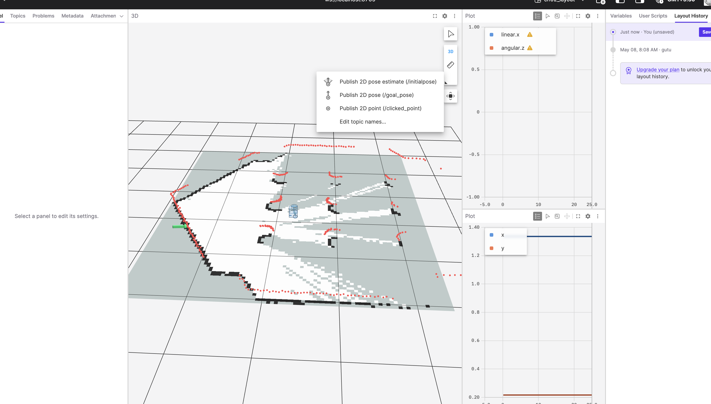
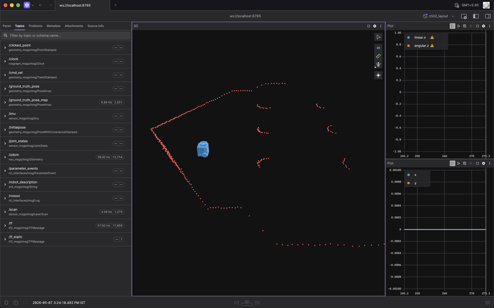
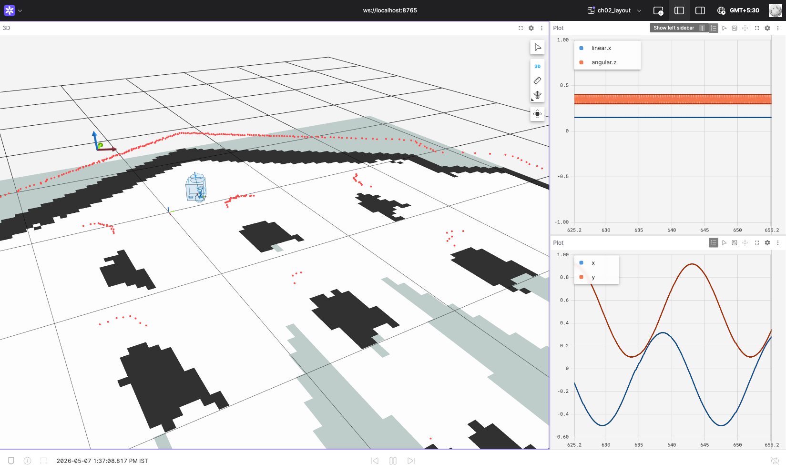
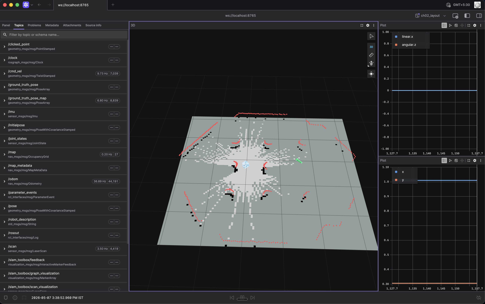
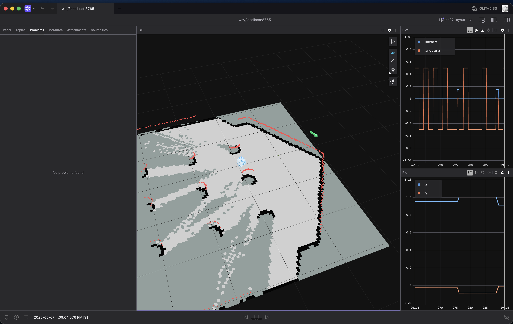
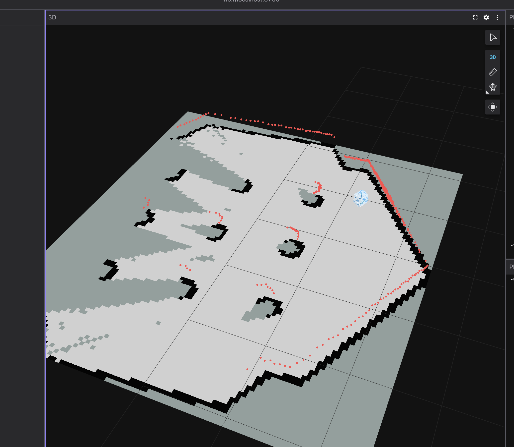
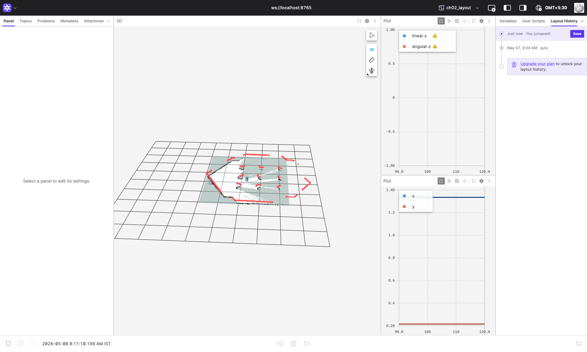

# Chapter 2 — Simulation

**Time:** Half day  
**Hardware:** Laptop only  
**Prerequisites:** Chapter 1

---

## What are we here for

Simulation lets you iterate fast — no cable, no batteries, no broken hardware. This chapter puts a robot in a 3D physics simulator, teaches you to see the world through its sensors, builds a map with SLAM, and sends the robot to a goal autonomously.

The tools you'll use here — Gazebo (headless), Foxglove, SLAM Toolbox, Nav2 — are the same tools you'll use on real hardware in ch03. Learning them in sim first means ch03 is just swapping the data source.

### How this chapter works

Gazebo runs **headless** (no GUI window) inside Docker. Foxglove — a free, cross-platform desktop app — connects via WebSocket and visualizes everything: robot model, lidar scans, map, Nav2 paths.

```
Docker container                           Your machine
┌───────────────────────────────────────┐  ┌──────────────────────────────┐
│  Gazebo headless (physics + sensors)  │  │  Foxglove Desktop (free app) │
│  ros_gz bridge (Gazebo ↔ ROS2)        │  │                              │
│  SLAM Toolbox / Nav2                  │  │  connects to                 │
│  foxglove_bridge (port 8765)          │◄─┤  ws://localhost:8765         │
└───────────────────────────────────────┘  └──────────────────────────────┘
```

**Why headless?** Running Gazebo's GUI requires OpenGL from the host GPU. Passing GPU access through Docker to a Linux container is unreliable across platforms (especially on ARM Macs). Headless Gazebo sidesteps this entirely: physics, sensors, and ROS2 bridges never needed graphics — only the GUI did. Foxglove replaces what the GUI would show, and then some.

This setup works on Mac (Intel and Apple Silicon), Windows, and Linux — any machine that can run Docker.

### Key concepts

**Differential-drive robot** — Two independently-driven wheels (plus a passive caster). Steering is done by spinning wheels at different speeds: same speed = straight, opposite directions = spin in place, slight difference = curve. The `TwistStamped` message (`linear.x` + `angular.z`) maps to wheel speeds through a kinematics formula the driver handles internally.

**TurtleBot3 Burger** — A small, well-documented differential-drive robot designed for ROS education. It exists as physical hardware and as a Gazebo model with the same topics, same TF tree, same drivers. The Burger variant has a 360° lidar on top and two driven wheels. We use it because everything works out of the box.


**Gazebo** — Open-source 3D physics simulator for robotics. It models gravity, friction, collisions, and sensors (lidar, IMU, cameras). In this chapter Gazebo runs headless — no GUI window, just physics and sensor data.

**Foxglove** — A cross-platform robot visualization tool (free). It connects to ROS2 over WebSocket via `foxglove_bridge` and renders the robot model, lidar scans, map, TF tree, and Nav2 paths. Think of it as a modern RViz that runs anywhere.

**SLAM** (Simultaneous Localization and Mapping) — The robot builds a map of its environment while figuring out where it is inside that map, at the same time, using only its sensors. No GPS, no pre-existing map.

**AMCL** (Adaptive Monte Carlo Localization) — Once you have a map, AMCL figures out where the robot is within it. It maintains hundreds of hypotheses ("maybe I'm here, maybe I'm there"), weights them against live lidar scans, and collapses to the most likely position. Unlike SLAM, it needs a map to already exist.

**Nav2** — The ROS2 navigation stack. Given a map (from SLAM) and a goal position, it runs AMCL to localize, plans a path, and drives the robot there autonomously.

**TF tree** — ROS2's system for tracking all coordinate frames on a robot. For TurtleBot3, the tree is: `map → odom → base_footprint → base_link → base_scan / wheel_left_link / wheel_right_link`. TF lets any node convert sensor data between frames automatically. Nav2 requires a valid, connected TF tree.

### Ground truth vs. belief

When you run this simulation, there are two entirely separate answers to the question "where is the robot?":

**Ground truth** — Gazebo computed the robot's exact position by simulating the physics. It knows precisely where the robot is because it put it there and calculated every movement. This information stays inside the Gazebo process.

**The robot's belief** — The robot's software stack (SLAM, Nav2) has no access to Gazebo's internal state. Instead it estimates its position the same way a real robot would: from noisy sensors. Wheel encoders tell it how far each wheel turned (but wheels slip). The lidar gives it 360 distance readings (but with ±1cm Gaussian noise added by the simulator). SLAM matches those scans against a growing map to refine the estimate. The result is close to ground truth, but never exactly equal.

**Why simulate noisy sensors instead of just giving the robot the exact pose?** Because the whole point of simulation is to test code that will later run on a real robot — and on a real robot, there's no Gazebo. If you fed the exact pose to SLAM and Nav2 in simulation, they'd work perfectly in sim but fail on hardware where no such oracle exists. So the simulator deliberately generates realistic sensor noise and the robot's stack has to deal with it, just like in the real world.

**A concrete example.** The robot drives forward 2 meters, then turns 90° left.

- **Gazebo (ground truth):** The robot is at exactly `x=2.00m, y=0.00m, heading=90°`.
- **Wheel encoders alone (`/odom`):** The left wheel slipped slightly on the floor — it spun a bit more than the robot actually moved, so the encoder over-reported distance. It reads `x=2.13m, y=0.03m, heading=88°`. This gets published to `/odom`.
- **SLAM's estimate (what Foxglove shows):** SLAM takes the `/odom` estimate, grabs a fresh lidar scan, matches it against the map, and corrects: `x=2.03m, y=0.01m, heading=89°`. Better, but still not exactly Gazebo's `2.00m`.

All three are different — and they diverge differently over time:

- **Odometry drifts without bound.** It's pure dead reckoning: integrate wheel speeds, never look back. Every revolution adds a tiny error (slip, encoder quantization, wheel-diameter mismatch) that accumulates forever. Drive 100m and you might be off by 2m; drive 1km and you could be off by 20m. There's no correction mechanism.
- **SLAM stays bounded.** Every new lidar scan (~10 Hz) is matched against the map, and the position estimate is reset to whatever best aligns scan to map. Errors don't accumulate — each correction overwrites the last. The gap to ground truth is noise around zero (a few cm), not drift, *as long as the lidar can see distinctive features*. The gap grows temporarily on fast turns and in featureless corridors where matching is ambiguous, then reconverges as soon as you pass something the lidar can lock onto.

**What does Foxglove show?** Foxglove only subscribes to ROS2 topics — it can't see Gazebo's internal state. By default Gazebo doesn't publish the robot's exact pose to ROS2; it stays inside the simulator. So out of the box, Foxglove only sees the robot's *belief* (SLAM or odometry estimate), not ground truth.

**But we expose it.** Our patched SDF (Simulation Description Format — Gazebo's XML file describing the robot's links, joints, sensors, and plugins) adds Gazebo's `PosePublisher` plugin to the robot, the headless launch bridges it to ROS2 as `/ground_truth_pose`, and a small relay node rewrites the frame_id to `map` and republishes on `/ground_truth_pose_map` so Foxglove can render it. In Foxglove's 3D panel you'll see a **green arrow** — that's where Gazebo says the robot actually is. The **blue robot model** is where SLAM thinks it is. Drive the robot and watch the two diverge slightly, then reconverge as SLAM corrects odometry drift.

> **Curious about the wiring?** Three files set this up: the [patched SDF](https://github.com/unltd0/bit2atms/blob/main/resources/ros2/turtlebot3_burger_gt.sdf) (search for `PosePublisher`), the [headless launch file](https://github.com/unltd0/bit2atms/blob/main/resources/ros2/launch/turtlebot3_world_headless.launch.py) (the `ground_truth_bridge_cmd` block), and the [relay node](https://github.com/unltd0/bit2atms/blob/main/resources/ros2/ground_truth_relay.py) that fixes the frame_id.

**Skip if you can answer:**
1. What is a TF tree and why does Nav2 need it?
2. What does SLAM produce, and what does Nav2 do with that output?
3. What's the difference between SLAM and AMCL?

---

## Projects

| # | Project | What you build |
|---|---------|----------------|
| A | Stack setup + robot interaction | Spawn robot, launch visualization, drive and observe |
| B | SLAM Toolbox | Drive around, watch a map build in real time, save it |
| C | Nav2 Autonomous Navigation | Send a goal, watch the robot plan and execute |

---

## Setup

**Prerequisites:** The `bit2atms-ros2` Docker container must be running with port 8765 published (`-p 8765:8765`). If you haven't built and started it yet, follow the **Docker image** resource in the sidebar — it covers build, run, and verify for all chapters. Also install [Foxglove](https://foxglove.dev/download) (free, Mac/Windows/Linux) if you haven't already.


### Terminal plan for this chapter

You'll need up to 5 shells inside the container. Open each with `docker exec -it ros2 bash` from a new terminal on your machine.

| Terminal | Use |
|---|---|
| T1 | Gazebo headless (long-running) |
| T2 | foxglove_bridge (long-running) |
| T3 | SLAM Toolbox / Nav2 |
| T4 | Auto-exploration / teleop / inspection |
| T5 | Map save / Python scripts |

---

## Project A — Stack Setup & Robot Interaction

**Goal:** Get the full stack running, connect Foxglove, drive the robot, and observe how sensor data responds to motion.

### 1. Launch the headless simulation

🟢 **Run** — T1, leave running

```bash
ros2 launch /workspace/ros2/launch/turtlebot3_world_headless.launch.py
```

This starts:
- Gazebo server (headless — no GUI window)
- TurtleBot3 Burger spawned in the default world
- `robot_state_publisher` publishing the TF tree

Within a few seconds, sensor topics appear: `/scan` (~10 Hz), `/odom` (47 Hz), `/imu` (185 Hz), `/tf` (65 Hz).

You'll see several warnings in the launch output — all are expected and harmless:

- `Server directory does not exist [/root/.gz/fuel/...]` — Gazebo looks for a local model cache on first run. It doesn't exist yet; Gazebo falls back to downloading models as needed. Ignore it.
- `XML Element[gz_frame_id] ... not defined in SDF` — our patched SDF uses a `<gz_frame_id>` tag that's valid in newer Gazebo but not yet in the SDF spec schema. Gazebo copies it through anyway and the sensor works correctly.
- `Unable to open display: . Trying to run in headless mode.` — this is the headless mode **succeeding**, not failing. Gazebo found no display (expected inside Docker) and switched to headless rendering. Physics and sensors run normally.

🟡 **Know** — T4, verify topics

```bash
ros2 topic list | grep -E '/scan|/odom|/cmd_vel'
ros2 topic hz /scan     # expect ~10 Hz
```

Expected output:

```
/cmd_vel
/odom
/scan
```

```
average rate: 9.625
    min: 0.000s max: 0.209s std dev: 0.09674s window: 33
average rate: 9.416
    ...
```

If you see `WARNING: topic [/scan] does not appear to be published yet` on the first call, Gazebo is still initializing — wait a couple of seconds and run it again.

### 2. Launch foxglove_bridge

🟢 **Run** — T2, leave running

```bash
ros2 launch foxglove_bridge foxglove_bridge_launch.xml port:=8765
```

This exposes all ROS2 topics over WebSocket on port 8765. Foxglove on your machine connects here.

### 3. Connect Foxglove

1. Open Foxglove on your machine
2. Click **Open connection** → **Foxglove WebSocket** → enter `ws://localhost:8765`
3. Click **Open**

You'll see topics streaming in the left panel but an empty or bare 3D view — that's expected until you load the layout.

**Load the pre-built layout:** In Foxglove, go to the layout menu in the top bar → **Import from file…** → select `resources/ros2/foxglove/ch02_layout.json` from your local repo clone.

> **Verify the import worked:** right-click the publish icon (arrow/hand, bottom of the 3D panel's right toolbar) — the menu should show **Publish 2D pose (/goal_pose)** as one of the options. If both pose options point to `/initialpose`, you're looking at an older cached copy of `ch02_layout` (Foxglove keeps every imported version under the same name). Open the layout menu, expand **Personal**, delete every `ch02_layout` entry, then re-import the file. Foxglove will load the freshly-imported one.
>
> 
> *Right-click the publish icon to see this menu. The middle option must read `Publish 2D pose (/goal_pose)` — that's how clicks in the 3D scene reach Nav2.*

After importing you should see the three-panel layout. At this point — before SLAM and before driving — this is what to expect:


*Foxglove right after connecting. The red dots are the lidar scan — each dot is where a laser beam hit a wall or obstacle. The shape traces the TurtleBot3 world walls around the robot. The blue cylinder is the robot. No map or ground grid yet — those appear once SLAM is running. The ⚠ on the plots is normal; cmd_vel and odom have no data until you start driving.*

### 4. Drive the robot

🟢 **Run** — T3

```bash
ros2 run turtlebot3_teleop teleop_keyboard
```

`W`/`X` increases/decreases forward speed, `A`/`D` turns, `S` stops. **The terminal running teleop must have keyboard focus** — click the T3 window before pressing keys.

While driving, observe in Foxglove:

- **3D panel**: the robot model moves, and the red lidar dots follow the robot's new position relative to walls
- **cmd_vel plot**: linear.x spikes when you press W, angular.z spikes on A/D
- **odom plot**: x and y track cumulative position — drive forward 1 meter and watch x increase by ~1.0

🔴 **Work** — drive the robot in a full circle and come back to roughly the starting position. Then run:

```bash
ros2 topic echo /odom --once | grep -A5 "position"
```

The x/y position won't be exactly 0/0 even if you eyeball it correctly. That's odometry drift — wheel slip accumulates over time. The map in Project B exists partly to correct this.

### 5. Inspect the TF tree

🟡 **Know** — T4

The TF tree is a live chain of coordinate frames on the robot. Every sensor and link has a frame; TF tracks how they relate to each other so any node can convert data between frames automatically.

Print the current frames:

```bash
ros2 topic echo /tf --once
```

Example output:

```
transforms:
- header:
    frame_id: odom
  child_frame_id: base_footprint
  transform:
    translation:
      x: 1.010
      y: 0.305
      z: 0.0
    rotation:
      x: 0.0
      y: 0.0
      z: 0.923
      w: 0.384
```

This says: `base_footprint` is 1.01m ahead and 0.31m to the left of `odom`, rotated ~134° — that's the robot's current estimated position. The chain continues: `odom → base_footprint → base_link → base_scan` and the wheel frames.

Notice there's no `map` frame yet — SLAM adds it in Project B. Without `map`, Nav2 can't run.

In Foxglove's 3D panel you can see the TF frames as coloured axes (red/green/blue arrows) on the robot. Drive the robot and watch the wheel frames rotate.


*Zoomed in on the robot. The coloured axes are TF coordinate frames. Red dots: current lidar scan hits.*

---

## Project B — SLAM Toolbox

**Goal:** Build a map of the environment by driving around, then save it for Nav2.

The simulation world is a hexagonal arena with 6 green box obstacles around the perimeter and small cylinder pillars inside:


**What is SLAM?** Simultaneous Localization and Mapping. The robot doesn't know the map — it builds one from scratch while figuring out where it is at the same time. SLAM Toolbox uses lidar scans + odometry: it matches each new scan against a sliding window of previous scans to detect overlap, then stitches them into a 2D occupancy grid.

It takes `/scan` (lidar) and `/odom` (wheel odometry) as input and produces two outputs: `/map` (a 2D occupancy grid that updates live) and the `map → odom` TF transform (SLAM's running correction for accumulated odometry drift).

### Terminal plan

T1 (Gazebo), T2 (foxglove_bridge) running. T3 for SLAM. T4 for auto-exploration. T5 for map save.

> **Start SLAM before the robot moves.** If the robot drove around in Project A, restart Gazebo first (Ctrl+C T1, relaunch), then immediately launch SLAM. The map origin is set at the robot's position when SLAM first starts — if it has already moved, the saved map won't align with the spawn point and Nav2 localization breaks.

### 1. Launch SLAM Toolbox

🟢 **Run** — T3

```bash
ros2 launch slam_toolbox online_async_launch.py use_sim_time:=true
```

`use_sim_time:=true` tells SLAM to use Gazebo's clock rather than wall time. Within ~8 seconds, `/map` appears and the 3D panel in Foxglove shows the occupancy grid. The ground grid and robot model also appear now — SLAM publishes the `map` TF frame that Foxglove needs to anchor the scene.

You'll also see a **green arrow** appear — that's `/ground_truth_pose_map`, Gazebo's exact robot position. As you drive and odometry drift accumulates, the green arrow (ground truth) and the blue robot model (SLAM estimate) will separate slightly, then reconverge as SLAM corrects itself.


*SLAM just started. The map is beginning to fill in (white = free space, black = obstacles, grey = unknown). The **green arrow** is Gazebo's ground truth — notice it's slightly offset from the blue robot model (SLAM's estimate). That gap is normal: odometry drift accumulated before SLAM started. It will shrink as SLAM corrects itself while you drive.*

### 2. Build the map with auto-exploration

🟢 **Run** — T4 (new shell: `docker exec -it ros2 bash`)

```bash
python3 /workspace/ros2/ch02/obstacle_detection.py
```

> **No file there?** From your repo root on the host, run `bash scripts/reset_workspace.sh --add-only` once. That copies `resources/ros2/ch02/obstacle_detection.py` (the source-of-truth) into `workspace/ros2/ch02/`, which is bind-mounted into the container. The same script also seeds `send_goal.py`, `nav2_params.yaml`, and the launch file.

This drives the robot automatically at 0.15 m/s — slow enough for clean scan matching. When it detects a wall closer than 0.4m, it stops, picks a random direction, and turns for 1.5 seconds before driving forward again. Let it run for 3–4 minutes and watch the map fill in Foxglove.

**Reading the map in Foxglove:**
- **White** — free space (lidar beams passed through, confirmed open)
- **Black** — obstacle (lidar hit a wall or object)
- **Grey** — unknown (lidar hasn't reached there yet)

The goal is to get the grey zone as small as possible. The auto-exploration script will bounce around the arena and fill it in — you'll see the white area grow and grey shrink over time.


*Mid-exploration. The right side is mostly mapped (white free space, black walls). The left and centre are still grey — the robot hasn't reached there yet. Keep the script running.*

**Signs the map has gone bad:** stray black dots scattered across open space, walls that appear doubled or jagged. If this happens, just restart SLAM — no need to restart Gazebo:

```bash
# In T3: Ctrl+C the SLAM launch, then:
ros2 launch slam_toolbox online_async_launch.py use_sim_time:=true
```

This wipes the map and starts fresh. Gazebo, the robot, and foxglove_bridge keep running. The robot's position resets to zero in the new map — that's fine, just let the exploration script keep going.

🔴 **Work** — let it run until the grey unknown zone is mostly gone, then proceed to save.

### 3. Save the map

Open T5 with `docker exec -it ros2 bash`.

When the grey zone is mostly gone — interior of the arena is white, obstacles are solid black — stop the exploration script and save:


*Good enough to save. The interior is mapped, all obstacles are visible. Some grey remains at the outer boundary — that's behind the walls and unreachable. Nav2 only needs the interior.*

🟢 **Run** — T5

```bash
ros2 run nav2_map_server map_saver_cli -f /workspace/ros2/ch02/my_map --ros-args -p use_sim_time:=true
```

This creates two files:
- `my_map.pgm` — the occupancy grid as a greyscale image (open it in any image viewer)
- `my_map.yaml` — metadata Nav2 reads to convert between pixel coordinates and metric coordinates

```yaml
# my_map.yaml
image: my_map.pgm
mode: trinary
resolution: 0.05       # 5 cm per pixel
origin: [-1.92, -0.55, 0]
negate: 0
occupied_thresh: 0.65
free_thresh: 0.25
```

The files are saved to `workspace/ros2/ch02/` which is bind-mounted to your host, so they persist after the container exits.

**Before moving to Project C:** restart Gazebo so the robot is back at the spawn position. Stop SLAM (T3), stop obstacle_detection (T4), then Ctrl+C Gazebo (T1) and relaunch it:

```bash
ros2 launch /workspace/ros2/launch/turtlebot3_world_headless.launch.py
```

T2 (foxglove_bridge) can stay running.

---

## Project C — Nav2 Autonomous Navigation

**Goal:** Load the map from Project B, localize the robot, and send it to goals autonomously.

**How Nav2 works:** Nav2 is a full navigation stack. It loads your saved map, runs AMCL to estimate where the robot is within that map, plans a collision-free path to the goal, and sends velocity commands to drive there.

Saved map + `/scan` + `/odom` → AMCL (localization) → planner → controller → `/cmd_vel`

AMCL (Adaptive Monte Carlo Localization) uses a particle filter: it maintains hundreds of hypotheses about where the robot might be, weights them against lidar scan observations, and collapses to a tight cluster around the most likely pose. A spread-out particle cloud means AMCL is uncertain — Nav2 plans using that uncertain estimate and may drive into walls.

**SLAM vs. AMCL:** SLAM builds the map while exploring without prior knowledge. AMCL figures out where the robot is within an already-built map. They solve different problems and can't both run at the same time — both publish the `map → odom` TF transform and they'll fight.

### 1. Reset before starting

Before launching Nav2, restart Gazebo so the robot is back at the spawn position — see **Appendix — How to reset the stack**. T2 (foxglove_bridge) can stay running.

Once Gazebo is back up, T3 and T4 should be stopped (SLAM and obstacle_detection off).

> **Don't have a saved map?** If you skipped Project B or your saved map is unusable, copy the reference map from `resources/ros2/ch02/my_map_reference.{yaml,pgm}` into `workspace/ros2/ch02/` and rename to `my_map.{yaml,pgm}` (or just point Nav2 at the reference yaml directly). The reference was generated with the same world and exploration script, so it works for Project C without re-running SLAM.

### 2. Launch Nav2

🟢 **Run** — T3

```bash
ros2 launch nav2_bringup bringup_launch.py \
  map:=/workspace/ros2/ch02/my_map.yaml \
  use_sim_time:=true
```

`use_sim_time:=true` is required — Nav2 must use Gazebo's clock, not wall time.

Nav2 starts 8+ nodes: `amcl`, `map_server`, `planner_server`, `controller_server`, `bt_navigator`, `behavior_server`, `smoother_server`, `waypoint_follower`, and `lifecycle_manager`. The lifecycle manager brings them up in order.

Startup takes ~5 seconds, then you'll see repeated warnings:

```
[amcl]: AMCL cannot publish a pose or update the transform. Please set the initial pose...
[global_costmap]: Timed out waiting for transform from base_link to map...
```

**This is expected.** AMCL can't publish the `map` TF until it knows where the robot is. The costmap is waiting for that TF. Move on to step 3 and set the initial pose — once AMCL gets it, the `map` TF appears, the costmap unblocks, and Nav2 finishes activating. You'll see:

```text
[lifecycle_manager]: Managed nodes are active
```

🟡 **Know** — verify all nodes are alive

```bash
ros2 node list | grep -E "amcl|planner|controller|bt_navigator"
```

### 3. Set the initial pose

AMCL starts with no idea where the robot is in the map. Seed it from the terminal:

🟢 **Run** — T4

```bash
ros2 topic pub --once /initialpose geometry_msgs/msg/PoseWithCovarianceStamped \
  '{header: {frame_id: map}, pose: {pose: {position: {x: 0.0, y: 0.0, z: 0.0}, orientation: {w: 1.0}}, covariance: [0.25,0,0,0,0,0, 0,0.25,0,0,0,0, 0,0,0,0,0,0, 0,0,0,0,0,0, 0,0,0,0,0,0, 0,0,0,0,0,0.07]}}'
```

> **Why `(0, 0)` and not `(-2.0, -0.5)`?** The robot spawns at `(-2.0, -0.5)` in Gazebo's world frame, but AMCL works in the *map* frame. When the robot spawns, its odometry resets to `(0, 0)` and the map→odom transform starts as identity — so the robot is at map-frame `(0, 0)`, regardless of its Gazebo world coordinates.

This seeds AMCL's particle filter. Once AMCL receives the pose it publishes the `map→odom` TF, the costmap unblocks, and the lifecycle manager finishes — you'll see `[lifecycle_manager]: Managed nodes are active` in the Nav2 terminal. In Foxglove, the particle cloud collapses to a tight cluster around the robot; once tight, AMCL is confident and Nav2 is ready.

> **Sanity check before you send a goal.** In Foxglove's 3D panel, the live lidar dots should sit on top of the map walls. If they're floating in free space or cutting across walls, AMCL has the robot in the wrong spot — the green ground truth arrow shows where Gazebo actually has it. Re-publish `/initialpose` near the green arrow and wait for the particle cloud to re-collapse. Sending a goal while mislocalized makes Nav2 plan against the wrong position and drive into a wall.


*Foxglove with Nav2 active. The white interior + black walls is your saved map, the red dots are live lidar scans, the blue cylinder is the robot, and the light grey polygon is Nav2's global costmap (inflated obstacles where the planner won't route). The two right-side plots track `/cmd_vel` and `/odom` while the robot drives.*

### 4. Send a goal from Foxglove

The layout defaults to **2D pose → `/goal_pose`**. To send a goal:

1. In the 3D panel's right toolbar, click the **publish icon** (arrow/hand, bottom of toolbar) to activate it
2. **Right-click** the publish icon → select **Publish 2D pose (/goal_pose)**
3. Left-click a spot on the **map** and drag to set the direction the robot should face when it arrives — release to publish

> Once the publish tool is active, any left-click in the 3D panel sends a goal immediately. Make sure AMCL is localized before clicking.

`bt_navigator` receives this on `/goal_pose` and starts navigating.

Nav2 will:
1. Call the planner to find a path (shown as a line in Foxglove)
2. Start the controller to drive along the path
3. Stop when within the goal tolerance (~0.25 m)

Watch in Foxglove:
- The robot model moves
- The lidar dots (red) stay consistent with the map walls — if they drift, AMCL is losing track
- `/cmd_vel` plot shows velocity commands from the controller
- `/odom` plot tracks position toward the goal

🔴 **Work** — send the robot to three different locations in the arena. For the third, pick a location behind a wall that requires the robot to navigate around a corner. Observe how the global planner routes around the obstacle.

### 5. Send a goal from Python

The `nav2_simple_commander` package wraps Nav2's action interface. `send_goal.py` is already in your workspace if you ran `reset_workspace.sh`; otherwise save the snippet below to `/workspace/ros2/ch02/send_goal.py`:

```python
from geometry_msgs.msg import PoseStamped
from nav2_simple_commander.robot_navigator import BasicNavigator
import rclpy

def main() -> None:
    rclpy.init()
    nav = BasicNavigator()

    goal = PoseStamped()
    goal.header.frame_id = 'map'  # coordinates are in the map frame
    goal.pose.position.x = 1.0   # meters from map origin (see my_map.yaml)
    goal.pose.position.y = 0.5
    goal.pose.orientation.w = 1.0  # w=1 = no rotation (facing +x)

    nav.goToPose(goal)
    while not nav.isTaskComplete():
        feedback = nav.getFeedback()
        if feedback:
            print(f'Distance remaining: {feedback.distance_remaining:.2f} m')

    print('Result:', nav.getResult())
    rclpy.shutdown()

if __name__ == '__main__':
    main()
```

🟢 **Run** — T5

```bash
python3 /workspace/ros2/ch02/send_goal.py
```

Expected output:

```text
Distance remaining: 1.32 m
Distance remaining: 1.18 m
...
Distance remaining: 0.05 m
Result: TaskResult.SUCCEEDED
```

🔴 **Work** — extend this to visit three waypoints in sequence using `nav.followWaypoints(poses)`. Build three `PoseStamped` objects and pass them as a list. The robot visits each in order without stopping at intermediate ones.

---

## Self-Check

1. What does SLAM Toolbox need as input, and what does it produce? — **Answer:** Input: `/scan` (lidar) and `/odom` (odometry). Output: `/map` (occupancy grid) and the `map → odom` TF transform, which corrects accumulated odometry drift.
2. What's the difference between SLAM and AMCL? — **Answer:** SLAM builds a map while exploring with no prior knowledge. AMCL localizes the robot on a pre-built map using a particle filter. They both publish `map → odom` — running both at the same time causes a TF conflict.
3. The robot drives into a wall. What's wrong? — **Answer:** AMCL is mislocalized. In Foxglove's 3D panel the particle cloud will be spread out or in the wrong location. Re-seed the initial pose and drive near a distinctive feature to help AMCL converge.
4. Nav2 completes the goal but the robot ends up in the wrong place. Why? — **Answer:** The map-to-reality match may have drifted. If the robot's lidar scan dots don't align with the map walls in Foxglove, AMCL's estimate is off. The planner planned to the right metric coordinate, but the robot's belief of that coordinate's physical location was wrong.
5. You save a map but Nav2 can't load it. Why? — **Answer:** Most likely a path issue — use the absolute path `/workspace/ros2/ch02/my_map.yaml`. Also check that `my_map.pgm` and `my_map.yaml` are in the same directory and the `image:` field in the yaml matches the `.pgm` filename exactly.

---

## Common Mistakes

- **Container started without `-p 8765:8765`**: Foxglove can't reach the bridge. You must restart the container with the port flag — it can't be added retroactively. Check with `docker port ros2`.
- **Forgetting `use_sim_time:=true`**: SLAM and Nav2 both need this when running against Gazebo. Without it, TF transforms appear "in the future" or "too old" and everything breaks.
- **SLAM and Nav2 running simultaneously**: Both publish the `map → odom` TF transform. They'll fight and the TF tree becomes inconsistent. Stop SLAM before launching Nav2.
- **Sending a Nav2 goal before setting the initial pose**: AMCL starts with high uncertainty. The robot will plan and drive based on a wrong location estimate. Always seed `/initialpose` first and wait for the particle cloud to converge.
- **SLAM map drifts on fast turns**: Drive slowly (~0.15 m/s). Scan matching fails when the rotation between two scans is too large. If the map looks doubled, restart SLAM.
- **Map origin mismatch**: If you drove the robot before starting SLAM, odometry has drifted from zero. The saved map encodes that drift. Restart Gazebo to reset odometry, then start SLAM immediately.
- **Foxglove shows "Invalid topic" for URDF**: The URDF layer needs `sourceType: "param"` pointing to `/robot_state_publisher.robot_description`, not a topic. The pre-built layout already has this configured.

---

## Resources

1. [Gazebo Sim — getting started](https://gazebosim.org/docs/latest/getstarted/) — sim concepts (worlds, models, plugins)
2. [TurtleBot3 simulation docs](https://emanual.robotis.com/docs/en/platform/turtlebot3/simulation/) — full setup guide for Gazebo + TurtleBot3
3. [SLAM Toolbox](https://github.com/SteveMacenski/slam_toolbox) — how online async mapping works and tuning parameters
4. [Nav2 concepts](https://navigation.ros.org/concepts/index.html) — costmaps, planners, controllers, recovery behaviors
5. [Nav2 first-time setup](https://navigation.ros.org/getting_started/index.html) — what each parameter in bringup does
6. [nav2_simple_commander API](https://github.com/ros-navigation/navigation2/tree/main/nav2_simple_commander) — `goToPose`, `followWaypoints`, feedback patterns
7. [TF2 tutorials](https://docs.ros.org/en/jazzy/Tutorials/Intermediate/Tf2/Tf2-Main.html) — writing static and dynamic transforms
8. [Foxglove docs](https://docs.foxglove.dev/) — panel configuration, layout import/export, custom extensions

---

## Appendix — How to reset the stack

### Step 1: Kill everything

Run this in any container shell. It kills Gazebo, all ROS2 launches, all Nav2/SLAM nodes, and the ROS2 daemon — leaves you with a clean slate:

```bash
pkill -9 -f 'gz |ruby.*gz|ros2 launch|parameter_bridge|robot_state_pub|ground_truth|slam_toolbox|obstacle_detection|nav2|component_container|amcl|controller_server|planner_server|bt_navigator|behavior_server|smoother_server|map_server|lifecycle_manager|waypoint_follower|collision_monitor|velocity_smoother|ros2-daemon' ; sleep 5
```

> **Doesn't work?** If `ros2 node list` still shows ghost nodes after this, DDS state is poisoned. From your host (outside the container): `docker restart ros2` — wipes everything in ~3 seconds.

### Step 2: Start what you need

Each project needs a different stack. Each command below goes in its own shell (`docker exec -it ros2 bash`).

**Project A — drive the robot:**

| T | Command |
|---|---|
| T1 | `ros2 launch /workspace/ros2/launch/turtlebot3_world_headless.launch.py` |
| T2 | `ros2 launch foxglove_bridge foxglove_bridge_launch.xml port:=8765` |
| T3 | `ros2 run turtlebot3_teleop teleop_keyboard` |

**Project B — build a map with SLAM:**

| T | Command |
|---|---|
| T1 | `ros2 launch /workspace/ros2/launch/turtlebot3_world_headless.launch.py` |
| T2 | `ros2 launch foxglove_bridge foxglove_bridge_launch.xml port:=8765` |
| T3 | `ros2 launch slam_toolbox online_async_launch.py use_sim_time:=true` |
| T4 | `python3 /workspace/ros2/ch02/obstacle_detection.py` |
| T5 | `ros2 run nav2_map_server map_saver_cli -f /workspace/ros2/ch02/my_map --ros-args -p use_sim_time:=true` *(only when map is good)* |

> Start SLAM (T3) **before** the robot moves, otherwise the map origin won't match the spawn point.

**Project C — navigate autonomously:**

| T | Command |
|---|---|
| T1 | `ros2 launch /workspace/ros2/launch/turtlebot3_world_headless.launch.py` |
| T2 | `ros2 launch foxglove_bridge foxglove_bridge_launch.xml port:=8765` |
| T3 | `ros2 launch nav2_bringup bringup_launch.py map:=/workspace/ros2/ch02/my_map.yaml use_sim_time:=true` |
| T4 | Seed initial pose (see snippet below), then `python3 /workspace/ros2/ch02/send_goal.py` |

Initial pose for T4:

```bash
ros2 topic pub --once /initialpose geometry_msgs/msg/PoseWithCovarianceStamped \
  '{header: {frame_id: map}, pose: {pose: {position: {x: 0.0, y: 0.0, z: 0.0}, orientation: {w: 1.0}}, covariance: [0.25,0,0,0,0,0, 0,0.25,0,0,0,0, 0,0,0,0,0,0, 0,0,0,0,0,0, 0,0,0,0,0,0, 0,0,0,0,0,0.07]}}'
```

---

## Appendix — What each Nav2 node does

Nav2 starts 8+ nodes managed by a lifecycle manager that brings them up in dependency order.

| Node | Role |
|---|---|
| `amcl` | Figures out where the robot is on the map using a particle filter |
| `map_server` | Loads the `.yaml` map file, publishes `/map` |
| `planner_server` | Global path planner (A*) — finds a route from current pose to goal |
| `controller_server` | Local path follower — drives the robot along the planned path |
| `bt_navigator` | Behavior tree orchestrator — plan → follow → recover |
| `behavior_server` | Recovery behaviors: spin in place, back up, wait |
| `smoother_server` | Smooths the planned path for more natural driving |
| `waypoint_follower` | Handles sequential waypoint goals |
| `lifecycle_manager` | Starts all nodes in dependency order |

The planner runs once to find a global route. The controller runs continuously to follow it, reacting to new obstacles. If the controller gets stuck, `bt_navigator` triggers a recovery (spin, back up), then re-plans.

---

## Appendix — Why a patched launch file?

The default `turtlebot3_gazebo` launch file has two problems for a headless Docker setup:

**1. GUI process kills the whole launch on exit.**
The default launch starts `gzclient` (Gazebo's GUI). When there's no display, the GUI fails to open and exits immediately. Because the launch file sets `on_exit_shutdown=true`, that exit shuts down the entire launch — including the physics server. The patched launch simply doesn't start `gzclient`.

**2. Broken TF frame IDs.**
The default launch sets `frame_prefix='/'` in `robot_state_publisher`. This produces frame IDs like `/base_link` with a leading slash. tf2 explicitly rejects frame IDs that start with `/` — the result is a broken TF tree and Foxglove can't resolve any transforms. The patched launch sets `frame_prefix=''`.

**Ground truth pose.**
The patched launch also adds Gazebo's `PosePublisher` plugin to the robot model and bridges its output to `/ground_truth_pose` → `/ground_truth_pose_map`. This is what the green arrow in Foxglove shows. See [resources/ros2/launch/turtlebot3_world_headless.launch.py](../../../resources/ros2/launch/turtlebot3_world_headless.launch.py) for the full implementation.

## Appendix — Why does the robot model look blocky in Foxglove?

Foxglove's URDF layer ignores the `scale` attribute on STL mesh tags. TurtleBot3's STL meshes are in millimeter coordinates with a `scale="0.001"` tag — without that scale being applied, the robot renders 1000× too large. The alternative `.dae` meshes in the package are placeholder unit cubes. The pre-built layout works around this by using `displayMode: "collision"`, which renders the URDF's box and cylinder collision primitives instead — these are defined in meters and render at the correct scale. The result is a blocky but correctly-sized robot.
