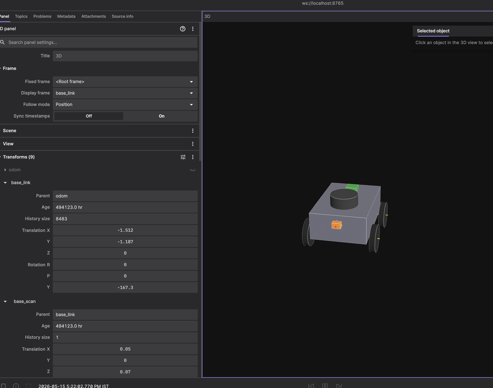

# Chapter 3 — Build your own robot

**Time:** Half-to-full day
**Hardware:** Laptop only
**Prerequisites:** Chapters 1–2

---

## What are we here for

Chapter 2 had you driving someone else's robot — TurtleBot3 in Gazebo, fully wired before you arrived. The wheels, the lidar, the bringup launch, the URDF — all done for you. Now you're going to **build your own**.

Concretely: imagine you have an **Arduino-driven 4-wheel car** — the kind of $25 hobbyist chassis kit that's everywhere. Four DC motors, an Arduino controlling them through a small motor-driver board, and a single front-facing IR distance sensor. The Arduino plugs into a laptop with a USB cable; over that cable, the laptop's operating system gives you a virtual *serial port* — so the ROS2 code on the laptop just opens `/dev/ttyACM0` and writes text commands, and the Arduino sees them coming in on its serial pin. *That's the robot.* Cheap, common, the kind of thing hobbyists actually build. You won't build the physical one in this chapter — but you'll model it in ROS2, drive it in a Gazebo physics sim with real walls, and at the end see exactly which files swap (and which stay byte-for-byte identical) when the real Arduino is wired in.

The deeper question: **is simulation in robotics there to replicate reality and test your behaviour code — the same way unit tests do in regular software?** Yes — with a fidelity caveat. Sim handles the kinematics (where the robot moves under a given command), the topic/message plumbing, and the rough shape of sensor data well. It only approximates the messy physics — motor inertia, friction, sensor noise patterns. Real teams develop algorithms in sim, tune the rough parts against measured hardware when stakes are high, then validate on the real robot. For us, the takeaway is stronger: **sim and real share so much code that your behaviour code (we'll call it *business logic*) ships unchanged across the gap.** Only the hardware-facing driver swaps.

By the end of this chapter you'll have a clean answer to: *"If I built this Arduino car for real, what code would I write, what would I install, and what would stay identical to what I just wrote?"*

### Notation used in this chapter

When introducing a ROS2 entity in prose we tag it with a prefix word so you immediately know what category it belongs to. (Once introduced, we drop the prefix to keep prose readable — context carries it from there.)

| Prefix | Means | Example |
|---|---|---|
| `topic ...` | a named channel messages flow over | `topic /cmd_vel` |
| `msg ...` | a message type (the data shape) | `msg Twist`, `msg LaserScan` |
| `node ...` | a ROS2 node / a script that runs as one | `node car_mover.py` |
| `pkg ...` | a ROS2 package | `pkg ros2_control` |
| `tf ...` | a TF frame name | `tf base_link` |

### Setup

All commands run inside the same `ros2` Docker container from ch02 (`docker exec -it ros2 bash`). Foxglove on your laptop, `pkg foxglove_bridge` running inside the container — same setup as ch02.

**Before you start**, make sure `workspace/ros2/ch03/` on your host is populated. If you ran the workspace seed step from the **Docker image** sidebar resource at any point, you're good — the chapter's resource files live under `/workspace/ros2/ch03/` inside the container. If you haven't seeded yet, run once from the repo root:

```bash
bash scripts/reset_workspace.sh --add-only
```

Then in a container shell:

```bash
# T1 — leave foxglove_bridge running
ros2 launch foxglove_bridge foxglove_bridge_launch.xml port:=8765
```

Open Foxglove, connect to `ws://localhost:8765`, load the new `ch03_layout.json` (Layouts panel → Import → `resources/ros2/foxglove/ch03_layout.json` from your local clone).

---

## Projects

| # | Project | What you build |
|---|---------|----------------|
| A | Describe your robot | A URDF for the 4-wheel Arduino car; `tiny_bot` appears in Foxglove |
| B | Simulate it | Spawn `tiny_bot` in a Gazebo world with walls; drive it; have it stop before hitting things |
| C | Wire the real Arduino | Concept-level: what swaps, what stays, when you go to real hardware |

---

## Project A — Describe your robot

**Goal:** model `tiny_bot`'s mechanical layout in a URDF and see it appear in Foxglove. No physics, no motors yet — just a shape on the screen with the right coordinate frames.

URDF (Unified Robot Description Format) is the standard way every ROS2 robot describes itself: what links exist (chassis, wheels, sensor mounts), how they connect, where each one sits. `node robot_state_publisher` reads the URDF and broadcasts the resulting coordinate-frame tree as TF transforms — `tf_static` for the fixed parts (sensor mounts), `tf` for the moving parts (wheel joints, once something publishes their angles). Every other tool in the ecosystem can then ask *"where is the IR sensor mounted relative to the chassis?"* and get a real answer.

🟢 **Run** — three commands in any container shell:

```bash
# 1. xacro preprocesses ${variables} and <macros> into plain URDF (one-shot)
ros2 run xacro xacro /workspace/ros2/ch03/tiny_bot.urdf.xacro \
    > /workspace/ros2/ch03/tiny_bot.urdf

# 2. publish the URDF + broadcast fixed-joint TF transforms (long-running)
ros2 run robot_state_publisher robot_state_publisher \
    /workspace/ros2/ch03/tiny_bot.urdf
```

In a second container shell (a new terminal on your laptop, then `docker exec -it ros2 bash`):

```bash
# 3. publish zero angles for the non-fixed joints (the wheels). On a real
# robot the motor driver does this; with no driver running yet, this stand-in
# keeps the TF tree complete so Foxglove can render.
ros2 run joint_state_publisher joint_state_publisher
```

In Foxglove (with `ch03_layout.json` loaded), the 3D panel's display frame is `base_link`. You should see `tiny_bot`:



The parts:

- **Grey box** — the chassis (`base_link`).
- **Four black cylinders** — the wheels (`fl_wheel`, `fr_wheel`, `rl_wheel`, `rr_wheel`), one at each corner.
- **Dark cylinder on top** — `base_scan`, the *lidar mount*. Reserved for a future 2D lidar. Not driven in this chapter.
- **Orange box at the front** — `ir_front`, the *IR distance sensor* mount. This one **is** used in Project B (Gazebo's ray sensor casts from here).
- **Green box on the back** — `imu_link`, an *IMU* (inertial measurement unit) frame. Also reserved for future use.

The unused frames (`base_scan`, `imu_link`) are deliberate — they're placeholder slots matching what a real hobbyist Arduino car typically has bolted on, so the URDF reads like a real-robot URDF and you have somewhere to wire those sensors in later.

> **Don't see the model?** Foxglove caches `topic /robot_description` per session. Re-import `ch03_layout.json` to force a refetch.

### Read the file

The whole URDF is ~120 lines. Open it side-by-side and skim:

```xml+collapsed resources/ros2/ch03/tiny_bot.urdf.xacro
```

Three things to notice — that's all you need from URDF for this chapter:

1. **Links** (`<link name="...">`) — rigid bodies. Chassis, wheels, sensors. Each has a `<visual>` (what Foxglove draws), an optional `<collision>` (what a physics sim hit-tests), and an `<inertial>` (mass + inertia — what a sim or `pkg ros2_control` reads to do dynamics).

2. **Joints** (`<joint type="...">`) — connections between links. `fixed` means bolted on (sensor mounts). `continuous` means free rotation (wheels). `revolute` and `prismatic` exist too (arm joints, sliders). A joint says *child sits at this offset and can move in this way relative to parent*.

3. **Frame names matter** — `tf base_scan` for a 2D lidar, `tf imu_link` for an IMU, `tf base_link` for the chassis. These are [REP-105](https://www.ros.org/reps/rep-0105.html) conventions. Stock SLAM and Nav2 expect them. Invent your own names and you'll be writing remap flags forever.

URDF describes the **mechanical structure**. It does *not* describe behavior — nothing in the file says how fast a wheel should spin, what a lidar measures, or how an IMU reports gravity. Those are runtime concerns. Drivers and physics engines fill them in. Project B does both.

**Side note on xacro.** Our robot description file is `tiny_bot.urdf.xacro`, not `tiny_bot.urdf` — the extra `.xacro` extension says it needs preprocessing before it becomes a real URDF (which is why step 1 above pipes it through `xacro`). `xacro` adds two things plain URDF lacks: constants (`<xacro:property name="wheel_radius" value="0.05"/>`, used as `${wheel_radius}`) and macros (`<xacro:macro name="wheel" params="prefix y_reflect x_reflect">...`, instantiated as `<xacro:wheel prefix="fl" y_reflect="1" x_reflect="1"/>` for the front-left wheel). Constants and functions. Everyone uses it because plain URDF makes you copy-paste.

---

## Project B — Simulate it

**Goal:** put `tiny_bot` in a real physics sim with walls, drive it, and have it stop before it crashes. URDF showed the *structure*; this project gives it *behaviour* — wheels that spin under torque, sensors that see actual geometry, a world with mass and friction.

We're not going to hand-roll any of that. **Gazebo Sim** does it for us — ch02 already used it to drive the TurtleBot. (Gazebo is a separate project from ROS2; we use *Harmonic*, the release officially paired with ROS2 Jazzy. The container has both installed already.) We just need to:

1. Tell Gazebo *what* the robot is — `tiny_bot.sdf`. Covers the parts of the URDF we want physics on (chassis, four wheels, IR sensor; the placeholder IMU and lidar frames from the URDF are skipped — no point simulating what we don't drive), plus a couple of Gazebo plugins (a "diff-drive" plugin that consumes Twist and moves the wheels, a "ray" sensor for the IR distance reading). The file format is **SDF** (Simulation Description Format) — URDF's Gazebo-flavoured cousin.
2. Tell Gazebo *where* the robot lives — `tiny_world.sdf`. A small world (also SDF) with walls.
3. Bridge Gazebo's native topics to ROS2 topics — `tiny_bot_bridge.yaml`, fed to `pkg ros_gz_bridge`.
4. Launch all of it — `tiny_bot_sim.launch.py`.

All four files live in `resources/ros2/ch03/`. Read them once at your leisure; we'll point at the interesting bits inline. The launch file is the only piece you need to *run* directly.

### The contract you're about to use

Every ROS2 wheeled robot speaks the same handshake. Here it is:

> *"Tell a wheeled robot how to move" means one thing across the entire ROS2 ecosystem: publish a `msg Twist` on `topic /cmd_vel`.*
>
> *`msg Twist` is the message type — six numbers (`linear.x/y/z`, `angular.x/y/z`) describing a desired velocity. `topic /cmd_vel` is the named channel those messages flow on. The combination — `msg Twist` on `topic /cmd_vel` — is the de-facto handshake for mobile robots. Nav2 publishes there. Every teleop tool publishes there. Every motor driver in the ecosystem subscribes there. It's not enforced by ROS2; it's enforced by the fact that everything else assumes it.*

Given that contract, four things have to run for `tiny_bot` to actually do anything:

**1. Something needs to consume `msg Twist` on `topic /cmd_vel` and turn it into wheel motion.** In sim, that's Gazebo's `gz-sim-diff-drive-system` plugin (attached to `tiny_bot.sdf`). It reads the Twist, computes each wheel's target angular velocity, drives the simulated wheel joints at those velocities, and publishes back `msg Odometry` on `topic /odom` plus the `tf odom → base_link` transform — exactly what a real motor driver would publish. **On real hardware, this slot is replaced by an Arduino-talking ROS2 node (more in Project C). Same ROS2 contract, different innards.**

→ **Driver:** Gazebo's diff-drive plugin (in sim) / your Arduino driver (on real hardware).

**2. Something needs to read the IR sensor and publish what it sees.** In sim, Gazebo's `<sensor type="gpu_lidar">` (configured as a single-ray scanner — one of the simpler ways to model a point-distance sensor in Gazebo) raycasts against world geometry every 100 ms and publishes `msg LaserScan` on `topic /ir_front`. On real hardware, a small ROS2 node would read your Arduino's analog pin via serial and publish the same shape (typically `msg Range`, but `LaserScan` with one ray works too). *Same ROS2 contract, different innards.*

→ **Sensor driver:** Gazebo's ray sensor (in sim) / your Arduino sensor driver (on real hardware).

**3. Something needs to publish the Twists** — to decide *what* the robot should do. Today that's a scripted pattern in `node car_mover.py`. Tomorrow it could be teleop, Nav2, or an AI policy.

→ **Business logic (commander):** `node car_mover.py`.

**4. Something needs to decide what to do with the IR reading** — "if the wall is close, stop the robot." Pure behaviour, hardware-agnostic.

→ **Business logic (safety):** `node obstacle_stop.py`. Sits between `car_mover` and the sim by intercepting Twists on `topic /cmd_vel_in` and forwarding to `topic /cmd_vel` only if the IR is far enough.

### The two layers — name them once

This is the chapter's central conceptual move. The two layers we just named keep showing up:

- **Drivers** — the bottom of the stack. Hardware-facing in real life; physics-engine-facing in sim. Speak standard ROS2 messages outward, and motor signals / sensor reads inward. **Replaced wholesale when you swap sim for real.**
- **Business logic** — the top of the stack. Application-facing. Decides what the robot should do. Speaks the same ROS2 messages. **Stays identical between sim and real.**

In Project B, *every* "driver" is provided by Gazebo plugins. The only code you'll read or modify — `car_mover.py` and `obstacle_stop.py` — is business logic. Project C will show that those two files survive unchanged when you swap Gazebo for an Arduino.

### Read the files

🟡 **Know** — six files: three XML/SDF/YAML config, three code. Skim each.

**The Gazebo model** — `tiny_bot.sdf`. The chassis, four wheels, and IR-sensor link (the same parts of the URDF that we actually want physics on — the URDF's placeholder IMU and lidar frames are skipped here, no point simulating something we don't drive), plus three Gazebo plugin blocks at the bottom: the diff-drive plugin (wiring wheel joints to `topic /cmd_vel`), a joint-state publisher (so `joint_states` reports actual wheel angles), and a `<sensor type="gpu_lidar">` with `samples=1` on the `ir_front` link.

```xml+collapsed resources/ros2/ch03/tiny_bot.sdf
```

**The world** — `tiny_world.sdf`. Ground plane, ambient light, four walls forming a ~3 m × 3 m room. `tiny_bot` spawns at origin facing +x; the front wall sits at x = 1.5 m. (At 0.2 m/s the robot would reach it in about 7 seconds — but in practice `obstacle_stop` halts forward motion well before that, when the IR drops below 0.5 m.)

```xml+collapsed resources/ros2/ch03/tiny_world.sdf
```

**The bridge yaml** — `tiny_bot_bridge.yaml`. Tells `pkg ros_gz_bridge` which Gazebo topics to copy to ROS2 and which way data flows. `cmd_vel` is ROS→GZ (Gazebo subscribes); `odom`, `joint_states`, `tf`, `clock`, `ir_front` are GZ→ROS (we read them).

```yaml+collapsed resources/ros2/ch03/tiny_bot_bridge.yaml
```

**The launch file** — `tiny_bot_sim.launch.py`. Starts Gazebo headless with `tiny_world.sdf`, runs `robot_state_publisher` against `tiny_bot.urdf.xacro` (so Foxglove can render the model), spawns `tiny_bot.sdf` into the running world, runs `pkg ros_gz_bridge` with `tiny_bot_bridge.yaml`, and starts `world_map_publisher.py` (next file). ~70 lines. You don't need to read it in detail; just know it orchestrates everything below.

```python+collapsed resources/ros2/ch03/tiny_bot_sim.launch.py
```

**The map publisher** — `world_map_publisher.py`. Hand-authors an `OccupancyGrid` that matches the walls in `tiny_world.sdf` and publishes it on `topic /map`. Gazebo's scene graph isn't bridged to ROS2 — Foxglove would otherwise see `tiny_bot` driving through empty space — so this small node makes the walls visible in the 3D panel. Not strictly necessary for the sim to work, but the demo is much clearer with the room drawn in.

```python+collapsed resources/ros2/ch03/world_map_publisher.py
```

**The business logic** — `car_mover.py` (publishes the Twist pattern) and `obstacle_stop.py` (the IR-aware filter). Both are simple.

```python+collapsed resources/ros2/ch03/car_mover.py
```

```python+collapsed resources/ros2/ch03/obstacle_stop.py
```

### Run it

🟢 **Run** — four shells.

First, if you have `joint_state_publisher` still running from Project A, **Ctrl+C it**. Gazebo's diff-drive plugin is about to take over `topic /joint_states`; only one source can be authoritative. Same for `robot_state_publisher` from Project A — the launch file starts its own; kill the standalone one.

```bash
# T1: Gazebo sim (world + robot + bridge + robot_state_publisher)
ros2 launch /workspace/ros2/ch03/tiny_bot_sim.launch.py

# T2: foxglove_bridge (if not already running)
ros2 launch foxglove_bridge foxglove_bridge_launch.xml port:=8765

# T3: business logic — drive pattern publisher
python3 /workspace/ros2/ch03/car_mover.py

# T4: business logic — IR-aware safety filter
python3 /workspace/ros2/ch03/obstacle_stop.py
```

In Foxglove (set the 3D panel's display frame to `tf odom` so the camera holds still while the robot moves; the four walls of `tiny_world.sdf` will appear as a black outline on a white floor — `world_map_publisher.py` republishes them as `/map` so Foxglove can render them), `tiny_bot` should:

1. Drive forward at 0.2 m/s.
2. As it approaches the front wall, the `/ir_front` plot drops from ~1.5 m to below 0.50 m.
3. `obstacle_stop` intercepts the forward command: on the `/cmd_vel` plot, **`linear.x` drops to zero**. Robot halts.
4. `car_mover`'s pattern continues — its next phase is *spin left* (`linear.x = 0, angular.z = 1.5`). With no forward component there's no collision risk, so `obstacle_stop` lets it through unchanged: **`angular.z` goes to 1.5 on the plot**. Robot pivots in place.
5. After pivoting, the IR no longer sees the wall, and `obstacle_stop` resumes forwarding the next forward Twist unmodified. Robot drives off in the new direction.

### What just happened

**Two of the four moving parts you ran are business logic that doesn't know it's in sim:**

- `car_mover.py` published Twists. It doesn't care whether Gazebo's diff-drive plugin is integrating them in a physics engine, or whether a real Arduino is reading them off a USB cable and driving real motors.
- `obstacle_stop.py` subscribed to `/ir_front` and made a stop/go decision. It doesn't care that the LaserScan reading came from a ray-cast in a simulated world. Real IR sensor data would have the same shape.

**The other two moving parts are drivers, all provided by Gazebo:**

- The diff-drive plugin in `tiny_bot.sdf` plays the motor driver's role.
- The `<sensor type="gpu_lidar">` plays the IR sensor driver's role.

Project C is what happens when both drivers swap for real hardware.

> **Note: a single-ray LaserScan is not the *most* canonical type for a point-distance sensor.** In production, an IR-driver package would typically publish `msg sensor_msgs/Range` (one number — distance + min/max range + frame_id). We use `LaserScan` here because Gazebo's stock ray sensor publishes that, and writing a tiny adapter just to convert one to the other adds clutter without teaching anything new. If you swap in a real IR driver, expect `Range`; if you swap in Nav2 expecting LaserScan, you'll need to either keep the LaserScan or convert. Either way, the business logic in `obstacle_stop.py` ships with a one-line type swap.

---

## Project C — Wire the real Arduino

🟡 **Know** — *no code to run here.* The goal is the mental model: now that you have a real physics sim running with business logic on top, what *exactly* changes when you build the real Arduino car? Where does the simulation end and the hardware begin?

The architecture stays the same shape across three deployments — sim, real-on-robot, and real-with-cloud-brain. Same layers, same contracts; only the *location* of each layer changes.

```
   ┌───────────────────────────┐ ┌───────────────────────────┐ ┌───────────────────────────┐
   │  A. SIM (Project B)       │ │  B. REAL, on-robot        │ │  C. REAL, with cloud      │
   │                           │ │                           │ │     brain                 │
   │  Laptop runs everything   │ │  Pi on the robot runs     │ │  Cloud runs heavy brain   │
   │                           │ │  ROS2; Foxglove on your   │ │  (VLA, planner, fleet);   │
   │                           │ │  laptop over WiFi         │ │  Pi runs reflex loop      │
   ├───────────────────────────┤ ├───────────────────────────┤ ├───────────────────────────┤
   │                           │ │                           │ │  ┌─────────────────────┐  │
   │                           │ │                           │ │  │ Heavy brain (cloud) │  │
   │                           │ │                           │ │  │ goals @ 1–10 Hz     │  │
   │                           │ │                           │ │  └──────────┬──────────┘  │
   │                           │ │                           │ │   Zenoh / VPN (slow link) │
   │                           │ │                           │ │             ▼             │
   │  ┌─────────────────────┐  │ │  ┌─────────────────────┐  │ │  ┌─────────────────────┐  │
   │  │ Business logic      │  │ │  │ Business logic      │  │ │  │ Reflex / safety     │  │
   │  │ car_mover,          │  │ │  │ car_mover,          │  │ │  │ obstacle_stop,      │  │
   │  │ obstacle_stop,      │  │ │  │ obstacle_stop,      │  │ │  │ /cmd_vel arbiter    │  │
   │  │ Nav2                │  │ │  │ Nav2                │  │ │  │ (Pi, 50–100 Hz)     │  │
   │  └──────────┬──────────┘  │ │  └──────────┬──────────┘  │ │  └──────────┬──────────┘  │
   │     /cmd_vel (Twist)      │ │     /cmd_vel (Twist)      │ │     /cmd_vel (Twist)      │
   │             ▼             │ │             ▼             │ │             ▼             │
   │  ┌─────────────────────┐  │ │  ┌─────────────────────┐  │ │  ┌─────────────────────┐  │
   │  │ Driver              │  │ │  │ Driver              │  │ │  │ Driver              │  │
   │  │ Gazebo diff-drive   │  │ │  │ Arduino bridge node │  │ │  │ Arduino bridge node │  │
   │  │ plugin + gpu_lidar  │  │ │  │ (serial over USB)   │  │ │  │ (serial over USB)   │  │
   │  └──────────┬──────────┘  │ │  └──────────┬──────────┘  │ │  └──────────┬──────────┘  │
   │             ▼             │ │     USB serial (fast)     │ │     USB serial (fast)     │
   │  ┌─────────────────────┐  │ │             ▼             │ │             ▼             │
   │  │ Simulated hardware  │  │ │  ┌─────────────────────┐  │ │  ┌─────────────────────┐  │
   │  │ (Gazebo physics)    │  │ │  │ Arduino + motors +  │  │ │  │ Arduino + motors +  │  │
   │  │                     │  │ │  │ encoders + IR pin   │  │ │  │ encoders + IR pin   │  │
   │  └─────────────────────┘  │ │  └─────────────────────┘  │ │  └─────────────────────┘  │
   │                           │ │                           │ │                           │
   │  Foxglove on same laptop  │ │  Foxglove on laptop, over │ │  Foxglove on laptop, over │
   │  (loopback)               │ │  WiFi → ws://<pi>:8765    │ │  WiFi → ws://<pi>:8765    │
   └───────────────────────────┘ └───────────────────────────┘ └───────────────────────────┘
        STAYS UNCHANGED across all three: the topic contracts (/cmd_vel, /odom,
        /joint_states, /ir_front), the business logic, and Foxglove.
        SWAPS: the driver (sim plugin ↔ Arduino bridge). MOVES: where the brain runs.
```

Three things to notice:

- **Only the driver swaps between sim and real.** The simulated-hardware box becomes the Arduino + motors box; everything above it ships unchanged. That's the whole thesis of this chapter.
- **The reflex loop never leaves the robot.** Whether the brain is on the same laptop (A), on the Pi (B), or in the cloud (C), `obstacle_stop` and the motor driver always sit on the fast/local side of the USB cable. Lose WiFi in (B) or (C) → the robot still stops at walls and waits.
- **"Where the laptop lives" depends on the deployment.** In sim you run ROS2 on your laptop. On a real driving car you can't trail a USB cable, so ROS2 moves to a Pi on the robot, and your laptop becomes a Foxglove window connected over WiFi. Add a heavy brain and that climbs further up into the cloud — but the Pi stays.

Foxglove doesn't know which deployment it's connected to. It asked `pkg foxglove_bridge` for `topic /odom`, and got whatever was being published there — Gazebo-simulated pose, Arduino-encoder dead-reckoning, same shape either way. **Same view, three very different things behind it.**

> **What this section is, and isn't.** The sketches below are *skeletons sized for clarity*, not a build recipe. A working Arduino car also needs: PWM-to-rad/s calibration per motor, encoder ISRs on the chip, a serial-timeout watchdog that cuts motors if ROS2 disconnects, and the right H-bridge for your motor current (an L298N module is the cheap default). What we *are* showing is the boundary — what code you write on each side of the USB cable, and how it wires to everything above. For real-build pointers, see section 4.

> **Where the "laptop" lives.** A driving car can't trail a USB cable, so ROS2 doesn't run on your laptop — it runs on a small computer *bolted to the robot*. A Raspberry Pi (4 or 5) is the typical pick: it boots Ubuntu + ROS2, talks to the Arduino through a short USB cable inside the chassis, and exposes `pkg foxglove_bridge` over WiFi. Your laptop just runs Foxglove and connects to `ws://<pi-ip>:8765`. "Laptop" in the diagram is really "the Pi"; substitute it mentally whenever you see it in the code below. The only wire on the robot is the short USB-serial inside the chassis.

### 1. The serial protocol

Inside the robot, between the on-board Pi (running ROS2 + business logic) and the Arduino (driving motors, reading the IR pin), there's a short USB cable carrying a serial stream. You can invent any line-based protocol; here's a dead-simple one for `tiny_bot`:

```
Laptop → Arduino:   V <left_rad_per_s> <right_rad_per_s>\n
                    e.g.  V 4.0 -2.0\n

Arduino → Laptop:   E <left_ticks> <right_ticks> <ir_raw>\n   (at 50 Hz)
                    e.g.  E 1234 1198 487\n
```

That's the contract between the two sides. Everything else in this project is just two halves of fulfilling it.

### 2. The motor-driver replacement (ROS2 side)

A real ROS2 motor-driver node subscribes to `topic /cmd_vel`, computes the same per-wheel split Gazebo's diff-drive plugin computes internally — and then writes the result to the serial port instead of solving wheel physics. Reads encoder lines back, derives `msg JointState`, `msg Odometry`, and `tf odom → base_link` from real measurements.

Sketch (not runnable — illustrative):

```python
class ArduinoMotorDriver(Node):
    def __init__(self):
        super().__init__("arduino_motor_driver")
        self.serial = serial.Serial("/dev/ttyACM0", 115200)
        self.create_subscription(Twist, "/cmd_vel", self.on_cmd_vel, 10)
        # ... publishers for /joint_states, /odom, plus a TransformBroadcaster ...
        self.create_timer(0.02, self.tick)   # 50 Hz read loop

    def on_cmd_vel(self, msg):
        v_left  = msg.linear.x - msg.angular.z * (WHEEL_SEPARATION / 2)
        v_right = msg.linear.x + msg.angular.z * (WHEEL_SEPARATION / 2)
        # ↓ THE LINE THAT REPLACES GAZEBO'S PHYSICS INTEGRATION
        self.serial.write(f"V {v_left/WHEEL_RADIUS} {v_right/WHEEL_RADIUS}\n".encode())

    def tick(self):
        line = self.serial.readline().decode().strip()
        if not line.startswith("E "):
            return
        _, left_ticks, right_ticks, ir_raw = line.split()
        # ↑ THE LINE THAT REPLACES THE RAY-CAST + WHEEL-SIM
        # ... convert ticks to angles, publish JointState + Odometry + TF ...
```

The diff-drive math is unchanged — same Twist → per-wheel velocity split that Gazebo's plugin does internally. The two lines highlighted are the swap: the **`serial.write`** replaces Gazebo's "apply force to simulated joint" math; the **encoder parse** replaces Gazebo's "read back the joint's velocity after physics step." The ROS2-side contract — Twist in, JointState + Odometry + TF out — is byte-for-byte identical to what Gazebo's plugin produces. **The business logic above doesn't notice the change.**

### 3. The Arduino-side firmware

This is the part sim doesn't have. In sim, Gazebo's physics engine simulates the motors. On real hardware, the chip runs its own program:

```c
// Tiny Arduino sketch — sized down for illustration.
// In: V <vl> <vr>    Out: E <left_ticks> <right_ticks> <ir_raw>

void setup() {
  Serial.begin(115200);
  pinMode(LEFT_PWM, OUTPUT);  pinMode(LEFT_DIR, OUTPUT);
  pinMode(RIGHT_PWM, OUTPUT); pinMode(RIGHT_DIR, OUTPUT);
  // ... encoder interrupts attached on rising edges ...
}

void loop() {
  // Read incoming command, if any
  if (Serial.available()) {
    String line = Serial.readStringUntil('\n');
    if (line.startsWith("V ")) {
      float vl, vr;
      sscanf(line.c_str(), "V %f %f", &vl, &vr);
      setMotorPwm(LEFT_PWM, LEFT_DIR, vl);
      setMotorPwm(RIGHT_PWM, RIGHT_DIR, vr);
    }
  }

  // Once per 20 ms, report state back
  if (millis() - lastReport >= 20) {
    int ir_raw = analogRead(IR_PIN);
    Serial.print("E "); Serial.print(left_ticks);
    Serial.print(' '); Serial.print(right_ticks);
    Serial.print(' '); Serial.println(ir_raw);
    lastReport = millis();
  }
}
```

~25 lines of Arduino C. Same protocol; just the other side of the wire. **Gazebo's `gz-sim-diff-drive-system` pretends to be this entire sketch + the motors + the world's friction + the encoders.** When you swap fake for real, this code starts running on the chip and Gazebo retires.

Note the chassis has four wheels but the sketch only drives two channels — that's the standard 4WD-toy-car wiring: front and rear motor on each side share one H-bridge channel, so `LEFT_PWM` spins both left wheels together (same for right). One H-bridge module (e.g. L298N) carries both channels; the diff-drive math doesn't change.

**Before plugging the Arduino into ROS2, test the protocol manually.** With the sketch flashed and the USB cable connected, run `screen /dev/ttyACM0 115200` (or `minicom -D /dev/ttyACM0 -b 115200`), type `V 1.0 1.0` + Enter, and watch the wheels spin. You should also see `E ...` lines streaming back. This catches PWM wiring, baud-rate, and protocol-parsing bugs *before* you add ROS2 to the picture — debugging a ROS2 node that talks to a broken Arduino is twice the work.

The IR sensor follows the same shape — a small ROS2 node parses the `<ir_raw>` field out of every `E` line, scales it to metres using whatever calibration the chip's datasheet specifies, and publishes `msg Range` (or `msg LaserScan` with one ray) on `topic /ir_front`. Drop-in replacement for Gazebo's ray sensor. **`obstacle_stop.py` doesn't notice — except possibly a one-line type change if you switch to `Range`.**

### 4. Off-the-shelf alternative: `pkg ros2_control`

Writing the serial-talking ROS2 node yourself works. But for anything beyond a teaching exercise, the community-standard path is `pkg ros2_control` — a framework that hosts the diff-drive math, the JointState publishing, and the controller loop, leaving you to write only the small bit that talks to your specific hardware. The Arduino-car case is well-trodden; an off-the-shelf hardware-interface plugin already exists.

You'd add a `<ros2_control>` block to your URDF naming the wheel joints and pointing at a hardware-interface plugin, write a YAML listing `diff_drive_controller` and `joint_state_broadcaster`, and launch the whole thing. The framework does the rest. *No kinematics code in your codebase.*

Pointers:
- [diffdrive_arduino](https://github.com/joshnewans/diffdrive_arduino) — a real-hardware `pkg ros2_control` plugin for exactly the Arduino + L298N + serial setup described above. Closest match to `tiny_bot`'s real build.
- [gz_ros2_control demos / diffbot](https://github.com/ros-controls/gz_ros2_control/tree/master/gz_ros2_control_demos) — same framework wired to *Gazebo* instead of real hardware. Useful if you want to see what graduating `tiny_bot`'s sim to `pkg ros2_control` looks like before adding the Arduino.

The two share the framework; only the hardware-interface plugin differs. So the upgrade path is incremental: sim `ros2_control` → real `ros2_control` is just a plugin swap.

### 5. What if the brain is heavy — can it run in the cloud?

That's deployment **C** in the diagram above. Reasonable question once the brain gets big: a VLA model, a multi-camera perception stack, or a fleet planner doesn't fit comfortably on a Raspberry Pi.

The split is **latency-driven, not size-driven.** The inner reflex loop — motor PWM, encoder feedback, IR-triggered stop — needs <20 ms per cycle and zero tolerance for dropouts. Heavy brain work — perception, planning, VLA inference, fleet coordination — outputs goals or trajectories at 1–10 Hz and tolerates much more latency. Two budgets, two links:

| Link | Typical latency | Jitter | Drop behaviour | Fit for |
|---|---|---|---|---|
| **USB serial** (Pi ↔ Arduino, 115200 baud, on-board) | 1–3 ms RTT | <1 ms | rare; physical cable | reflex loop, 50–100 Hz |
| **WiFi LAN** (Pi ↔ laptop, home AP) | 5–30 ms RTT | spikes to 100–500 ms under contention | seconds-long dropouts are normal | Foxglove, teleop, telemetry |
| **WiFi → internet → cloud** (Pi ↔ remote server) | 50–300 ms RTT | spikes to 500+ ms | minutes-long outages possible | high-level goals, 1–10 Hz |

The 50 Hz motor loop has a ~20 ms budget per cycle; USB sits well inside it, WiFi-to-cloud doesn't. **A WiFi hiccup of 500 ms means the motors keep their last command for 500 ms — the car drives into the wall.** That's why the reflex loop stays on the robot no matter how clever the brain gets. Heavy thinking moves up where the budget allows it.

Two consequences worth remembering: **lose WiFi → the cloud brain pauses, on-robot `obstacle_stop` + reflex keep running, robot halts gracefully.** Lose the USB serial → that's the bug you can't paper over; the robot is dead. The wired link is the safety boundary.

For the cloud↔Pi hop, the ROS2 ecosystem typically uses [Zenoh](https://github.com/ros2/rmw_zenoh) or DDS-over-VPN — both handle intermittent links and selective message bridging. [micro-ROS](https://micro.ros.org/) can run ROS2 directly on the Arduino if you want to skip the line-protocol entirely. Even Waymo, with massively more compute, runs safety-critical control on-vehicle for exactly this reason — the rule isn't "small robots must be local," it's "anything in the reflex loop must be."

### 6. The contract, end to end

So when you're standing in your kitchen watching the real Arduino car drive a square, your laptop's Foxglove window is **the same view you've been using in sim — same map of where the robot thinks it is, same IR distance plot, same `cmd_vel` trace.** Same `car_mover.py` publishing the pattern. Same `obstacle_stop.py` halting it. The only thing that's different is what's behind the `/cmd_vel`, `/odom`, `/joint_states`, `/ir_front` topic boundary. That's the contract earning its keep.

---

## The reality gap, briefly

Sim and real share a lot — but not everything. Worth knowing where the gap is.

**Sim handles well:** algorithm development, message contracts, kinematics, sensor *shape* (a simulated LaserScan has the right number of rays in roughly the right ranges). Gazebo's physics gives you contact, friction, mass, basic motor dynamics — enough to develop and debug most behaviour without ever wiring real hardware.

**Sim approximates crudely:** the *characteristics* of motor dynamics (real motors have inertia, deadband, PWM nonlinearity, voltage sag under load — Gazebo's models are coarse), friction surface details (carpet vs hardwood vs concrete produces different trajectories from the same Twist), sensor noise *patterns* (real lidar noise is bursty and wavelength-dependent; sim noise is usually clean Gaussian), and timing jitter (real driver topics arrive late, sometimes out of order; sim is metronomic).

**How real teams cope:** algorithm work in sim (cheap, fast, reproducible), calibrate model parameters against measured hardware data when stakes are high (`pkg ros2_control` exposes plenty of dials), domain randomisation for ML-driven robots (train on many perturbed sims so the policy survives the gap), and always validate on hardware before declaring done.

For a beginner course, the takeaway is simpler — and it's the thesis of this whole chapter:

> ***Business logic ships unchanged across the gap. Drivers swap. That's the contract — and that's why ROS2.***

---

## Self-Check

1. What's the standard handshake for telling a wheeled robot to move? — **Answer:** Publish `msg Twist` on `topic /cmd_vel`. It's a convention, not enforced by ROS2 itself, but every teleop tool, every motor driver, and every autonomy stack assumes it.

2. In Project B, which two files were business logic and which two were drivers? — **Answer:** Business logic: `car_mover.py` (publishes the Twist pattern) and `obstacle_stop.py` (IR-aware safety filter). Drivers: Gazebo's `gz-sim-diff-drive-system` plugin (consumes Twist, moves wheels, publishes odom) and Gazebo's `<sensor type="gpu_lidar">` (raycasts against the world, publishes LaserScan on `/ir_front`).

3. Why does `obstacle_stop.py` subscribe to `topic /cmd_vel_in` instead of `topic /cmd_vel`? — **Answer:** Because it needs to *intercept* the commander's output and re-publish (possibly modified) on `/cmd_vel`, which is the canonical name the motor driver subscribes to. `car_mover.py` publishes to `/cmd_vel_in`; `obstacle_stop` forwards to `/cmd_vel` unless the IR is too close.

4. On a real Arduino car, what swaps and what stays the same? — **Answer:** Two drivers swap: the motor driver (Gazebo's diff-drive plugin → an Arduino-talking ROS2 node) and the sensor driver (Gazebo's ray sensor → a serial-parsing IR node). Two business-logic files stay identical: `car_mover.py`, `obstacle_stop.py`. Plus `robot_state_publisher`, `foxglove_bridge`, your URDF — all unchanged.

5. Why use Gazebo at all if your business logic doesn't care whether it's in sim? — **Answer:** Because Gazebo handles real physics (collision, friction, mass, motor dynamics), real geometry (walls the IR can actually see), and provides driver-equivalent plugins for free. Without it you'd have to hand-roll all of that — which buys you nothing the framework doesn't already give you.

---

## Common Mistakes

- **Both `joint_state_publisher` (from Project A) and Gazebo running:** wheels jitter or stop responding because two sources fight over `topic /joint_states`. Kill the placeholder before launching sim.
- **Both `robot_state_publisher` (from Project A) and the launch file running:** two instances both try to publish `topic /robot_description`. Kill the standalone one — the launch file starts its own.
- **Commander publishes to `/cmd_vel` instead of `/cmd_vel_in`:** `obstacle_stop` is bypassed; the IR sensor reports proximity, nothing acts on it, robot crashes into the wall. The shipped `car_mover.py` publishes to `/cmd_vel_in` correctly — only an issue if you swap in `teleop_twist_keyboard` (which publishes to `/cmd_vel` by default; use `--ros-args -r /cmd_vel:=/cmd_vel_in` to fix).
- **Display frame stuck on `tf base_link`:** the camera follows the robot, which is fine in Project A but disorienting in Project B (robot looks stationary while the world slides). Switch to `tf odom` for sim.
- **Foxglove showing stale URDF:** Foxglove caches `topic /robot_description`. Re-import the layout to force refetch.
- **Gazebo "couldn't open render engine: ogre2":** Docker container is missing a GL library. On Apple Silicon, headless mode (the launch file uses `-s`) avoids this; if you somehow ended up with a GUI mode, force headless.

---

## Resources

1. [REP-105 — Coordinate Frames for Mobile Platforms](https://www.ros.org/reps/rep-0105.html) — the convention for `tf base_link`, `tf odom`, `tf map`, `tf base_scan`, `tf imu_link`.
2. [URDF tutorial (Jazzy)](https://docs.ros.org/en/jazzy/Tutorials/Intermediate/URDF/URDF-Main.html) — full walkthrough beyond what this chapter covers.
3. [xacro user guide](https://github.com/ros/xacro/wiki) — properties, macros, conditionals.
4. [Gazebo Sim (Harmonic) tutorials](https://gazebosim.org/docs/harmonic/tutorials) — sensors, plugins, world authoring.
5. [ros_gz_bridge docs](https://github.com/gazebosim/ros_gz/tree/ros2/ros_gz_bridge) — the YAML bridge format used here.
6. [`pkg ros2_control` docs](https://control.ros.org/jazzy/index.html) — the production-grade framework that subsumes both Gazebo's plugins and real-hardware drivers behind one interface.
7. [gz_ros2_control demos — `diffbot`](https://github.com/ros-controls/gz_ros2_control/tree/master/gz_ros2_control_demos) — a working sim diff-drive robot wired through `pkg ros2_control`. The natural next step.
8. [`pkg teleop_twist_keyboard`](https://github.com/ros2/teleop_twist_keyboard) — keyboard joystick. Plug into `topic /cmd_vel_in` and drive `tiny_bot` manually.

---

## Appendix — How to pick the right topic, message type, and driver

ROS2 has no central registry that says *"for X, use topic Y with message Z."* The conventions are real, just enforced by the ecosystem rather than the framework — every off-the-shelf package (Nav2, SLAM Toolbox, MoveIt, RViz, Foxglove) assumes specific topic names and message types, and if you don't follow them you cut yourself off from all of it. This appendix is the structured reference for finding the right answer.

### A1. Message packages, their types, and the conventional topics

The official catalogue lives in [common_interfaces](https://github.com/ros2/common_interfaces) — ~150 message types covering the vast majority of robotics data. Below, each package is grouped with its commonly-used types and the de-facto topic names where those types are published.

**Rule of thumb:** if your data is kinematic, geometric, or sensor, the type already exists. Only invent a custom message when nothing fits. And once you've picked the type, use the conventional topic name — every off-the-shelf consumer (Nav2, SLAM Toolbox, MoveIt, RViz, Foxglove) assumes it.

**One important wrinkle about topics and types:**

| Direction | Cardinality | Note |
|---|---|---|
| Package → message types | **1:many** | One package defines many types — `sensor_msgs` alone has ~30 (LaserScan, Imu, Image, …). |
| Message type → topics | **1:many** | The same `Twist` type appears on `/cmd_vel`, `/cmd_vel_in`, `/cmd_vel_nav`, … |
| Topic → message type | **1:1, strict** | A topic has exactly one type. ROS2 refuses to bind publishers/subscribers with mismatched types. |
| Topic → publishers | many | Multiple nodes can publish to one topic. Usually a bug for commands, normal for `/tf`. |
| Topic → subscribers | many | The normal pub/sub fan-out. |

So in the tables below, each *row* is a topic+type binding. When the same type shows up on multiple conventional topic names (e.g. `Twist` on `/cmd_vel` vs `/cmd_vel_in`), you wire them together by **topic remapping** at launch — e.g. `--ros-args -r /cmd_vel:=/cmd_vel_in` — never by changing the type.

(Sidebar: ROS2 has three transport primitives — **topics** (pub/sub, one type, fire-and-forget), **services** (request/response, two types), **actions** (goal/feedback/result, three types). All three are name-keyed and type-strict. This appendix covers topics; services and actions follow the same selection logic.)

**The packages at a glance** — what each one is for, before drilling into individual types:

| Package | What it carries |
|---|---|
| `geometry_msgs` | Velocities, poses, transforms — the geometric primitives that describe motion and position. |
| `sensor_msgs` | Raw readings from physical sensors — cameras, lidar, IMU, GPS, joint encoders. |
| `nav_msgs` | Navigation data — robot odometry, occupancy maps, planned paths. |
| `tf2_msgs` | Coordinate-frame relations — "frame A is here relative to frame B" over time. |
| `std_msgs` | Primitives (`Bool`, `Int`, `Float`, `String`) and the URDF carrier. Mostly avoid; prefer typed messages. |
| `trajectory_msgs` | Multi-joint motion plans — what an arm or multi-DOF base should do over time. |
| `visualization_msgs` | Debug overlays for RViz/Foxglove — markers, lines, arrows, text you draw from code. |
| `diagnostic_msgs` | Health and status reports — "this node is OK / WARN / ERROR, here's why." |
| `shape_msgs` | Geometric primitives (boxes, spheres, meshes) for collision objects in planning scenes. |
| `actionlib_msgs` | Plumbing for ROS2 actions — goal IDs, status codes. Used inside the action protocol, not directly. |

#### `geometry_msgs` — velocities, poses, transforms

| Topic → type | Example data |
|---|---|
| `/cmd_vel` → `Twist` | `linear: {x: 0.2, y: 0, z: 0}`, `angular: {x: 0, y: 0, z: 0.5}` — drive forward 0.2 m/s while spinning 0.5 rad/s |
| `/goal_pose` → `PoseStamped` | `header.frame_id: "map"`, `pose.position: {x: 2.0, y: 1.5, z: 0}`, `pose.orientation` as a quaternion. *RViz/Foxglove publishes here when you click "Goal".* |
| `/initialpose` → `PoseWithCovarianceStamped` | Same as PoseStamped + a 6×6 covariance matrix. Used to seed AMCL with where the robot thinks it starts. |

Other types in this package — `TwistStamped`, `Pose`, `PoseWithCovariance`, `Transform`, `TransformStamped`, `Vector3`, `Quaternion`, `Point` — are used as fields *inside* other messages (Odometry contains a Pose, TF contains TransformStamped, etc.) rather than published on topics directly. See [docs.ros2.org/latest/api/geometry_msgs](https://docs.ros2.org/latest/api/geometry_msgs/).

#### `sensor_msgs` — raw sensor readings

| Topic → type | Example data |
|---|---|
| `/scan` → `LaserScan` | `angle_min: -3.14`, `angle_max: 3.14`, `angle_increment: 0.0175` (1°), `range_min: 0.05`, `range_max: 10.0`, `ranges: [3.2, 3.1, 2.9, ..., inf, ...]` — 360 distance readings, one per degree. |
| `/imu/data` → `Imu` | `orientation` (quaternion), `angular_velocity: {x, y, z}` rad/s, `linear_acceleration: {x, y, z}` m/s², plus 3×3 covariance for each. |
| `/camera/image_raw` → `Image` | `height: 480`, `width: 640`, `encoding: "rgb8"`, `step: 1920`, `data: [...921600 bytes...]`. |
| `/joint_states` → `JointState` | `name: ["fl_wheel_joint", "fr_wheel_joint", ...]`, `position: [1.2, 1.3, ...]` rad, `velocity: [4.0, 4.1, ...]` rad/s. |
| `/ir_front` → `Range` | `radiation_type: 1` (IR), `field_of_view: 0.04`, `min_range: 0.05`, `max_range: 1.5`, `range: 0.32` (m to nearest obstacle). |

Other commonly-used types in this package: `CompressedImage` (`/camera/image_raw/compressed`, JPEG/PNG bytes), `CameraInfo` (`/camera/camera_info`, intrinsics — latched), `PointCloud2` (`/points`, 3D points from depth or lidar), `NavSatFix` (`/gps/fix`, lat/lon/alt), `BatteryState` (`/battery_state`), `MagneticField`, `Temperature`, `FluidPressure`, `Joy`. See [docs.ros2.org/latest/api/sensor_msgs](https://docs.ros2.org/latest/api/sensor_msgs/).

#### `nav_msgs` — navigation, maps, paths

| Topic → type | Example data |
|---|---|
| `/odom` → `Odometry` | `header.frame_id: "odom"`, `child_frame_id: "base_link"`, `pose.pose` (where the robot thinks it is) + 6×6 covariance, `twist.twist` (current velocity) + covariance. |
| `/map` → `OccupancyGrid` | `info.resolution: 0.05` (m/cell), `info.width: 68`, `info.height: 68`, `info.origin.position: {x: -1.7, y: -1.7}`, `data: [0, 0, ..., 100, 100, ...]` (-1 = unknown, 0 = free, 100 = occupied). |
| `/plan` → `Path` | `header.frame_id: "map"`, `poses: [PoseStamped, PoseStamped, ...]` — sequence of waypoints from current pose to goal. |

Also: `MapMetaData` (used inside OccupancyGrid). See [docs.ros2.org/latest/api/nav_msgs](https://docs.ros2.org/latest/api/nav_msgs/).

#### `tf2_msgs` — coordinate-frame relations

| Topic → type | Example data |
|---|---|
| `/tf` → `TFMessage` | `transforms: [TransformStamped, ...]` — each entry says "frame `child` is at translation `T` and rotation `R` relative to frame `parent` at time `stamp`." High-frequency (every odom tick). |
| `/tf_static` → `TFMessage` | Same shape, but **latched** (TRANSIENT_LOCAL QoS): published once per frame pair that never moves. Used for `base_link → base_scan`, `base_link → imu_link`, etc. |

See [docs.ros.org tf2 concepts](https://docs.ros.org/en/jazzy/Concepts/Intermediate/About-Tf2.html).

#### `std_msgs` — primitives and the URDF carrier

| Topic → type | Example data |
|---|---|
| `/robot_description` → `String` (URDF/XML) | `data: "<?xml version=\"1.0\"?>\n<robot name=\"tiny_bot\">..."` — entire URDF as one string. Latched. |

Other primitives in this package (`Bool`, `Int32`, `Float32`, `Float64`, `Header`) are technically usable as topic types but **avoid them** — they carry no semantic context. Wrap your data in a typed message instead.

#### Other packages (briefly)

| Package | Typical topic → type | Used by |
|---|---|---|
| `trajectory_msgs` | per-controller action topics → `JointTrajectory` | MoveIt, `pkg ros2_control` arm controllers |
| `visualization_msgs` | `/visualization_marker_array` → `MarkerArray` | RViz/Foxglove debug overlays (lines, spheres, arrows you draw from code) |
| `diagnostic_msgs` | `/diagnostics` → `DiagnosticArray` | health-monitoring tools, `pkg diagnostic_aggregator` |
| `shape_msgs` | (inside collision objects) → `SolidPrimitive`, `Mesh`, `Plane` | MoveIt planning scene |
| `actionlib_msgs` | (inside action protocol) → `GoalStatus` | every ROS2 action server |

Full reference: [docs.ros2.org/latest/api](https://docs.ros2.org/latest/api/).

**Inspect any of these locally:**
```bash
ros2 interface list                              # every message known to your install
ros2 interface show sensor_msgs/msg/LaserScan    # full field definition for one type
ros2 interface packages                          # every package that defines messages
```

**Coordinate frame names** are governed by [REP-105](https://www.ros.org/reps/rep-0105.html):

| Frame | Meaning |
|---|---|
| `map` | global, world-fixed; jumps when SLAM relocalises |
| `odom` | continuous, drifts over time; reference for `/odom` topic |
| `base_link` | robot's root frame, usually rear-axle midpoint or geometric centre |
| `base_footprint` | projection of `base_link` to the ground |
| `<sensor>_link` | each sensor's own frame, fixed relative to `base_link` (e.g. `base_scan`, `imu_link`, `ir_front`) |

**Units and conventions** are governed by [REP-103](https://www.ros.org/reps/rep-0103.html): SI units throughout, right-handed coordinates, x-forward / y-left / z-up, angles in radians.

### A2. What each major consumer requires

If you're building a robot that should plug into one of these stacks, this is the topic contract you need to satisfy. Get the topics on the left right, and the package on the right works.

| Consumer | Subscribes to | Publishes |
|---|---|---|
| **Nav2** (path planning + control) | `/scan` (LaserScan), `/odom` (Odometry), `/map` (OccupancyGrid), `/tf`, `/tf_static`, `/goal_pose` (PoseStamped), `/initialpose` (PoseWithCovarianceStamped) | `/cmd_vel` (Twist), `/plan` (Path), various status topics |
| **SLAM Toolbox** | `/scan`, `/odom`, `/tf`, `/tf_static` | `/map` (OccupancyGrid), updates `/tf` (map→odom) |
| **`pkg robot_localization` (EKF)** | `/odom`, `/imu/data`, `/gps/fix`, configurable | fused `/odometry/filtered`, `/tf` (odom→base_link) |
| **MoveIt** (arm planning) | `/joint_states`, action servers per planning group | trajectory commands on action topics |
| **`pkg robot_state_publisher`** | `/joint_states`, `/robot_description` (param) | `/tf`, `/tf_static` |
| **Foxglove / RViz** | anything you tell them; assumes convention names for default layouts | nothing (visualisation only) |
| **`pkg ros2_control`** (controller manager) | `/joint_states` (from hardware interface) + `/cmd_vel` (when running `diff_drive_controller`) | `/joint_states`, `/odom`, `/tf` (odom→base_link) |

**Discovery rule:** before publishing anything, read the README of the package that will consume it. The topic name and message type the package needs is the right answer — overriding it costs you adapters forever.

### A3. Finding the right driver for a piece of hardware

ROS2 has no monolithic device list, but two starting points get you 95% of the way:

| Source | What it gives you | URL |
|---|---|---|
| **ROS Index** | searchable registry of every published ROS2 package, filtered by distro. Best for hardware drivers. | [index.ros.org](https://index.ros.org/) |
| **awesome-ros2** | curated, browsable list by category | [github.com/fkromer/awesome-ros2](https://github.com/fkromer/awesome-ros2) |

Common hardware categories and the canonical driver packages:

| Hardware | Typical driver package | Publishes |
|---|---|---|
| 2D LiDAR (RPLIDAR, Hokuyo, SICK) | `sllidar_ros2`, `urg_node`, vendor-specific | `/scan` (LaserScan) |
| 3D LiDAR (Velodyne, Ouster, Livox) | `velodyne_driver`, `ouster-ros`, `livox_ros2_driver` | `/points` (PointCloud2) |
| Depth camera (RealSense, Azure Kinect, ZED) | `realsense2_camera`, `azure_kinect_ros_driver`, `zed_ros2_wrapper` | `/camera/depth/image_raw`, `/camera/color/image_raw`, `/camera/depth/points` |
| IMU (BNO055, MPU6050, Phidgets) | `bno055_driver`, `phidgets_drivers/imu` | `/imu/data` (Imu) |
| GPS | `nmea_navsat_driver`, `ublox_dgnss` | `/gps/fix` (NavSatFix) |
| Joystick / gamepad | `joy` | `/joy` (sensor_msgs/Joy) |
| Robot arm (UR, Franka, xArm) | `ur_robot_driver`, `franka_ros2`, `xarm_ros2` | `/joint_states` + action servers |
| Mobile base (TurtleBot, Husky, Jackal) | `turtlebot3_bringup`, `clearpath_*` | full Nav2 contract |
| Arduino + diff-drive (custom) | [diffdrive_arduino](https://github.com/joshnewans/diffdrive_arduino) (community) or roll your own + `pkg ros2_control` | full diff-drive contract |
| ESP32 / microcontroller (direct ROS2) | [micro-ROS](https://micro.ros.org/) | whatever you publish from the chip |

**Selection rule:** pick the package with the most recent commits, an active issues tab, and explicit support for your ROS2 distro (Jazzy at time of writing). Vendor-shipped drivers are usually best; community drivers fill the gaps.

### A4. The workflow, end to end

When you need to add something new to a robot — a sensor, an actuator, a behaviour — the process is the same:

1. **What standard message type fits the data, and what's the conventional topic for it?** Scan §A1. The package grouping gives you both at once.
2. **Who will consume this topic?** Scan §A2. Read that consumer's README; match the contract exactly.
3. **For hardware, is there an existing driver?** Search ROS Index (§A3). Almost always yes for common parts.
5. **Confirm by looking at a similar working robot.** TurtleBot3, Husky, F1Tenth bringup launch files are the reference designs — `ros2 topic list -t` on a running TurtleBot tells you the full topic surface.
6. **Only invent custom names / messages when nothing in steps 1–5 fits.** It's almost never the right answer in the first year.

### A5. Inspecting a running system

When you join an unfamiliar robot, these are the four commands that tell you what's actually happening:

```bash
ros2 topic list -t                 # every active topic, with message type
ros2 topic echo /odom              # see live data on one topic
ros2 topic hz /scan                # publish rate (sanity check: 10 Hz? 40 Hz?)
ros2 topic info /cmd_vel -v        # who publishes, who subscribes, QoS settings
ros2 node list                     # every running node
ros2 node info /motor_driver       # what one node publishes, subscribes, services
ros2 interface show <type>         # field definition for any message type
ros2 param list                    # every parameter on every node
```

This is the most honest answer to "what does this robot expose." Documentation drifts; `ros2 topic list -t` doesn't.
