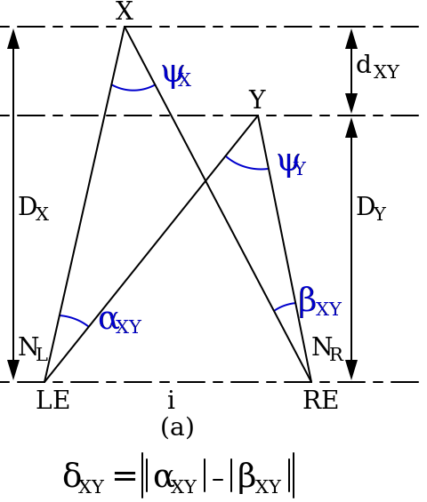
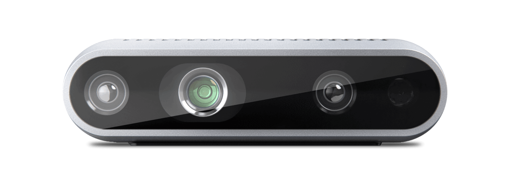
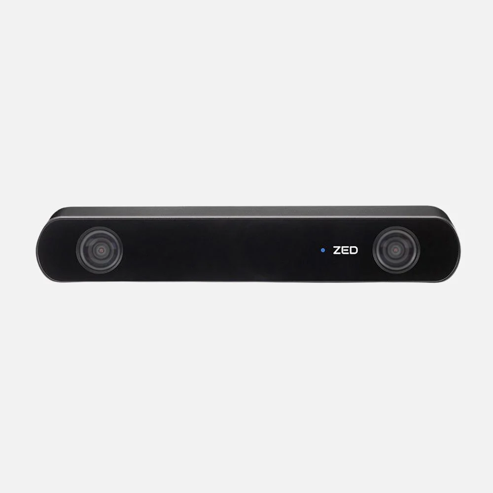
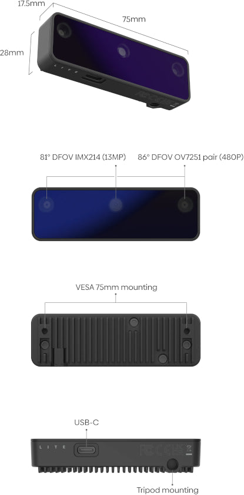

# Chapter 01 — Cameras: 2D & Depth

**Time:** ~30 min
**Hardware:** Laptop only
**Prerequisites:** ROS2 course ch01–ch02

---

The camera is the most-used sensor in robotics, by an enormous margin. Every VLA model, every visual SLAM stack, every Tesla on the road runs on cameras first. They're cheap, dense, well-understood, and they capture far more information than any other sensor — at the cost of needing serious compute to make sense of any of it.

This chapter is in two halves. **Part 1** covers regular 2D cameras: image formation, lenses, shutter types, calibration. **Part 2** covers depth cameras (stereo, time-of-flight, structured light) — which are basically 2D cameras plus geometry or projected light. Same physics core, different add-ons.

---

## 2D camera (RGB / mono)

**What it does.** Projects light onto a sensor and returns a 2D image at some frame rate.

**Senses.** Visible light (and sometimes near-infrared) hitting a silicon array — either a **CCD** (older, expensive, used in scientific imaging) or **CMOS** (the universal default in 2026, cheap and fast).

**Input.** Power, optional trigger signal, lens (focal length × aperture defines what gets imaged).

**Output.**
- **Raw or compressed image frames** at 30–240 Hz (rolling-shutter consumer) or 100–1000 Hz (global-shutter machine vision)
- Pixel formats: `mono8` / `mono16` / `bgr8` / `rgb8` / `yuv422`
- Plus **camera intrinsics** — the lens model — published separately


**Integration.**
- **Physical interface:** USB (UVC for plug-and-play), MIPI-CSI (Raspberry Pi cameras, embedded boards), GigE Vision / USB3 Vision (machine vision), GMSL/FPD-Link (automotive)
- **ROS2:** `v4l2_camera` (any V4L2 / UVC USB camera), `usb_cam`, `image_pipeline` for processing → `sensor_msgs/Image`, `sensor_msgs/CompressedImage`, `sensor_msgs/CameraInfo`
- **Non-ROS:** OpenCV (`cv2.VideoCapture`), GStreamer, Pylon (Basler), Spinnaker (FLIR), libcamera (Raspberry Pi), Pillow / PIL for basic capture

**Limitations to watch out for.**
- **Motion blur and rolling shutter.** Most consumer cameras read pixels row-by-row. A fast-moving object or a fast-rotating robot produces sheared, slanted images — sometimes called the "jello effect." Global-shutter cameras avoid this but cost 3–10×.
- **Dynamic range.** A camera sees ~60 dB of light at once; the real world spans 100+ dB. A robot moving from a sunlit window to a shaded room will see one or the other go to full black/white.
- **White balance.** Indoor incandescent, outdoor daylight, and fluorescent lights have wildly different color temperatures. Auto white balance helps; for ML models trained on one lighting condition, it doesn't help enough.
- **Calibration is mandatory.** Out of the box, a camera's pixel coordinates don't have a clean geometric meaning. You need intrinsic calibration (focal length, optical center, distortion coefficients) before doing anything geometric. Use `camera_calibration` in ROS2 with a checkerboard.
- **Lens distortion.** Cheap wide-angle lenses curve straight lines noticeably. Fisheye lenses do it on purpose. Calibration corrects this but adds latency.
- **Compression artifacts.** USB cameras often compress to MJPEG before transmission to save bandwidth. ML pipelines trained on raw images degrade on compressed ones.
- **Bandwidth.** A 1080p × 60 fps × 3-channel raw stream is ~370 MB/s. USB 3.0 or compression is the only way to ship it off-camera.

### Why & how it works

The pinhole-camera model is the geometric heart of every camera. A point in 3D space at coordinates (X, Y, Z) projects onto the image at pixel (u, v) via:

```
u = fx · X/Z + cx
v = fy · Y/Z + cy
```

…where `fx`, `fy` are focal lengths in pixels and `cx`, `cy` is the optical center. Real lenses add distortion (radial, tangential), which calibration measures and corrects.

This linear projection is *all of camera geometry*. Stereo vision is "two pinhole cameras with known geometry." Structure-from-motion is "one pinhole camera, many viewpoints." SLAM is "one pinhole camera, but also estimate the viewpoints."

The reason cameras are so popular: silicon sensors are now sub-$1 in volume, the math is mature, and modern ML can extract semantic content (cars, faces, gestures) that no other sensor reveals.

**Representative products.**

| Product | Tier | Resolution | Shutter | Price (USD) | Pick when |
|---|---|---|---|---|---|
| [Raspberry Pi Camera Module 3](https://www.raspberrypi.com/products/camera-module-3/) | Hobby | 12 MP | Rolling | ~$25 | MIPI-CSI on a Pi-class SBC; cheap and small |
| [Logitech C920 / C922](https://www.logitech.com/en-us/products/webcams/c920-pro-hd-webcam.html) | Hobby | 1080p / 30 fps | Rolling | ~$70 | Plug-and-play USB; great default webcam |
| [Arducam global-shutter](https://www.arducam.com/) | Prosumer | 1–5 MP | Global | ~$30–$80 | Fast motion, no rolling-shutter artifacts, hobbyist budget |
| [FLIR Blackfly S](https://www.flir.com/products/blackfly-s-usb3/) | Industrial | 0.4–24 MP | Global or rolling | ~$400–$1,500 | Repeatable image acquisition with hardware triggers |
| [Basler ace 2](https://www.baslerweb.com/) | Industrial | 0.4–24 MP | Both options | ~$500–$2,500 | Production-line machine vision |

*Prices verified May 2026 from manufacturer and distributor pages.*

---

## Depth camera: stereo

**What it does.** Two regular cameras placed a few cm apart. By matching the same point in both images, the system computes depth from the disparity (baseline ÷ disparity = distance).



**Senses.** Visible / near-IR light, same as a 2D camera — just twice.

**Input.** Power, optional trigger.

**Output.**
- An RGB image (typically from one of the two stereo cameras)
- A **depth image** (`sensor_msgs/Image` with `32FC1` or `16UC1`, distances in meters or millimeters)
- A **point cloud** (`sensor_msgs/PointCloud2`) derived from the depth + intrinsics
- Some units include an IMU (D435i, ZED 2i)

**Integration.**
- **Physical interface:** USB-C (USB 3) on most consumer units; PoE on some industrial
- **ROS2:** `realsense2_camera` (Intel), `zed-ros2-wrapper` (Stereolabs), `depthai-ros` (Luxonis OAK) → `sensor_msgs/Image`, `sensor_msgs/PointCloud2`, `sensor_msgs/CameraInfo`
- **Non-ROS:** librealsense2 (Intel), ZED SDK (Stereolabs, GPU-accelerated), DepthAI SDK (Luxonis), OpenCV's `StereoBM` / `StereoSGBM` for roll-your-own from any two cameras

**Limitations to watch out for.**
- **Textureless surfaces fail.** Stereo matching needs visual texture. A blank white wall has nothing to match — the depth image will be full of holes there.
- **Baseline ↔ range trade-off.** Wider baseline = better far-range accuracy but worse near-range (the cameras can't see the same close object). The D435 has a ~5 cm baseline; long-range stereo can be 10–20 cm or more.
- **Compute cost.** Stereo matching is GPU-friendly but not free. The ZED line offloads to a host GPU; OAK cameras do it on-device.
- **Sunlight is OK** (this is a real advantage over IR-projector depth cameras — passive stereo just needs ambient light).
- **Reflective / transparent surfaces** still confuse it. Glass, mirrors, polished metal — stereo matching breaks down.

**Pick when:** you want passive depth with no special lighting, and you can supply (or accept onboard) compute. The default depth sensor on most modern robots.

---

## Depth camera: time-of-flight (ToF)

**What it does.** Fires an infrared light source at the scene; measures how long the light takes to return per-pixel. Returns depth directly without correspondence matching.

**Senses.** Phase shift or pulse-time of an infrared illuminator (typically 850 nm or 940 nm).

**Input.** Power, the camera handles its own illumination.

**Output.** Same shape as stereo — depth image + point cloud + (optionally) RGB image. No texture-dependent dropouts.

**Integration.**
- **Physical interface:** USB-C, Ethernet, MIPI-CSI on embedded ToF chips
- **ROS2:** `k4a_ros2_driver` (Kinect Azure), vendor SDKs for newer units → `sensor_msgs/Image`, `sensor_msgs/PointCloud2`
- **Non-ROS:** Kinect SDK (deprecated Azure Kinect line — still works), libfreenect2 (older Kinect v2), Orbbec SDK, Pico Zense SDK

**Limitations to watch out for.**
- **Outdoor performance dies.** Direct sunlight floods the IR sensor; depth dropouts or full failure. Indoor only, basically.
- **Dark / absorbent surfaces** (matte black, fur) absorb the IR pulse — no return, no depth.
- **Highly reflective surfaces** (mirrors, glass) return depth of *whatever's behind the mirror*. Confusing.
- **Multi-path interference.** Corners and concave shapes can produce systematically wrong depth values; the IR bounces twice before returning.
- **Microsoft discontinued the Azure Kinect line** in 2023. The depth-sensing R&D moved into HoloLens. ToF as a category is healthy (Orbbec, Pico Zense, Intel L515 was a great one but also discontinued); product lifecycles in this space are short.

**Pick when:** indoor robotics where texture-poor surfaces are common (blank walls, plain floors) — depth from ToF will be cleaner than from stereo.

---

## Depth camera: structured light

**What it does.** Projects a known infrared pattern (dots or stripes) onto the scene; a normal IR camera captures the distorted pattern; the deformation tells you depth.

**Senses.** Same as ToF — IR illumination plus an IR-sensitive camera.

**Output.** Depth image + point cloud.

**Integration.**
- **Physical interface:** USB-C
- **ROS2:** vendor drivers (Orbbec, RealSense L515 was structured light — discontinued); `realsense2_camera` for older SR300
- **Non-ROS:** vendor SDKs

**Limitations to watch out for.**
- **Same outdoor failure as ToF** — IR pattern washes out in sunlight.
- **Short range** — typically <2 m for high accuracy. Past that the projected pattern is too dim.
- **Mostly historical at this point.** The original Kinect v1 used structured light; that approach has been displaced by stereo + ToF for most consumer applications.

**Pick when:** historically the dominant cheap-3D-depth approach (Kinect v1 made it famous), now niche. Stereo and ToF are the active categories.

---

## Event cameras (asynchronous vision)

**What it does.** Instead of returning frames, each pixel independently reports *changes* in brightness as they happen. No global clock; events arrive whenever something in the scene moves.

**Senses.** Per-pixel log-brightness change events at microsecond resolution.

**Output.** A stream of `(x, y, t, polarity)` events — millions per second, no frames at all. Vendor SDKs convert to frame-like representations for downstream code.

**Integration.**
- **ROS2:** `prophesee_event_ros_driver`, `dvs_ros2_driver` → custom `dvs_msgs/EventArray` or `sensor_msgs/Image` (accumulated frames)
- **Non-ROS:** Metavision SDK (Prophesee), Inivation DV (DVS)

**Why it matters.** No motion blur. Microsecond temporal resolution. ~1000× higher dynamic range than a frame camera. Native low-power operation (no events fire if nothing changes).

**Limitations.** Niche; the toolchain is younger. ML training data is scarce. Most engineers haven't touched one.

**Representative products:** [Prophesee EVK4](https://www.prophesee.ai/event-camera-evk4/) (~$3,000), [Inivation DAVIS346](https://inivation.com/) (~$5,000). Pick when: high-speed drones, vibration analysis, low-light surveillance, neuromorphic ML research.

---

## Thermal cameras

**What it does.** Imaging in long-wave infrared (8–14 μm). Each pixel reads the temperature radiated by what it sees.

**Senses.** Far-infrared blackbody radiation.

**Output.** A thermal image (`sensor_msgs/Image` with mono16 — temperature mapped to 16-bit values via a calibration curve).

**Integration.**
- **Physical interface:** USB, SPI on bare modules (FLIR Lepton)
- **ROS2:** `flir_lepton_ros2`, `flir_boson_ros2`; vendor drivers for higher-end thermal
- **Non-ROS:** FLIR Atlas / Spinnaker SDKs

**Why it matters.** Sees through smoke, dust, total darkness. Detects living things (warm) against backgrounds (cool). Spots overheating equipment from a distance.

**Limitations.**
- Low resolution (160×120 to 640×512 typical). Don't expect to read text.
- Glass and many plastics are opaque in thermal IR. Can't see through windows.
- Expensive — even modest thermal cameras start around $300.
- ITAR / export restrictions apply to higher-resolution units.

**Representative products:** [FLIR Lepton 3.5](https://www.flir.com/products/lepton/) (~$250 module), [FLIR Boson+](https://www.flir.com/products/boson-plus/) (~$2,500), [Seek Thermal](https://www.thermal.com/) (~$200–$500 USB). Pick when: search & rescue, building inspection, agricultural monitoring, security.

---

## Depth camera comparison

| Product | Tech | Range | RGB | IMU | Price (USD) | Pick when |
|---|---|---|---|---|---|---|
| [Intel RealSense D435 / D435i](https://www.realsenseai.com/products/stereo-depth-camera-d435/) | Stereo + IR projector | 0.3–3 m (best), up to 10 m | Yes | D435i only | ~$300 / $400 | Default depth camera; huge ROS2 community |
| [Intel RealSense D455 / D456](https://store.intelrealsense.com/buy-intel-realsense-depth-camera-d455.html) | Stereo + IR projector | 0.6–6 m | Yes | Yes | ~$400 / $600 (D456 IP65) | Longer range, outdoor-friendly (D456 is dust+water rated) |
| [Stereolabs ZED 2i](https://www.stereolabs.com/store/products/zed-2i) | Passive stereo | 0.3–20 m | Yes | Yes | ~$500 | Outdoor work, long-range stereo with onboard SLAM |
| [Luxonis OAK-D Lite](https://shop.luxonis.com/products/oak-d-lite-1) | Stereo + on-device AI | 0.2–8 m | Yes | No | ~$130 | Cheap depth + on-device neural inference (object detection without a host GPU) |
| [Microsoft Azure Kinect](https://azure.microsoft.com/en-us/products/kinect-dk/) | ToF + RGB | 0.5–5 m | Yes | Yes | discontinued (used: ~$300) | Indoor body-tracking research; compatible with widely-cited public datasets |
| [Orbbec Femto / Gemini](https://www.orbbec.com/) | ToF or stereo | 0.2–5 m | Yes | Some | ~$200–$500 | Indoor robots; ToF without the Kinect lock-in |

*Prices verified May 2026 from manufacturer and distributor pages.*

  

---

## LiDAR vs depth camera

When do you reach for a depth camera vs a [LiDAR](../ch02_lidar_radar/README.md)?

| | Depth camera | 3D LiDAR |
|---|---|---|
| Range | 0.3–10 m | 5–200 m |
| Resolution | Dense (1080p+) | Sparse (16–128 lines) |
| RGB context | Yes | No |
| Outdoor sun | Stereo OK, ToF/IR struggles | Mostly fine, fragile in rain/fog |
| Power | 5–10 W (USB) | 8–30 W |
| Cost | $100–$600 | $1,000–$80,000 |
| Field of view | 60–120° forward | 360° horizontal |
| Used for | Manipulation, close-range navigation, perception ML | Outdoor navigation, SLAM, automotive |

Most modern robots use **both**: a depth camera for close-range manipulation and obstacle detail, plus LiDAR for medium-range navigation.

---

## How to choose

- **Indoor manipulation, close range:** RealSense D435 or D455. Default choice.
- **Outdoor robot:** ZED 2i (passive stereo handles sunlight) or RealSense D456 (IP65).
- **Need on-device AI without a GPU:** OAK-D — runs neural nets inside the camera.
- **Just need RGB, no depth:** RPi Camera Module 3 or Logitech C920 — both fine.
- **Fast motion, no motion blur:** global-shutter (Arducam, FLIR Blackfly).
- **High-speed vision research:** event camera (Prophesee).
- **See through smoke / find people in the dark:** thermal (FLIR Lepton).
- **You're not sure between depth camera and LiDAR:** if range < 5 m → depth camera; if range > 5 m → LiDAR.

---

## Going Deeper

- [REP-104 — Suffix Conventions for `camera_info`](https://www.ros.org/reps/rep-0104.html)
- [OpenCV camera calibration tutorial](https://docs.opencv.org/4.x/dc/dbb/tutorial_py_calibration.html)
- [`image_pipeline` package](https://github.com/ros-perception/image_pipeline) — rectification, debayering, monocular calibration
- [Intel RealSense overview](https://www.realsenseai.com/compare-all-cameras/) — feature matrix across the D-series and Lidar L515
- [Stereolabs ZED documentation](https://www.stereolabs.com/docs/)
- [Luxonis DepthAI docs](https://docs.luxonis.com/)
- [Prophesee — event-based vision primer](https://www.prophesee.ai/event-camera-evk4/)
- [Hartley & Zisserman — *Multiple View Geometry in Computer Vision*](http://www.robots.ox.ac.uk/~vgg/hzbook/) — the textbook for camera geometry

https://www.youtube.com/watch?v=qByYk6JggQU

(Above: Two Minute Papers — event camera demo; mind-blowing if you've only seen frame cameras)
