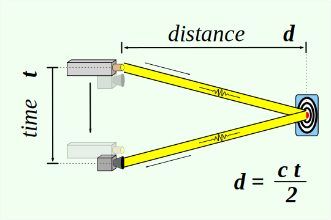
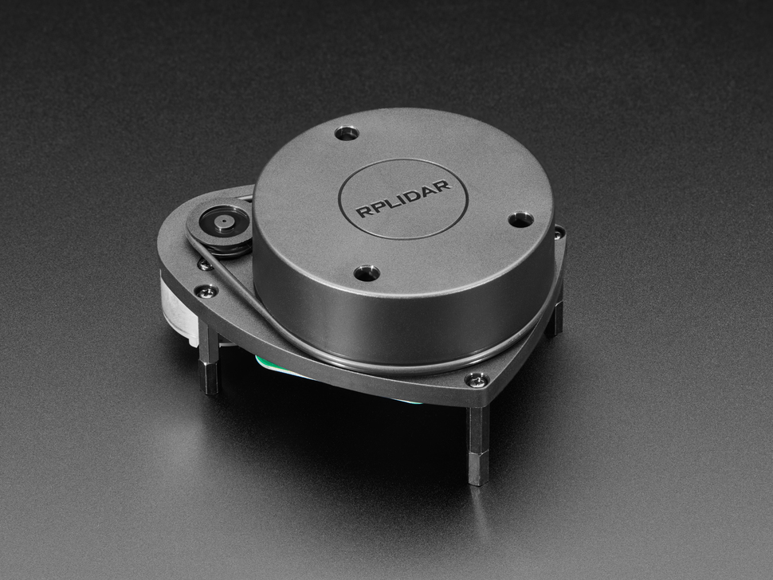
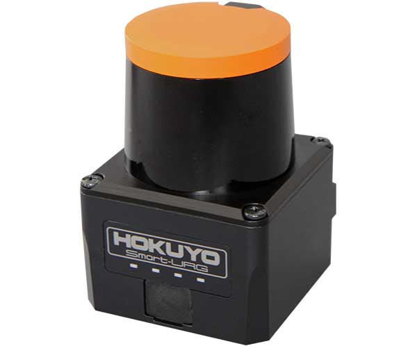
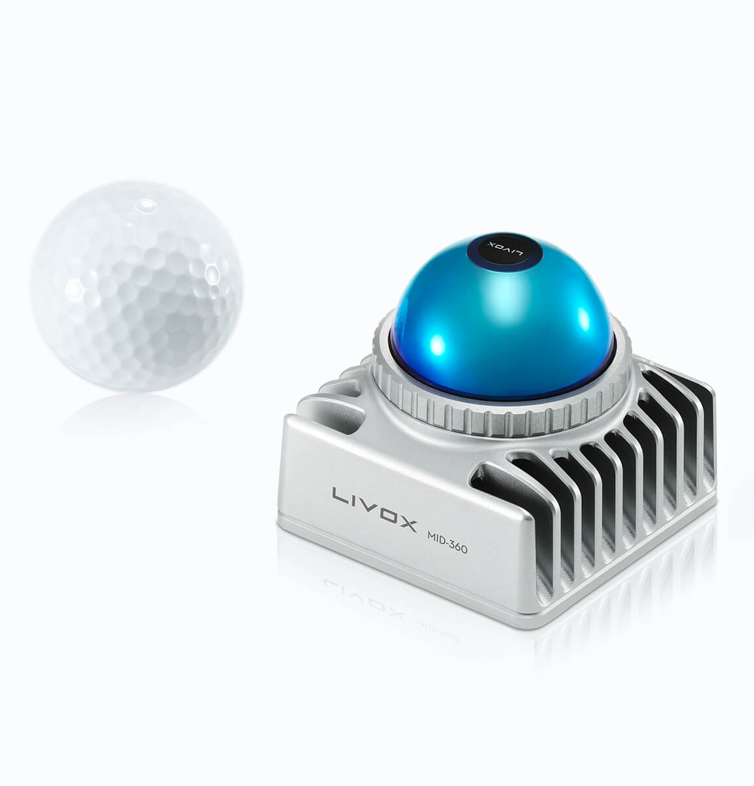
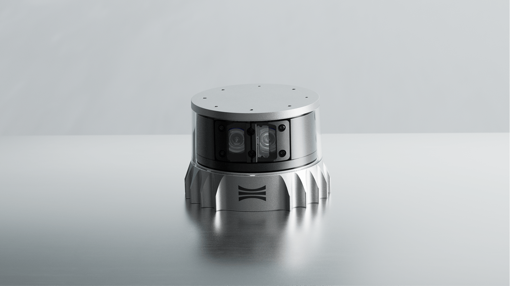
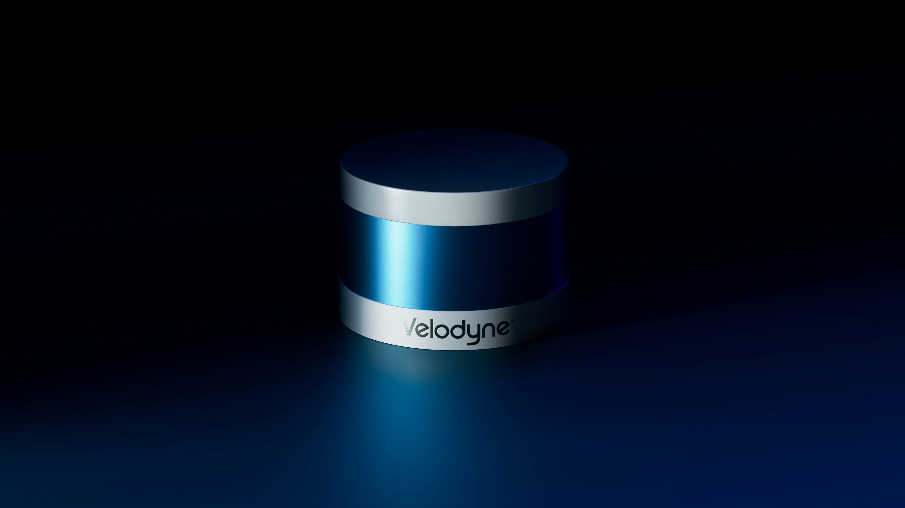
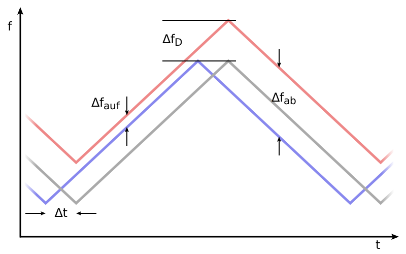

# Chapter 02 — LiDAR & Radar

**Time:** ~25 min
**Hardware:** Laptop only
**Prerequisites:** ROS2 course ch01–ch02

---

A $100 RPLidar and an $80,000 Velodyne both measure distance by timing a reflected pulse. The 800× price gap is almost entirely about how many pulses per second, how precisely you can time them, and how well the device behaves when it rains.

LiDAR fires light, radar fires radio waves. Both time the bounce, divide by twice the speed of the wave, and call the result distance. Light has a very short wavelength (≈905 nm typical for LiDAR), so you can tell two nearby objects apart by direction (good *angular resolution*) — but the beam is easily blocked by dust, rain, and fog. Radio waves are millimeter-to-centimeter wavelength (24–81 GHz for automotive radar), so they punch through weather but blur small objects together.

Everything below is variations on this theme — how many lasers, mechanical vs solid-state scanning, pulsed vs frequency-modulated continuous-wave (FMCW), 2D vs 3D.

---

## 2D Spinning LiDAR

**What it does.** Spins a single laser around a horizontal plane and returns a flat slice of distances around the robot.

**Senses.** Time-of-flight of an infrared laser pulse (or, on cheaper units, *laser triangulation* — measure the angle at which the reflection lands on a small sensor inside the unit, and convert that angle to distance via simple geometry).

**Input.** 5 V power; no trigger needed — the unit runs continuously on its own.

**Output.** A full 360° sweep of (angle, distance) pairs, 5–15 sweeps per second.

**Integration.**
- **Physical interface:** USB serial (most hobby units) or UART (Universal Asynchronous Receiver/Transmitter — the simple serial protocol microcontrollers use) + 5 V
- **ROS2:** `rplidar_ros` / `sllidar_ros2` → `sensor_msgs/LaserScan`; Hokuyo: `urg_node2` → `sensor_msgs/LaserScan`
- **Non-ROS:** vendor SDKs (Slamtec SDK, Hokuyo URG library); Python via `pyrplidar`

**Limitations to watch out for.**
- **Sunlight washout** — direct sun saturates the IR detector; outdoor performance drops sharply
- **Reflective and dark surfaces** — mirrors return weird angles; matte black foam absorbs the pulse and reads as "no return"
- **Glass and transparent obstacles** are mostly invisible — the laser goes through
- **Triangulation units (cheap A1/A2) lose accuracy past ~6 m**; ToF (time-of-flight) units (S2, C1) hold accuracy to 25–30 m but cost 3–4× more
- **2D only** — anything above or below the scan plane doesn't exist as far as the sensor is concerned. Stairs, tables, low-hanging cables: invisible.

**Representative products.**

 

| Product | Tier | Method | Range | Price (USD) | Pick when |
|---|---|---|---|---|---|
| [Slamtec RPLidar A1](https://www.slamtec.com/en/lidar/a1) | Hobby | Triangulation | 12 m | ~$99 | 2D SLAM on a $300 robot, don't care about >6 m accuracy |
| [Slamtec RPLidar A2M12](https://www.slamtec.com/en/lidar/a2) | Hobby+ | Triangulation | 12 m | ~$229 | A1 but quieter, thinner |
| [Slamtec RPLidar S2](https://www.slamtec.com/en/s2) | Prosumer | ToF | 30 m | ~$399 | Indoor + outdoor mixed, IP65, dark-surface detection |
| [Hokuyo URG-04LX](https://www.hokuyo-aut.jp/) | Prosumer | ToF | 4 m | ~$1,200 | Lab-grade reliability for indoor research robots |
| [Hokuyo UST-10LX](https://www.hokuyo-usa.com/products/lidar-obstacle-detection/ust-10lx) | Industrial | ToF | 10 m / 20 m | ~$2,000 | AGV (Automated Guided Vehicle) or AMR (Autonomous Mobile Robot) with safety requirements; 270° field of view (FoV), 0.25° angular resolution |

*Prices verified May 2026 from Slamtec, DFRobot, Hokuyo, and ROS Components.*

---

## 3D Spinning LiDAR

**What it does.** Stacks 16–128 lasers vertically and spins the whole array, producing a full 3D point cloud of the environment 10–20 times per second.

**Senses.** Time-of-flight of pulsed infrared lasers (typically 905 nm or 1550 nm).

**Input.** 12–24 V power, gigabit Ethernet for the data firehose, plus an optional GPS PPS (Pulse-Per-Second) pin that lets the LiDAR sync its timestamps to GPS time.

**Output.** A point cloud — millions of points per second. Each point has (x, y, z, intensity, ring, timestamp), where *intensity* is how strongly the return came back and *ring* tells you which of the stacked laser channels produced the point.

**Integration.**
- **Physical interface:** Ethernet (UDP packets), separate power
- **ROS2:** `velodyne_driver` (Velodyne), `ouster-ros` (Ouster), `livox_ros_driver2` (Livox) → `sensor_msgs/PointCloud2`
- **Non-ROS:** vendor SDKs (Ouster SDK in Python/C++, Velodyne PCAP tools), PCL (Point Cloud Library), Open3D — both are open-source libraries for working with 3D point clouds

**Limitations to watch out for.**
- **Cost.** Even the cheapest 3D units start around $1k; high-channel automotive units run $5k–80k+.
- **Rain, snow, fog, dust** — light scatters off airborne particles. The point cloud fills with phantom returns. Hardware filtering helps; perfect filtering doesn't exist.
- **Black cars and dark asphalt** — low return intensity → dropouts at long range. This is a real problem for autonomous driving stacks.
- **Mechanical wear** — the spinning unit has bearings. Lifetime is measured in years of continuous operation, not decades.
- **Vertical FoV (field of view) is narrow** (15°–90° depending on model). Don't expect to see the sky.
- **Motion compensation** matters at speed — the robot moves during one full revolution, so a naive point cloud comes out *skewed*. Drivers fix this if you feed them odometry (wheel-based motion estimate — see [Chapter 3](../ch03_imu_gnss_odom/README.md)) or IMU data. If you don't, your map will have a wobble during SLAM (Simultaneous Localization and Mapping — building a map while figuring out where you are in it).

### Why & how it works

A spinning LiDAR is just N copies of the 2D version, with the lasers angled at different vertical elevations. Each laser fires a pulse; a photodetector beside it captures the return. The time between fire and capture, multiplied by half the speed of light, is the distance for that pulse. Multiply by N lasers × spin rate × pulses-per-revolution and you get the point-cloud sample rate — easily a million points per second on a 32-channel unit.

The interesting design choice is wavelength. 905 nm uses cheap silicon detectors but is limited by eye-safety rules (you can only fire so much power before you risk damaging retinas). 1550 nm is invisible to the human eye and to silicon detectors — you need expensive InGaAs — but you can fire much more power, which means longer range. Automotive long-range units mostly use 1550 nm; everything else uses 905 nm.

**Representative products.**

  

| Product | Tier | Channels | Range | Price (USD) | Pick when |
|---|---|---|---|---|---|
| [Livox Mid-360](https://www.livoxtech.com/mid-360) | Prosumer | Hybrid solid-state, 360° H × 59° V | 40 m | ~$1,000 | 3D on a hobbyist budget, don't need highest density |
| [Ouster OS0](https://ouster.com/products/hardware/os0-lidar-sensor) | Industrial | 32–128 | 35 m, 90° V FoV | ~$8k–$15k | Indoor AMRs, low-speed AVs needing wide vertical FoV |
| [Ouster OS1](https://ouster.com/products/hardware/os1-lidar-sensor) | Industrial | 32–128 | 120–200 m | ~$10k–$24k | Workhorse for outdoor robots, mapping, security |
| [Velodyne VLP-16 (Puck)](https://ouster.com/products/hardware/vlp-16) | Industrial (legacy) | 16 | 100 m | ~$4k used / $8k new | Maintaining an existing stack; new builds use Ouster/Livox |
| [Hesai Pandar / AT128](https://www.hesaitech.com/) | Automotive | 128 | 200 m+ | ~$5k–$20k | AV development at scale |

*Prices verified May 2026. 3D LiDAR pricing varies wildly by channel count, distributor, and volume — these are order-of-magnitude.*

---

## Solid-State LiDAR

**What it does.** Same job as spinning LiDAR (3D point cloud), but with no moving parts — the beam is steered electronically.

**Senses.** Time-of-flight of pulsed lasers, just like the spinning variants.

**Input.** 12–24 V, Ethernet.

**Output.** `sensor_msgs/PointCloud2`, often with a *limited horizontal FoV* (e.g., 120°) rather than full 360°.

**Integration.**
- **Physical interface:** Ethernet, USB-C on some compact units
- **ROS2:** `livox_ros_driver2`, vendor-specific drivers (e.g., Aeva, Innoviz, Cepton publish their own)
- **Non-ROS:** vendor SDKs

**Limitations to watch out for.**
- **Narrow FoV** — most are forward-facing only. Full 360° coverage means stitching multiple units.
- **Beam-steering tech varies wildly** — three competing approaches: **MEMS mirrors** (Micro-Electro-Mechanical mirrors that tilt to redirect the laser; Innoviz, Cepton); **optical phased arrays** (no moving parts at all; Quanergy); **flash LiDAR** (illuminate the whole scene at once with one big pulse; Cepton flash, Continental). Each has different range, resolution, and cost trade-offs.
- **Still expensive** — solid-state isn't automatically cheaper than spinning. Volume drives price more than physics.
- **Newer tech, less battle-tested** — fewer years of field deployment, weirder failure modes, less mature ROS2 driver ecosystem.

**Pick when:** you need 3D and can't tolerate a spinning mechanism — drones with strict weight budgets, automotive integration into the body of a car, or operation in environments with vibration that would kill bearings.

---

## FMCW LiDAR

**What it does.** Instead of pulsing, transmits a continuous laser whose frequency ramps up and down. By measuring the frequency shift of the reflected light, the sensor recovers **distance and velocity simultaneously** via the Doppler effect (the same frequency shift you hear when an ambulance siren passes you — the pitch is higher coming toward you, lower moving away).

**Senses.** Frequency-modulated coherent light reflection.

**Input.** 12–24 V, Ethernet.

**Output.** Same `sensor_msgs/PointCloud2`, but with an extra per-point velocity field — often surfaced as a custom message or stored in the intensity channel by the driver.

**Integration.**
- **ROS2:** vendor-specific (Aeva, Aurora — automotive players); ecosystem still consolidating
- **Non-ROS:** vendor SDKs only

**Limitations to watch out for.**
- **Bleeding edge.** Few products, high cost ($10k+), limited driver maturity.
- **Coherent detection is fussy** — needs careful local-oscillator setup, sensitive to vibration.
- **Most useful at long range** — the velocity data is the killer feature for highway driving, less compelling for indoor robots.

**Pick when:** you're building a long-range automotive perception stack and per-point velocity is worth the cost. For most robotics work, pulsed time-of-flight is the right answer.

---

## Radar (mmWave / FMCW radar)

**What it does.** Same FMCW trick as FMCW LiDAR, but with millimeter-wave radio (typically 60 GHz or 76–81 GHz) instead of light. Returns distance, velocity, and (with multiple antennas) angle.

**Senses.** Reflection of frequency-modulated radio waves off conductive surfaces.

**Input.** 3.3–12 V, depending on module.

**Output.** A list of detected targets per frame, each with (range, velocity, angle, signal strength). Some chips also expose the raw radar data cube for custom processing.

**Integration.**
- **Physical interface:** UART / USB on developer boards; CAN bus (Controller Area Network — the standard automotive communication bus) on automotive units
- **ROS2:** `ti_mmwave_rospkg` (community port for TI chips); ecosystem is thinner than LiDAR
- **Non-ROS:** TI mmWave SDK, Infineon Radar SDK, manufacturer-specific tooling

**Limitations to watch out for.**
- **Poor angular resolution.** A typical automotive mmWave radar tells you "a thing is at 50 m, moving 20 m/s, somewhere in this 5° cone" — a cone of uncertainty roughly like a flashlight beam spreading out. That's much fuzzier than LiDAR.
- **Multipath and clutter** — radio bounces off everything. Returns from the ground, walls, and chain-link fences can swamp the target you care about.
- **Stationary objects vs moving objects** — Doppler-only filtering throws away stationary cars (a real Tesla-failure-mode for years). Modern radars track stationary too but it requires more processing.
- **Cross-interference** — many radars in the same area can blind each other. Becoming a real issue in dense automotive deployments.
- **Resolution improves with bandwidth** — 60 GHz / 77 GHz units are much better than older 24 GHz ones, but bandwidth is regulated and varies by country.

### Why & how it works (when it pays off)

The radar transmits a *chirp* — a sinusoidal signal whose frequency ramps linearly from, say, 77 to 81 GHz over a few hundred microseconds. The reflected chirp arrives delayed by the round-trip flight time. The transmitter mixes the outgoing and incoming chirps; the *difference frequency* (called the beat frequency) is proportional to the round-trip distance. An FFT over one chirp recovers range; an FFT across many chirps recovers Doppler velocity; phase differences across antenna arrays recover angle.

This is why radar gets distance, velocity, and direction "for free" from one continuous signal stream — at the cost of being mathematically denser than a LiDAR pulse-counter.

**Representative products.**

| Product | Tier | Frequency | Output | Price (USD) | Pick when |
|---|---|---|---|---|---|
| [TI IWR6843ISK](https://www.ti.com/tool/IWR6843ISK) | Dev kit | 60 GHz | Tracked objects via UART | ~$200 | Prototyping indoor presence/gesture/proximity radar |
| [TI AWR1843BOOST](https://www.ti.com/tool/AWR1843BOOST) | Dev kit | 77 GHz | Tracked objects + raw data | ~$350 | Automotive-band experiments, longer range |
| [Infineon BGT60TR13C (Position2Go)](https://www.infineon.com/) | Dev kit | 60 GHz | Doppler, presence | ~$200 | Compact integration, gesture-style apps |
| [Continental ARS548](https://www.continental.com/) | Automotive | 77 GHz | Full radar cube on CAN/Ethernet | ~$1k–$2k+ | Production automotive, ADAS development |
| [Smartmicro UMRR-96](https://www.smartmicro.com/) | Automotive | 79 GHz | Object list | ~$2k+ | High-resolution automotive radar |

*Prices verified May 2026. Radar pricing varies by region and volume — automotive units rarely have public pricing.*

---

## LiDAR + camera fusion

LiDAR knows *where* an obstacle is to centimeter accuracy. A camera knows *what* an obstacle is (car, pedestrian, leaf). Fusing them is the dominant approach in self-driving stacks:

1. Project the LiDAR point cloud into the camera image plane using calibrated *extrinsics* — the measured relative position and rotation between the two sensors
2. Run object detection in the image (YOLO / DETR / etc.)
3. Assign LiDAR points falling inside a 2D detection box to the detected object
4. Compute distance/velocity from the LiDAR cluster, class from the image

The hard part is **time synchronization and extrinsic calibration**. If the camera frame and LiDAR sweep are off by 50 ms while the car drives at 20 m/s, every detection is off by a meter. ROS2's `message_filters::ApproximateTime` helps; precise hardware sync helps more.

This isn't a chapter on fusion, but it's the reason every automotive stack has both sensors.

---

## How to choose

- **Indoor 2D mobile robot, hobbyist budget:** RPLidar A1 or C1. Good enough for SLAM up to ~6 m.
- **Indoor robot with dark obstacles or glass:** ToF unit (S2, Hokuyo URG-04LX). The triangulation units lie to you.
- **Outdoor low-speed robot (delivery, lawn, farm):** 3D LiDAR — Livox Mid-360 is the budget sweet spot, Ouster OS0/OS1 above that.
- **Autonomous vehicle development:** Ouster, Hesai, or Velodyne 64–128 channel. Plus radar for adverse weather.
- **Drone:** weight matters. Solid-state or compact spinning (Livox Mid-360 is 265 g).
- **Through-weather (rain, fog, dust):** add radar. LiDAR alone is fragile in bad weather.
- **Velocity matters more than spatial detail:** radar wins on cost and information density.
- **Indoor / short-range and you just need "is something there":** ultrasonic or IR ToF (covered in [Chapter 04](../ch04_proximity_contact/README.md)) is 10–100× cheaper than the smallest LiDAR.

---

## Going Deeper

- [Slamtec RPLidar product line](https://www.slamtec.com/en/lidar) — datasheets for A1/A2/C1/S2/S2L/S3
- [Ouster OS family overview](https://ouster.com/os-overview)
- [Livox Mid-360 specs](https://www.livoxtech.com/mid-360/specs)
- [Hokuyo industrial 2D LiDARs](https://www.hokuyo-aut.jp/)
- [TI mmWave radar SDK](https://www.ti.com/tool/MMWAVE-SDK)
- [Radar Tutorial — FMCW basics](https://www.radartutorial.eu/02.basics/Frequency%20Modulated%20Continuous%20Wave%20Radar.en.html)
- [Why is chirp used in radar?](https://resources.system-analysis.cadence.com/blog/why-is-chirp-used-in-radar)
- [Mainstreet Autonomy — All about automotive lidar (2025)](https://mainstreetautonomy.com/blog/2025-08-29-all-about-automotive-lidar/) — the best single overview of automotive LiDAR trade-offs

https://www.youtube.com/watch?v=EYbhNSUnIdU

(Above: Real Engineering — "How LiDAR works", great primer on the physics)
