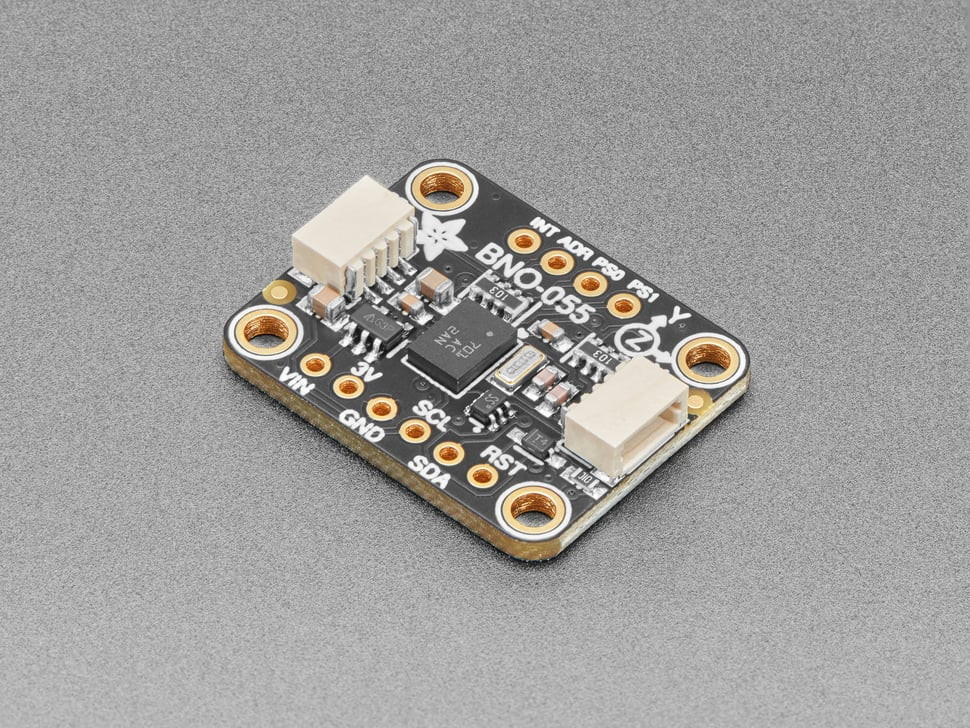
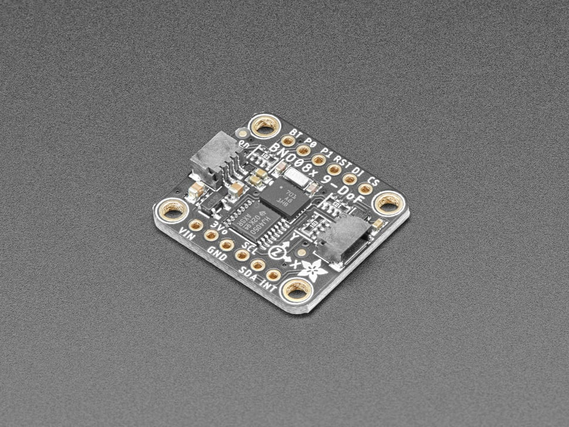
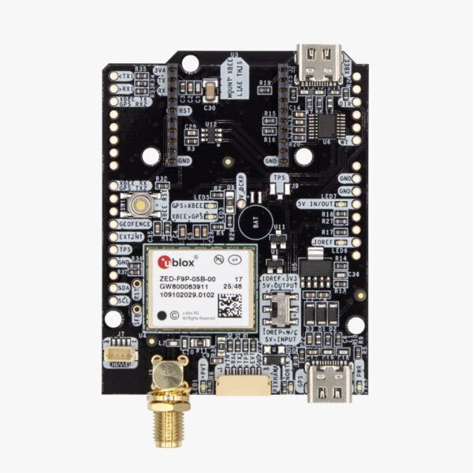

# Chapter 03 — IMU, GNSS & Wheel Odometry

**Time:** ~25 min
**Hardware:** Laptop only
**Prerequisites:** ROS2 course ch01–ch02

---

The three sensors in this chapter share one job: tell you where the robot is and how it's moving. They all do it badly — but each fails in a *different* way, which is exactly why they get *fused* (combined into one better estimate).

Two terms used throughout the chapter:
- **Dead reckoning** — estimating your position by accumulating step-by-step motion (velocity, heading) without any external reference. Errors only ever grow; they never self-correct.
- **Drift** — the slow accumulation of error in a dead-reckoning estimate.

How the three sensors drift:

- **IMU** drifts in time. Stand still and the estimated heading will slowly walk away from reality.
- **GNSS** (Global Navigation Satellite System — GPS and its non-US equivalents) drifts in space. Your antenna gets confused by buildings, trees, and clouds; the position skitters around the true location.
- **Wheel odometry** drifts when wheels slip. A skid for one second on a polished floor adds a permanent error to your position estimate.

The trick of every robot localization stack is to combine them so each sensor's strengths cover the others' weaknesses. The end of the chapter explains that fusion at the right level — no Kalman filter math, just the intuition.

---

## Inertial Measurement Unit (IMU)

Reports acceleration (m/s²) and angular rate (rad/s) in three axes at 100–1000 Hz, plus magnetic field on a 9-axis ("9-DoF") unit. Many modern chips also fuse the streams on-chip and output orientation directly as a quaternion. Outputs `sensor_msgs/Imu` and `sensor_msgs/MagneticField`. Drivers: `bno055`, `ros2_mpu6050_driver`, `xsens_mti_ros2_driver`.

A 6-axis IMU measures three perpendicular linear axes (X, Y, Z) and three rotational axes (roll, pitch, yaw); a 9-axis adds three magnetometer axes for absolute heading.

**Limitations.**
- **Gyro drift.** Integrating the rate of rotation gives orientation — and any small constant error (*bias*) in the reading becomes unbounded heading drift over time. Hobby chips drift 1–10°/min stationary; industrial units drift <0.1°/hour.
- **Accel double-integration is catastrophic.** Position from acceleration alone diverges in seconds. Never use accel alone for position.
- **Magnetometer interference.** Anything ferrous (motors, speakers, steel-reinforced floors) warps the local field; indoor heading is often unreliable.
- **Temperature sensitivity.** Bias shifts with temperature. Industrial IMUs have calibration tables; hobby units don't.
- **"9-DoF" doesn't mean "9 reliable degrees."** The mag axis is much worse than accel and gyro indoors.

**Representative products.**

 

| Product | Tier | DoF | Fusion | Price (USD) | Pick when |
|---|---|---|---|---|---|
| [InvenSense MPU6050](https://invensense.tdk.com/products/motion-tracking/6-axis/mpu-6050/) | Hobby | 6 (no mag) | None | ~$3 (chip), ~$10 breakout | You want the cheapest IMU and will fuse externally |
| [Bosch BNO055](https://www.bosch-sensortec.com/products/smart-sensor-systems/bno055/) | Hobby+ | 9 | On-chip quaternion fusion | ~$25 (Adafruit breakout) | Plug-and-play orientation without writing a filter |
| [Bosch BNO085](https://www.adafruit.com/product/4754) | Hobby+ | 9 | On-chip + better algorithms | ~$25 | BNO055 but more accurate; newer chip |
| [InvenSense ICM-20948](https://invensense.tdk.com/products/motion-tracking/9-axis/icm-20948/) | Hobby+ | 9 | Optional DMP firmware | ~$15 (Adafruit breakout) | Hackable; lots of community support |
| [Xsens MTi-630](https://www.xsens.com/products/sensor-modules/xsens-mti-600-series-flexible-reliable-imus-for-all-design-needs) | Industrial | 9 + on-chip fusion (AHRS) | Factory-calibrated | ~$1,500–$3,000 | Robot needs 0.2° pitch/roll accuracy and you trust the heading indoors |
| [VectorNav VN-100](https://www.vectornav.com/products/detail/vn-100) | Industrial | 9 + AHRS | Factory-calibrated | ~$800–$1,500 | Drone or marine vehicle; rugged casing |

*Prices verified May 2026 from Adafruit, Mouser, DigiKey, Xsens, VectorNav.*

---

## GNSS / GPS

Reports the antenna's (latitude, longitude, altitude) by triangulating from 4+ satellites. Outputs `sensor_msgs/NavSatFix`. Drivers: `nmea_navsat_driver` for any NMEA receiver, `ublox_gps` for u-blox modules.

Two flavors:
- **Standard GNSS** — ±2–5 m, 1–10 Hz.
- **RTK GNSS** — ±2 cm, but only with a nearby base station or an NTRIP correction service (an internet stream of corrections from a known-location base).

**Limitations.**
- **No indoor coverage.** Walls block GHz signals.
- **Urban canyons.** Tall buildings reflect signals (*multipath*) — position skitters by 10–50 m.
- **Tree cover, weather.** Forests cut accuracy 2–5×.
- **Cold start.** First fix from power-on can take 30 s to several minutes.
- **RTK needs a base station.** A standalone "RTK rover" with no base is just a normal receiver.
- **Antenna placement.** A patch antenna under your robot's metal chassis sees 30% of the sky and performs accordingly.
- **GPS time ≠ wall-clock time.** GPS has its own epoch; your computer uses UTC. The two are usually a few seconds apart — careful when fusing timestamps.

**Representative products.**

| Product | Tier | Accuracy | Constellations | Price (USD) | Pick when |
|---|---|---|---|---|---|
| [u-blox NEO-M9N](https://www.u-blox.com/en/product/neo-m9n-module) | Hobby | ~2 m | GPS+GLONASS+Galileo+BeiDou | ~$70 (SparkFun board) | Outdoor robot, ±2 m good enough |
| [u-blox ZED-F9P](https://www.u-blox.com/en/product/zed-f9p-module) | Prosumer | ~2 cm with RTK | Multi-band, multi-constellation | ~$200 (chip), ~$300 (Ardusimple board) | You need cm-level outdoor positioning |
| [Ardusimple simpleRTK2B](https://www.ardusimple.com/product/simplertk2b/) | Prosumer | ~2 cm with RTK | F9P-based | ~$300 | Ready-to-use RTK board with helpful tooling |
| [Emlid Reach M2](https://emlid.com/reach/) | Prosumer | ~2 cm with RTK | Multi-band | ~$1,000 | Drone surveying, photogrammetry |
| [Septentrio AsteRx-i3](https://www.septentrio.com/) | Industrial | mm + integrated INS | All bands | ~$5k–$15k | Survey-grade or autonomous vehicle navigation |

*Prices verified May 2026 from SparkFun, Ardusimple, Emlid.*

---

## Wheel odometry

Counts wheel rotations (via encoders on the motor shaft) and converts them to estimated robot pose (x, y, θ) using the platform's kinematic model. Outputs `nav_msgs/Odometry` plus the `odom` → `base_link` TF — published by the motor controller node (`ros2_control` diff-drive controller, `roboclaw_driver`, etc.). Effectively free if you already have wheels and encoders.

**Limitations.**
- **Wheel slip.** Polished floors, gravel, tight turns, sudden acceleration — anything that breaks tire-to-ground contact adds permanent error.
- **Wheel diameter drift.** Tire wear and inflation change effective diameter by a few percent; miles of driving turn into meters of error.
- **Differential-drive yaw error.** A 1% wheel-circumference mismatch causes ~6° of heading error per meter. Calibrate.
- **No absolute reference.** Pure dead reckoning. Errors only grow — they never self-correct.
- **It's 2D only.** If the robot pitches over a bump, the planar projection of motion is wrong.

---

## How they fuse

Each sensor fails differently — IMU drifts in time (seconds for position, minutes for heading), GNSS skitters in space (multipath, geometry), wheel odom accumulates error with distance. The standard combine is an **Extended Kalman Filter (EKF)** — an algorithm that maintains a best-guess state plus uncertainty and updates both whenever a new measurement arrives.

The shape:
1. **Predict** the next state from IMU + wheel odom (fast, low-latency)
2. **Correct** with GNSS when it arrives (slow, but absolute)
3. Repeat at 50–200 Hz

In ROS2 this is almost always [`robot_localization`](http://docs.ros.org/en/noetic/api/robot_localization/html/) — a community-maintained EKF/UKF node. Wire `sensor_msgs/Imu`, `nav_msgs/Odometry`, `sensor_msgs/NavSatFix` into it; get a fused `nav_msgs/Odometry` out. Configure with a YAML matrix saying which input fields to trust.

The two output frames:
- **`odom` → `base_link`** — continuous and smooth, drifts over hours. Use for control loops.
- **`map` → `odom`** — corrected by absolute references; jumps when corrections arrive. Use for navigation goals.

This is the standard ROS2 convention (REP-105).

---

## Going Deeper

- [`robot_localization` documentation](https://docs.ros.org/en/noetic/api/robot_localization/html/) — the canonical ROS2 fusion node
- [REP-105 — Coordinate Frames for Mobile Platforms](https://www.ros.org/reps/rep-0105.html) — the `map`/`odom`/`base_link` convention
- [u-blox ZED-F9P integration manual](https://content.u-blox.com/sites/default/files/ZED-F9P_IntegrationManual_UBX-18010802.pdf) — surprisingly readable RTK reference
- [Xsens MTi product selector](https://www.xsens.com/sensor-modules/xsens-mti-product-selector)
- [Madgwick filter paper (2010)](https://www.x-io.co.uk/res/doc/madgwick_internal_report.pdf) — the most-cited IMU fusion algorithm
- [Probabilistic Robotics — Thrun, Burgard, Fox](http://www.probabilistic-robotics.org/) — the textbook for the EKF math when you want to go deeper
- [SparkFun GPS tutorial](https://learn.sparkfun.com/tutorials/gps-basics) — accessible intro to how GPS actually works

https://www.youtube.com/watch?v=eqZgxR6eRjo

(Above: 3Blue1Brown-style intuition for Kalman filtering — the math without the trauma)
