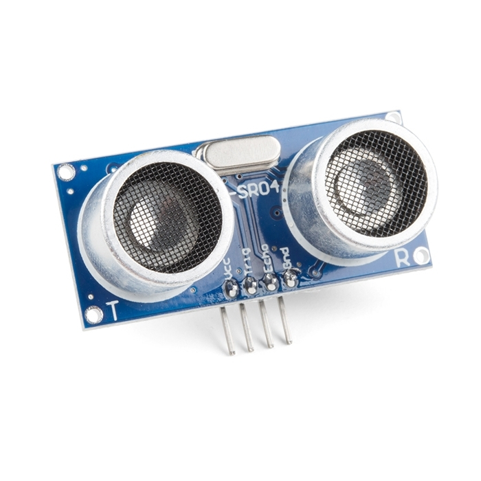
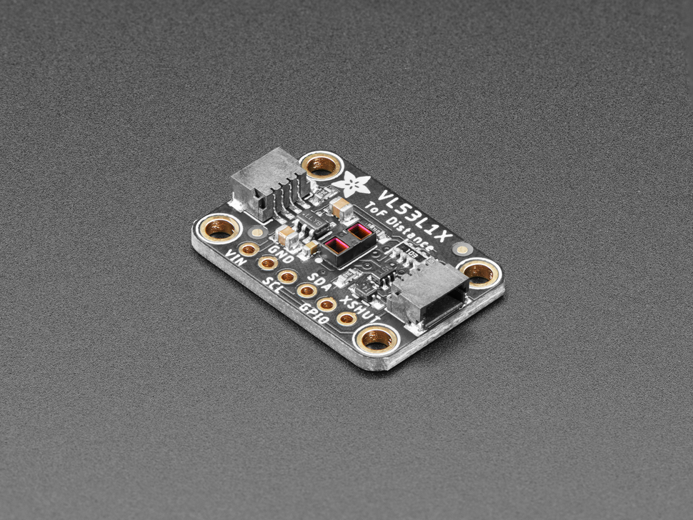
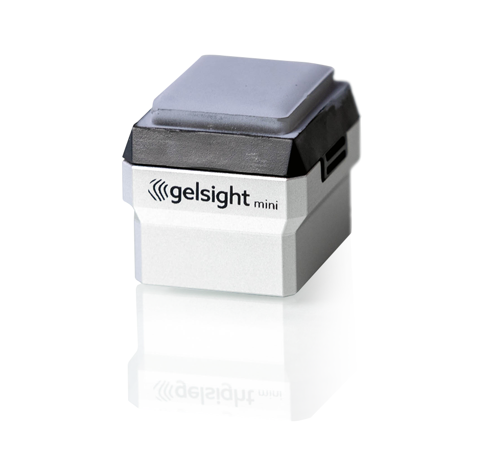

# Chapter 04 — Proximity & Contact

**Time:** ~20 min
**Hardware:** Laptop only
**Prerequisites:** ROS2 course ch01–ch02

---

The iRobot Roomba navigates a house using mostly bump switches and IR cliff detectors. Tens of millions of them are sold. You don't always need a LiDAR — sometimes you just need to know "did I hit something" or "is something within arm's reach."

This chapter covers the *close-range* family: sensors that work within a couple of meters, often within a few centimeters. They're cheap, simple, and they fill the gaps that depth cameras and LiDAR leave behind — especially for safety, grasping, and contact.

---

## Ultrasonic distance sensor

**What it does.** Emits a *chirp* (a short burst of sound, ~40 kHz — above human hearing), times the echo, returns distance.

**Senses.** Time-of-flight of an ultrasonic pulse off the nearest reflective surface in a cone (~15–30° wide).

**Input.** 5 V power, a trigger pulse, an echo pin to time.

**Output.** A single distance reading (0.02–4 m typical) at up to ~20 Hz.

**Integration.**
- **Physical interface:** GPIO (General Purpose Input/Output — a digital pin on the host microcontroller). One GPIO pin sends a 10 μs trigger pulse to start a measurement; another receives the echo — staying high for a duration proportional to distance (~58 μs per cm one-way). Smarter modules expose the result over I2C instead.
- **ROS2:** `ros2_hcsr04`, generic GPIO-driven nodes → `sensor_msgs/Range`
- **Non-ROS:** Trivial: `pigpio` / `RPi.GPIO` on Pi, NewPing on Arduino. Often handled in firmware and exposed via UART/I2C.

**Limitations to watch out for.**
- **Wide cone, no resolution.** It can tell you *something* is in front, not *where* in the cone. Two objects in the cone → reading is the nearer one.
- **Soft surfaces absorb sound** (curtains, foam) and return nothing.
- **Glancing angles miss.** A flat wall at a steep angle reflects sound away from the sensor.
- **Min range floor.** Below ~2 cm, the echo arrives before the speaker element has stopped vibrating, so the sensor can't hear it. Blind zone.
- **Multiple sensors interfere.** Two HC-SR04s firing simultaneously hear each other's echoes. Schedule them so only one fires at a time.
- **Temperature affects speed of sound** (~0.18% per °C). Doesn't matter for indoor robots; matters for high-precision use.

**Representative products.**

| Product | Tier | Range | Price (USD) | Pick when |
|---|---|---|---|---|
| [HC-SR04](https://www.sparkfun.com/ultrasonic-distance-sensor-hc-sr04.html) | Hobby | 0.02–4 m | ~$4 | Cheapest possible "did I hit a wall" sensor |
| [MaxBotix MB7389](https://maxbotix.com/) | Prosumer | 0.3–7.65 m | ~$100 | Outdoor use, weatherproof |
| [SRF08 / SRF10](https://www.robot-electronics.co.uk/) | Hobby+ | 0.03–6 m | ~$30 | I2C, on-board temperature comp, cleaner data |

*Prices verified May 2026.*

---

## IR time-of-flight distance sensor

**What it does.** Same as an ultrasonic but uses an infrared laser pulse instead of sound. Much faster, much narrower beam, much higher accuracy at short range.

**Senses.** Time-of-flight of a class-1 laser pulse (typically 940 nm).

**Input.** 3.3 V via I2C, optional external interrupt for "measurement ready."

**Output.** Distance in mm at 10–100 Hz. Newer multizone variants (VL53L5CX) return an 8×8 grid of distances — a tiny depth image.

**Integration.**
- **Physical interface:** I2C
- **ROS2:** Generic I2C nodes; `vl53l1x_ros2`; `pololu_ros` for multizone → `sensor_msgs/Range` or `sensor_msgs/Image` for multizone
- **Non-ROS:** ST VL53L1X driver in C; Adafruit CircuitPython library; Pololu library

**Limitations to watch out for.**
- **Outdoor performance limited.** Direct sunlight reduces range; works fine in shade.
- **Dark / matte surfaces** absorb the laser pulse — reduced range.
- **Range cap ~4 m.** Beyond that you're in 2D LiDAR territory.
- **One reading per ping.** Doesn't see "what's behind the first object."

**Representative products.**

| Product | Tier | Range | Beam | Price (USD) | Pick when |
|---|---|---|---|---|---|
| [Sharp GP2Y0A21](https://global.sharp/products/device/lineup/selection/opto/haca/index.html) | Hobby (analog) | 0.1–0.8 m | Narrow | ~$10 | Cheap analog distance; legacy hobby projects |
| [ST VL53L0X](https://www.adafruit.com/product/3317) | Hobby | 0.03–1 m | Narrow | ~$15 (breakout) | Tiny package, I2C |
| [ST VL53L1X](https://www.adafruit.com/product/3967) | Hobby+ | 0.03–4 m | Narrow | ~$15 (breakout) | Longer range, programmable region-of-interest |
| [ST VL53L5CX](https://www.pololu.com/product/3417) | Prosumer | 0.02–4 m | 8×8 grid | ~$25 (breakout) | "Mini depth camera" for cheap |
| [Garmin LIDAR-Lite v3HP](https://www.garmin.com/en-US/p/557294) | Prosumer | 0.05–40 m | Narrow | ~$140 | Long-range pinpoint distance, drone altimetry |

*Prices verified May 2026.*

---

## Bump switches and contact sensors

**What it does.** A mechanical switch closes when something hits it.

**Senses.** Mechanical force above a threshold.

**Output.** Binary digital signal — 0 or 1.

**Integration.**
- **Physical interface:** GPIO digital input, pulled up or down
- **ROS2:** Any GPIO node; `joy` (treat as a button input) → `sensor_msgs/Joy` or custom Bool topic
- **Non-ROS:** Single digital read; one line of firmware.

**Limitations to watch out for.**
- **Bouncing.** Mechanical switches chatter open-and-closed for a few milliseconds on contact. *Debounce* — ignore the rapid changes in software (or with a small hardware filter) for the first 10–20 ms after each transition.
- **Binary only.** Yes/no, no force value.
- **Coverage gaps.** A switch only detects contact at the switch itself. Most robots use a bumper *skirt* with multiple switches.

**Pick when:** safety-critical "did I crash" detection. Backup to any other obstacle sensor. The Roomba's whole worldview.

---

## Force-torque sensors (F/T)

**What it does.** Measures forces and torques along all 6 axes (3 linear + 3 rotational). Used at robot wrists and on grippers.

**Senses.** Tiny deflections in carefully-designed *flexures* (metal beams that bend slightly under load), measured by *strain gauges* (sensors whose electrical resistance changes when they're stretched).

**Input.** Power (typically 24 V), Ethernet or CAN bus (Controller Area Network — the standard automotive / industrial communication bus), mechanical mount.

**Output.** Six floats — Fx, Fy, Fz, Tx, Ty, Tz — at 100–1000 Hz.

**Integration.**
- **Physical interface:** Ethernet (most ATI sensors), CAN, EtherCAT for fast control
- **ROS2:** `ati_force_torque_sensor_driver`, `robotiq_ft_sensor` → `geometry_msgs/WrenchStamped`
- **Non-ROS:** ATI NetFT API, Robotiq SDK

**Limitations to watch out for.**
- **Cost.** Industrial F/T sensors start at ~$2,000 and go to $15,000+. There is no $50 version that works well.
- **Drift with temperature.** All strain-gauge sensors have temperature coefficients; serious applications re-zero periodically.
- **Crosstalk.** Forces along one axis bleed into reported torques about other axes. Calibration matrices help.
- **Overload damages.** Mechanical flexures plastically deform if hit hard enough. Always specify with margin.
- **Sensor noise dominates at small forces.** Detecting <0.1 N reliably is hard.

### Cheap alternative: motor-current sensing

Industrial F/T sensors are precise but expensive. A common cheap substitute on smart actuators (Dynamixel servos, ODrive) is to **estimate torque from motor current**. Each motor has a *torque constant* — a number specific to the motor that says how many newton-meters of torque you get per amp of current. Multiplying current × torque constant gives an estimate of output torque. It's much noisier than a real F/T sensor, ignores friction and inertia, but it's effectively free if you already have the servo.

**Representative products.**

| Product | Tier | Range | Accuracy | Price (USD) | Pick when |
|---|---|---|---|---|---|
| [Robotiq FT 300-S](https://robotiq.com/products/ft-300-force-torque-sensor) | Cobot (collaborative robot) integration | ±300 N | ~0.5% of full scale | ~$3,000–$5,000 | Universal Robots / collaborative-robot cell, plug-and-play |
| [ATI Mini40 / Nano17](https://www.ati-ia.com/products/ft/) | Research | ±40 N / ±17 N | High | ~$5,000–$10,000 | Research-grade precision, small form factor |
| [Bota Systems Medusa](https://www.botasys.com/) | Research | ±100–500 N | High | ~$3,000–$6,000 | Lightweight, modern alternative to ATI |
| Motor current sensing | Hobby/cheap | varies | very rough | "free" with servo | Hobby manipulation, cost-sensitive grippers |

*Prices verified May 2026; F/T sensor pricing rarely public — figures are typical quotes.*

---

## Tactile sensors

**What it does.** Detects contact distribution and (sometimes) *shear forces* — forces along the surface (sliding) rather than just pressing into it — across a surface, like skin.

**Senses.** Varies: optical (camera looking at a deformable gel), capacitive (electrode arrays), piezoresistive (pressure-sensitive ink), MEMS.

**Output.** A 2D map of contact pressure (and on optical sensors, surface texture / slip detection). Often a custom message type per vendor.

**Integration.**
- **Physical interface:** USB (GelSight, DIGIT), I2C / SPI (capacitive arrays)
- **ROS2:** `gelsight_ros` (community), vendor-specific packages; sometimes published as `sensor_msgs/Image` for optical tactile
- **Non-ROS:** GelSight SDK, PyTouch (Meta's tactile library — works with DIGIT)

**Limitations to watch out for.**
- **Optical tactile sensors are bulky.** GelSight Mini is the size of a fingertip plus a camera; doesn't fit everywhere.
- **Wear and tear.** Gel surfaces scratch and degrade; replacement parts cost real money.
- **Data is hard to use.** A 320×240 tactile image is huge; most code wants a few summary statistics — contact area, *centroid* (the center point of the contact patch), and *normal force* (the perpendicular pressing force).
- **Limited standards.** No universal "tactile msg" yet; every vendor has their own format.
- **Sim-to-real gap.** Tactile simulation is much less mature than visual or LiDAR sim.

**Representative products.**

| Product | Tier | Tech | Output | Price (USD) | Pick when |
|---|---|---|---|---|---|
| [GelSight Mini](https://www.gelsight.com/gelsightmini/) | Research | Optical (camera + gel) | Tactile image | ~$500 | Out-of-the-box optical tactile for grasping research |
| [Meta DIGIT](https://www.gelsight.com/product/digit-tactile-sensor/) | Research / open | Optical (open-source) | Tactile image | ~$300 (DIY) | Open hardware, research-friendly |
| [BioTac (Syntouch)](https://www.syntouchinc.com/) | Research (legacy) | Capacitive + thermal + vibration | Multi-modal | ~$3,000+ | Discontinued but ubiquitous in older grasping papers |
| Resistive pressure mats (e.g., Velostat) | Hobby | Piezoresistive | Pressure array | <$50 DIY | Cheap pressure mapping for prototypes |

*Prices verified May 2026.*

---

## How to choose

- **"Did I hit a wall?":** bump switches. Free, instant.
- **Cheap forward-distance for a small robot:** ultrasonic (HC-SR04). $4 and good enough.
- **More accurate short-range distance:** IR ToF (VL53L1X). $15 and 10× the accuracy.
- **Cliff / edge detection on a vacuum-style robot:** downward-pointing IR ToF.
- **Multi-zone "is something close in any direction":** ring of VL53L5CX or VL53L1Xs.
- **Robot arm doing assembly:** F/T sensor at the wrist (Robotiq if on a cobot; ATI if precision matters).
- **Slip detection or texture-sensitive grasping:** optical tactile (GelSight, DIGIT).
- **Hobby gripper feedback on a budget:** motor-current sensing on smart servos.
- **Don't reach for these when you really need 360° awareness** — that's LiDAR's job.

---

## Going Deeper

- [ST VL53L1X datasheet](https://www.st.com/en/imaging-and-photonics-solutions/vl53l1x.html)
- [Robotiq FT 300-S product page](https://robotiq.com/products/ft-300-force-torque-sensor)
- [ATI Industrial Automation F/T overview](https://www.ati-ia.com/products/ft/)
- [GelSight Mini documentation](https://www.gelsight.com/gelsightmini/)
- [Meta AI DIGIT sensor](https://digit.ml/) — open hardware tactile sensor
- [PyTouch library](https://github.com/facebookresearch/PyTouch) — tactile ML toolkit
- [Mason — *Mechanics of Robotic Manipulation*](https://mitpress.mit.edu/9780262133968/mechanics-of-robotic-manipulation/) — the standard reference for contact in manipulation
