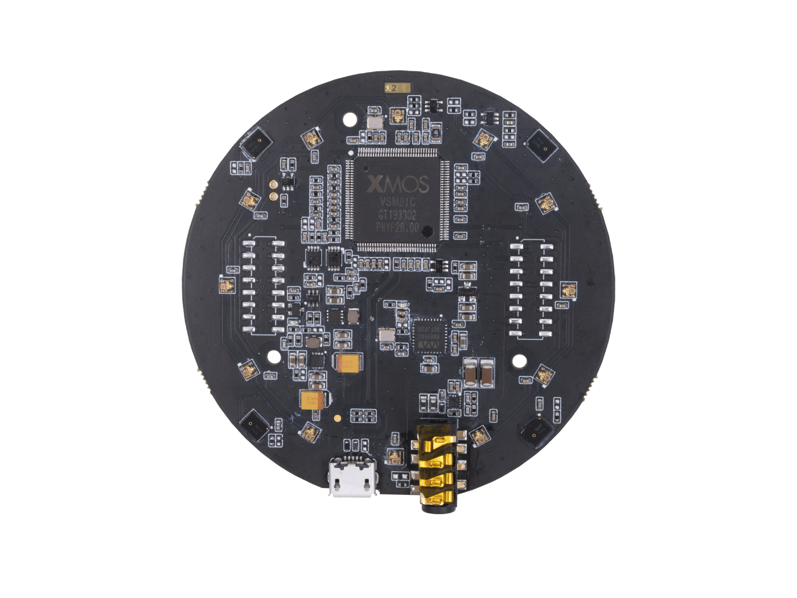

# Chapter 05 — Audio

**Time:** ~15 min
**Hardware:** Laptop only
**Prerequisites:** ROS2 course ch01–ch02

---

A single microphone is a device that converts sound (air pressure changes) into a varying electrical voltage. A microphone *array* is something qualitatively different — multiple microphones spaced at known distances. Software uses the tiny differences in when a sound reaches each microphone to compute *where* the sound is coming from. That trick — beamforming — is why Alexa works in a noisy kitchen and why a robot can follow voice commands from across a room.

Audio is a smaller part of robotics than cameras or LiDAR, but it's the natural interface for human-robot interaction and a useful sensor for anomaly detection in industrial settings.

---

## Single microphone

**What it does.** Converts sound-pressure waves in air into a time-varying electrical signal.

**Senses.** Air pressure fluctuations (sound) — typically across the audible band (20 Hz–20 kHz) for human-targeted applications, sometimes ultrasonic (above 20 kHz) for industrial use.

**Input.** Power (1.5–5 V for *electret* mics — the classic small analog capsule; 3.3 V for *MEMS* — micro-fabricated digital mics). Analog electret mics need a bias resistor — a single resistor that supplies the mic capsule with current. Digital MEMS mics over I2S (Inter-IC Sound — a 3-wire digital audio protocol) need no extra setup.

**Output.** A stream of audio samples at 16, 44.1, or 48 kHz (sometimes higher), 16 or 24 bits per sample. Mono.

**Integration.**
- **Physical interface:** Analog (electret — needs an ADC, an Analog-to-Digital Converter on the host), I2S (digital MEMS, common on Pi-class boards), USB (a "USB sound card" mic — plug-and-play on any host)
- **ROS2:** `audio_common` package (and its ROS2 ports) → `audio_common_msgs/AudioData`. Or capture with PulseAudio / PortAudio and publish raw arrays.
- **Non-ROS:** PortAudio, PyAudio, sounddevice (Python), GStreamer, FFmpeg, ALSA on Linux

**Limitations to watch out for.**
- **Single mic has no direction info.** A wall clock at your 9 o'clock and a refrigerator at your 3 o'clock are indistinguishable from one stream of samples.
- **Acoustic environment matters more than the mic.** A $5 mic in a quiet room beats a $500 mic in a fan-noise lab.
- **Sample-rate matching.** If your speech recognizer expects 16 kHz and your capture is at 48 kHz, you must resample.
- **Latency** for real-time feedback (echo cancellation, voice activity detection) is hard to drive below 50 ms without OS tuning.
- **Compression eats high-frequency detail.** If you're shipping audio over a network, the *codec* (the algorithm that compresses and decompresses audio) matters. Opus and PCM (Pulse-Code Modulation — uncompressed raw samples) are robot-friendly; MP3 is too lossy for speech recognition.

**Representative products.**

| Product | Tier | Interface | Output | Price (USD) | Pick when |
|---|---|---|---|---|---|
| [Electret + MAX9814 amp board](https://www.adafruit.com/product/1713) | Hobby | Analog (needs ADC) | Mono analog | ~$8 | Cheapest audio capture on any MCU |
| [ICS-43434 / SPH0645 I2S MEMS](https://www.adafruit.com/product/3421) | Hobby | I2S | Mono digital | ~$7 | Digital audio on Pi / ESP32, no analog noise |
| [Generic USB conference mic](https://www.amazon.com/) | Plug-and-play | USB Audio Class (UAC) | Mono digital | ~$20–$50 | Quickest path on a laptop / Jetson host |
| [Røde NT-USB Mini](https://rode.com/en/microphones/usb/nt-usb-mini) | Prosumer | USB | Studio-quality | ~$100 | Voice quality matters (assistant demos, recording) |

*Prices verified May 2026.*

---

## Microphone array

**What it does.** Multiple microphones placed at known relative positions. Software combines their signals to determine the *direction of arrival* (DoA) of a sound, and (with beamforming) to enhance audio from one direction while suppressing others.

**Senses.** Sound, plus the tiny time-of-arrival differences (microseconds) between mics that imply geometry.

**Input.** USB power; an on-board DSP (Digital Signal Processor — a small chip specialized for real-time audio math) handles the heavy lifting.

**Output.**
- A processed mono audio stream (the "beamformed" signal pointing at the strongest source)
- DoA estimate: an angle (0–360°) where the sound is coming from
- Voice-activity-detection (VAD) signal: is anyone talking right now?
- Sometimes per-channel raw audio if you want to do your own processing

**Integration.**
- **Physical interface:** USB-C on most consumer arrays; I2S on bare-board arrays
- **ROS2:** `respeaker_ros` → custom topics for DoA, VAD, beamformed audio
- **Non-ROS:** vendor SDKs (XMOS for ReSpeaker), PyAudio for raw capture, ODAS (open-source DoA library) for roll-your-own

**Limitations to watch out for.**
- **Acoustic reverb breaks DoA.** Hard walls bounce sound; the array hears reflections as if from a different direction. Carpeted rooms behave much better than echoey halls.
- **Wind noise** (drones, outdoor robots) overwhelms speech.
- **Distance trade-off.** Beyond ~5 m, even good arrays struggle with conversational speech in noise.
- **Multiple simultaneous speakers** are still hard. Single-speaker beamforming is mature; cocktail-party speaker separation isn't.
- **Vendor lock-in.** ReSpeaker is the only widely-supported array in ROS2. Other vendors require writing your own driver.
- **Far-field mics** — mics tuned to pick up speech from across a room rather than up close — **are tuned for voice (300 Hz–8 kHz).** Don't expect music-quality fidelity.

### Why & how it works

When a sound source is off to your right, a sound wave reaches your right ear ~600 μs before your left ear (the distance between your two ears, ~20 cm, divided by the speed of sound, 343 m/s). A mic array does the same trick: pick up the same waveform on N microphones at slightly different times, slide the recordings against each other to find the time offset (*cross-correlation*), and infer the angle of arrival.

**Beamforming** flips it around: shift each microphone's signal in time, then add them all together. Signals from a chosen direction line up and add up (*constructive interference*); signals from other directions arrive at different relative offsets and cancel each other out (*destructive interference*). The result is a virtual "directional microphone" you can electronically steer toward whoever's talking.

Modern array chips (XMOS XVF3000, Cirrus DSPs) bundle all of this — DoA, beamforming, echo cancellation, noise suppression — into a sealed package that exposes one cleaned mono stream and a direction estimate. You generally don't write the algorithms; you read the output.

**Representative products.**

| Product | Tier | Mics | DoA range | Price (USD) | Pick when |
|---|---|---|---|---|---|
| [ReSpeaker USB Mic Array v2.0](https://www.seeedstudio.com/ReSpeaker-Mic-Array-v3-0.html) | Hobby/prosumer | 4 | 360° | ~$65 | Default mic array for robots — XMOS DSP, ROS2 driver, well-supported |
| [ReSpeaker 4-Mic HAT (RPi)](https://wiki.seeedstudio.com/ReSpeaker_4_Mic_Array_for_Raspberry_Pi/) | Hobby | 4 | 360° | ~$25 | Raspberry Pi HAT, less polished DSP than v2.0 |
| [Alexa-style 7-mic dev kits](https://developer.amazon.com/alexa/alexa-voice-service/dev-kits) | Prosumer | 7 | 360° | varies | Building Alexa-class voice frontends |
| [PUI Audio / Knowles digital arrays](https://www.knowles.com/) | OEM | 4–8 | 360° | varies | Volume integration, custom hardware |

*Prices verified May 2026.*

---

## Things audio is actually used for in robotics

- **Voice commands** — wake-word + speech-to-text → command routing. ReSpeaker + Whisper / Vosk is a common stack.
- **Speaker localization** — robot turns to face whoever is talking. Built into mid-range mic arrays.
- **Acoustic event detection** — glass break, door slam, fall detection. Small ML models on audio features.
- **Machine fault diagnosis** — bearings make different sounds as they fail. Industrial maintenance robots and quality-control stations listen for it.
- **Sonar** — ultrasonic distance (covered in [Chapter 04](../ch04_proximity_contact/README.md)). Mostly a proximity sensor rather than "audio."
- **Underwater communication and localization** — hydrophones, beyond the scope of this course.

---

## How to choose

- **You just want speech input from a quiet room:** any USB conference mic. $30 done.
- **You want speech input from a noisy room and the robot to turn toward the speaker:** ReSpeaker Mic Array v2.0.
- **You want low-cost digital audio on a Raspberry Pi:** I2S MEMS mic (SPH0645) or ReSpeaker HAT.
- **You're doing acoustic event detection / industrial monitoring:** a single quality mic + ML model is usually enough.
- **You're a researcher doing cocktail-party / multi-speaker separation:** roll your own with a high-channel array (8+) and PyAudio + algorithm of choice.
- **The robot is outdoors:** plan for wind. Foam windscreens, mechanical isolation, or directional shotgun mics.

---

## Going Deeper

- [`audio_common` package](https://github.com/ros-drivers/audio_common) — ROS audio capture / playback
- [Seeed Studio ReSpeaker wiki](https://wiki.seeedstudio.com/ReSpeaker_Mic_Array_v2.0/) — full ReSpeaker reference
- [`respeaker_ros` driver](https://github.com/furushchev/respeaker_ros)
- [ODAS — Open embeddeD Audition System](https://github.com/introlab/odas) — open-source DoA + beamforming
- [PyAudio / sounddevice docs](https://python-sounddevice.readthedocs.io/) — quickest Python audio
- [OpenAI Whisper](https://github.com/openai/whisper) — speech-to-text that runs locally
- [Vosk](https://alphacephei.com/vosk/) — lighter offline STT, good for embedded
