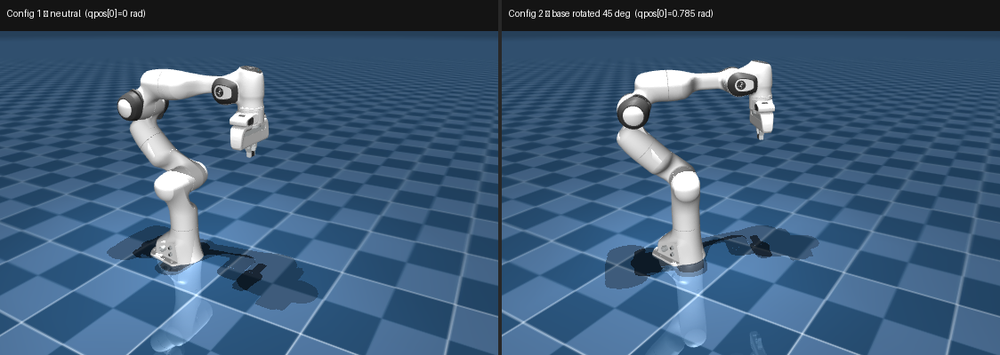
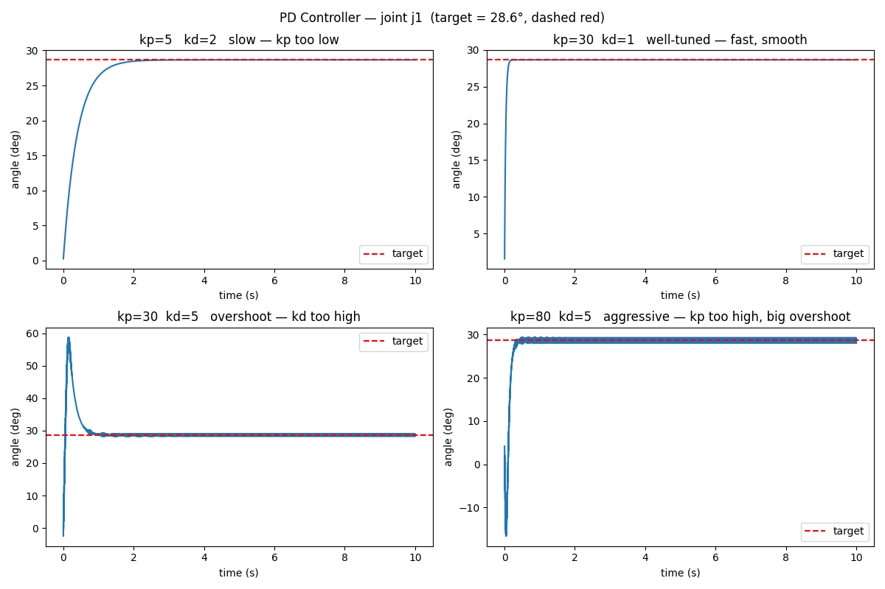
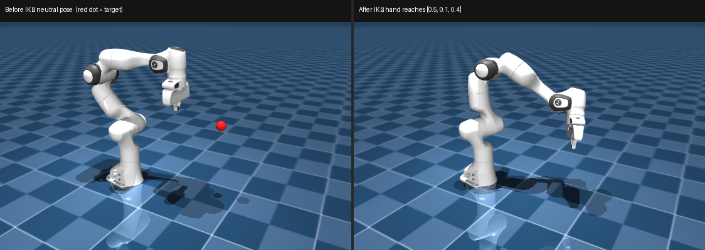

# Chapter 1 — MuJoCo & Robot Fundamentals

**Time:** 2–3 days
**Hardware:** Laptop only
**Prerequisites:** Python, NumPy basics

---

## What are we here for

Every chapter in this course runs inside MuJoCo — a fast, accurate physics simulator used
by DeepMind, Google, and most serious robot learning labs. Before you can train a policy,
collect demonstrations, or run IK, you need to be fluent with it: how to load a robot, step
the physics, read where things are, make joints move, and plan end-effector paths.

This chapter covers all of that in four projects. You'll load a real robot model, localize
objects using camera transforms, write a controller that holds a pose, and solve for joint
angles that put the hand wherever you want. These four skills appear in every subsequent
chapter.

> **End-effector (EE)** — the physical tip of the robot arm: the hand, gripper, or tool that actually touches objects. Everything upstream (shoulder, elbow, wrist joints) exists only to position and orient this tip.
>
> In code, "end-effector" usually refers to the **pose** of that tip — its `[x, y, z]` position plus orientation in world space.
>
> - **Forward kinematics (FK):** given joint angles → compute the end-effector pose. This is what `mj_forward()` does.
> - **Inverse kinematics (IK):** given a target end-effector pose → solve for the joint angles that achieve it. Covered in Project D.

**Install:** (run from the repo root)
```bash
# mujoco       — physics simulator engine
# numpy        — array math
# matplotlib   — plotting trajectories and images
# scipy        — scientific computing (Rotation, etc.)
# pin-pink     — inverse kinematics solver (NOT 'pink' which is a code formatter)
# pinocchio    — kinematics library that Pink builds on top of
# robot_descriptions — fetches robot URDF/XML models from GitHub
# quadprog     — quadratic programming backend for IK optimization
pip install mujoco numpy matplotlib scipy pin-pink pinocchio robot_descriptions quadprog
git clone https://github.com/google-deepmind/mujoco_menagerie workspace/ext/mujoco_menagerie
```

**Skip if you can answer:**
1. You load a Franka arm. How do you read the end-effector position in world space?
2. You set `data.ctrl[0] = 1.57` on a `position` actuator. What happens?
3. Your PD controller oscillates but doesn't settle. Which gain do you increase?
4. You want the hand at `[0.5, 0.0, 0.4]`. How do you find the joint angles?

---

## Projects

| # | Project | What you build |
|---|---------|---------------|
| A | Load a Robot, Read Its State | Load Franka Panda, print joint states and body poses in two configurations |
| B | PD Controller | Hold a target joint pose; plot four kp/kd combinations |
| C | IK Solver | Move the end-effector to any 3D target using Pink differential IK |

---

## Project A — Load a Robot, Read Its State

**Problem:** Before you can control a robot, you need to understand what MuJoCo gives you
and how to read the state of a loaded model.

**Approach:** Load the Franka Panda from Menagerie, open the interactive viewer, set two
joint configurations, and print the resulting body poses.

### MuJoCo's two core objects

MuJoCo splits everything into two objects:

- **`MjModel`** — the static description: geometry, masses, joint limits, actuator types. Load it once from an XML file; it never changes.
- **`MjData`** — the live state: joint positions, velocities, body poses, contact forces. Updated every call to `mj_step()`.

> **Quick note on two key functions:**
> - `mj_forward(model, data)` — recomputes derived quantities (body positions, rotation matrices) from whatever joint angles are currently in `data.qpos`, **without advancing time**. Use it to query poses after you set `qpos` manually. Calling it twice with the same `data` is safe and harmless — it just recomputes the same values.
>   ```python
>   data.qpos[0] = 1.0   # set joint 0 to 1 rad
>   data.qpos[1] = -0.5  # set joint 1 to -0.5 rad
>   mujoco.mj_forward(model, data)           # now data.xpos is up-to-date
>   pos = data.xpos[model.body("hand").id]   # read the new end-effector position
>   ```
> - `mj_step(model, data)` — advances physics by one timestep (default 2 ms): reads `data.ctrl`, computes forces, integrates dynamics (gravity, collisions), and writes results back to `data`. Use this for simulation loops.

You can verify this yourself:

```python
import mujoco, os
xml = "workspace/ext/mujoco_menagerie/franka_emika_panda/scene.xml"
assert os.path.exists(xml), "Clone Menagerie first: git clone https://github.com/google-deepmind/mujoco_menagerie workspace/ext/mujoco_menagerie"
model = mujoco.MjModel.from_xml_path(xml)
data  = mujoco.MjData(model)
print(f"Time before step: {data.time:.4f}s")
mujoco.mj_step(model, data)
print(f"Time after step:  {data.time:.4f}s  (Δ = {model.opt.timestep*1000:.1f} ms)")
print(f"Joint 0 position: {data.qpos[0]:.4f} rad  (unchanged — no control signal yet)")
```

Run from the repo root.

### Coordinate frames

A **frame** is a coordinate system attached to a body — an origin `[x, y, z]` plus three
axes (X, Y, Z). Every link in a robot has one. It answers: *where is this body?* and
*which way is it facing?*

> **Franka Panda** — a 7-DOF collaborative arm by Franka Engineering, widely used in
> robotics research. The Menagerie model (`franka_emika_panda`) is the official simulation
> description from Google DeepMind.

> **`qpos` vs `xpos` — the most common point of confusion:**
> - `data.qpos` — joint-space: one number per joint, in radians (or meters for prismatic joints). It's the *input* — the configuration you set.
> - `data.xpos` — Cartesian space: `[x, y, z]` in world coordinates for each **body** (a rigid link). It's the *output* — computed from `qpos` by forward kinematics.
>
> You never set `xpos` directly. You set `qpos`, call `mj_forward()`, and MuJoCo fills in `xpos`.
>
> **Why can't you just command a Cartesian position?**
> Motors are at the joints — there is no motor that moves a body to `[x, y, z]` directly.
> The hardware only speaks joint angles. Going the other direction — "I want the hand at
> this position, what joint angles achieve it?" — is the **inverse kinematics (IK)** problem,
> and it's non-trivial: one Cartesian target can map to multiple joint solutions, or none.
> That's what Project C solves.

MuJoCo gives you `data.xpos[body_id]` (the origin) and `data.xmat[body_id]` (a 3×3
rotation matrix stored flat as 9 numbers — reshape to use it). These are computed by
**forward kinematics** — chaining all the joint transforms from base to tip.

Use `mj_forward()` to recompute poses after setting joint angles:

```python
data.qpos[0] = 1.5   # shoulder joint to 1.5 rad
mujoco.mj_forward(model, data)     # update all body poses
body_id = model.body("hand").id
pos = data.xpos[body_id]           # [x, y, z] world frame
R   = data.xmat[body_id].reshape(3, 3)
```

`data.qpos` holds one value per joint in the model. You can set all joints at once with `data.qpos[:] = my_array`. After calling `mj_forward()`, `data.xpos` and `data.xmat` reflect the new configuration.

### The code

`read_robot_state.py` sets two joint configurations and prints the EE position for each — no physics simulation, just FK. The viewer opens at the end showing the final pose.

```python courses/vla/ch01_mujoco/code/read_robot_state.py
```

**What to observe in the terminal:**
```
Config 1  qpos[0]=0 rad      EE=[0.307  0.     0.59 ]
Config 2  qpos[0]=0.785 rad  EE=[0.217  0.217  0.59 ]

EE moved by [-0.09   0.217  0.   ]  (0.235 m)
One joint angle changed → EE moved. That's forward kinematics.
```
Only `qpos[0]` changed (base rotation, 0 → 45°). The EE swept 23 cm in the XY plane; Z stayed the same because a base rotation doesn't change height.

**Try it:** comment out the line marked `# <-- comment this out` and rerun — both configs are now identical, EE delta prints `[0. 0. 0.]`. Uncomment to restore the change.

**What to expect in the viewer:** the arm holds Config 2's pose. Use the joint sliders in the right panel to move it manually.

**macOS viewer error?** Re-run with `mjpython` instead of `python`. The terminal output above is the actual deliverable — viewer is optional.



Left: neutral pose (Config 1). Right: base joint rotated 45° (Config 2). The arm sweeps in the XY plane — Z stays the same because a base rotation doesn't change height.

---

## Project B — PD Controller: Tune the Gains

**Problem:** You need the robot to hold a **target joint configuration** — a specific set of joint angles, like "shoulder at 30°, elbow at -45°" — and stay there despite gravity pulling it down.

You might wonder: why not just set `data.qpos` to the target angles every timestep and call it done?

- **Set `qpos` directly** — only useful when you want to inspect a pose (like in Project A). You're telling MuJoCo "pretend the robot is in this configuration" so you can read back body positions. No physics runs, no gravity, no time advances.
- **Send torques via `data.ctrl`** — what you do when physics matter. The simulator (and real hardware) only understands "apply this much force to this motor." Gravity, inertia, and contact all push back; your controller has to fight them every timestep.

Forcing `qpos` every timestep would make the arm teleport to the target — bypassing gravity and inertia entirely, which is useless for understanding how a real robot behaves.

The correct approach is a **control loop**: code that runs every timestep, measures how far each joint is from its target, and applies a corrective torque to push it back. With `motor` actuators MuJoCo gives you raw torque control and nothing else — you write that loop yourself.

**Approach:** Build a simple 2-joint arm and write a PD controller. A PD controller has two knobs:

- **`kp`** (proportional gain) — how hard to push toward the target. Too low: slow. Too high: overshoots and oscillates.
- **`kd`** (derivative gain) — how hard to brake based on current velocity. Damps the oscillation caused by high `kp`.

You'll run the arm with four combinations — low/high `kp` × low/high `kd` — and plot the joint angle over time for each. The plot makes the effect of each gain immediately visible.

We use a custom 2-DOF arm here, not the Franka. The Franka Menagerie model uses
`position` actuators (built-in PD servo — MuJoCo does the control for you). To write and
tune a PD controller yourself you need `motor` actuators, so we define a simple arm in XML.
The principle transfers directly to any motor-actuated hardware.

### Actuators

An **actuator** is what makes a joint move — the motor attached to it. In MuJoCo you
declare it in XML and command it via `data.ctrl`. Three types:

- **`motor`** — applies raw torque. You stabilize the joint yourself. Closest to real hardware.
- **`position`** — set a target angle; MuJoCo drives there automatically. (Sim convenience only — real motors don't work this way. Useful for prototyping when you don't care about torque realism.)
- **`velocity`** — set a target joint velocity. (Useful for wheels or conveyor belts; rarely used for robot arms.)

For this project you use `motor` so you implement the full control loop.

### PD control

**P (proportional):** push toward target in proportion to the error.
**D (derivative):** brake in proportion to current velocity — prevents overshoot.

```text PD formula
torque = kp × (target_angle − current_angle) − kd × current_velocity
```

- Too little `kp` → slow response
- Too much `kp` → oscillation
- `kd` damps the oscillation

### The code

```python courses/vla/ch01_mujoco/code/pd_controller.py
```

**What to observe:** The script saves `pd_gains.png` in your working directory. Here is what the four panels should look like:



Each panel shows joint j1 angle over time. The dashed red line is the target (28.6°). All four cases eventually reach the target — what differs is **how they get there**.

| Panel | What to look for |
|---|---|
| **slow (kp too low)** | Arm crawls to target over ~3 s — kp is too weak to push the arm fast |
| **well-tuned** | Reaches target in ~0.3 s, no bounce — kp pushes hard, kd brakes just enough to stop exactly at target |
| **overshoot (kd overbrakes)** | Shoots past to 58°, bounces back and settles — kd is braking so early and hard it carries momentum past target before the arm reverses |
| **underdamped (kp too high)** | Fast rise but dips to −15°, bounces through target several times — kp generates so much torque that kd=5 can't absorb the kinetic energy fast enough |

The well-tuned case (top-right) is what you want on a real robot: fast, no oscillation, no overshoots that could hit objects.

> **Why gravity=0 here?** With gravity on, the arm settles *below* the target — not because the controller gives up, but because of how proportional control works. The only torque the controller produces is `kp × error`. At equilibrium, that torque is exactly balancing gravity — which means there must be a nonzero error left to generate it. Less error → less push → can't fully overcome gravity. Increasing kp reduces the gap but never closes it completely. This is called **steady-state error** and it's a fundamental limitation of pure PD control. Real robots add a **feedforward gravity compensation term** — a separate torque estimate based on the arm's current pose — to cancel gravity before the PD loop even runs, so the PD only has to handle small deviations. For this exercise we zero gravity to keep the focus on gain tuning, not compensation.

---

## Project C — IK Solver: Reach Any Target

**Problem:** Given a desired end-effector position in world space, find the joint angles
that put the hand there — this is **inverse kinematics (IK)**.

**Approach:** Use Pink, a differential IK library. At each timestep Pink solves for the
joint velocity that moves the end-effector toward the target, then integrates it.

### Background — coordinate transforms

IK works in world space, but in a real pipeline the target comes from a camera in camera space. The standard tool for converting between frames is the **homogeneous transform** — used by MuJoCo, ROS, and Pink.

```text 4×4 transform
T_wrist_in_world =               ← where the wrist is and which way it faces, in world space
  [[R00, R01, R02, tx],          ← rotation (3×3)  |  tx = x position of wrist
   [R10, R11, R12, ty],                             |  ty = y position of wrist
   [R20, R21, R22, tz],                             |  tz = z position of wrist
   [0,   0,   0,   1 ]]          ← fixed bottom row, always exactly this
```

The bottom row never changes — bookkeeping that makes the matrix algebra work. To convert a cup position from camera space to world space:

```text
p_cup_in_camera = [px, py, pz, 1]   ← cup position in camera frame, with 1 appended
p_cup_in_world  = T_wrist_in_world @ p_cup_in_camera
```

**Chaining** — if the camera is offset from the wrist (mounted on a bracket), multiply two transforms:

```text
T_camera_in_world = T_wrist_in_world @ T_camera_on_wrist
p_cup_in_world    = T_camera_in_world @ p_cup_in_camera
```

In this project the target is hardcoded in world space, so no transform is needed. You'll use this in Chapter 8 (Capstone A) when a real depth camera gives you the cup position in camera space.

### Why load the model twice?

You need the robot description loaded into **both** MuJoCo and Pinocchio:

- **MuJoCo** handles physics simulation — gravity, collisions, dynamics. You use it for visualization.
- **Pinocchio** (used internally by Pink) handles inverse kinematics optimization — computing Jacobians, solving constrained optimization to find joint angles for a target pose.

They're separate libraries with different APIs and data structures, so there's no way to do IK inside MuJoCo here. The workflow is: Pink/Pinocchio computes new joint angles → you copy them into MuJoCo's `qpos` each step → `mj_forward()` updates the viewer. Both models must describe the same robot — `panda_description` and the Menagerie Franka match on the 7 arm joints used here.

### Why IK needs a library

FK is just matrix multiplication along the chain. IK is harder:
- Many joint configs can reach the same position (redundancy)
- Some positions are unreachable
- Near **singularities** — configurations where the arm loses a degree of freedom
  (like fully extending a straight arm) — naive approaches explode into infinite joint velocities

Pink uses the **Jacobian** — a matrix mapping joint velocities to end-effector velocity —
to solve a constrained optimization problem at each step. It handles joint limits,
singularities, and multiple simultaneous tasks. [Read more: Pink docs](https://stephane-caron.github.io/pink/)

### The code

```python courses/vla/ch01_mujoco/code/ik_solver.py
```

**Note:** The loop uses `mj_forward()` not `mj_step()` — physics don't advance. The arm
teleports joint-by-joint to each IK solution. This is intentional: we're solving geometry,
not simulating dynamics. You'd add `mj_step()` when you need contact forces or inertia.

> **Debugging tip:** The viewer runs in the foreground and blocks the terminal. To add
> debug prints, comment out the viewer block and use manual `mj_forward()` + print calls.

**Experiment:** Change `target.translation` to different positions. Try `[0.8, 0.0, 0.3]`
(near workspace edge) and watch how the arm reaches — or stops when it can't.



Left: neutral pose (initial configuration). Right: IK solver moved the end-effector to `[0.5, 0.1, 0.4]` — the arm reconfigured all seven joints to reach the target position.

---

## Self-Check

1. You call `mj_forward()` vs `mj_step()`. What's the difference?
   **Answer:** `mj_forward()` recomputes all derived quantities (xpos, xmat) from the
   current `qpos` without advancing time or physics. `mj_step()` also integrates dynamics
   by one timestep. Use `mj_forward()` for pose queries; `mj_step()` for simulation.

2. You run `mj_step()` with `data.ctrl` all zeros. What happens to the arm?
   **Answer:** With no control torques, gravity pulls every joint toward its lowest-energy
   position. The arm falls. This is why a viewer loop without control looks like a collapse —
   you need either a control signal or `position` actuators to hold a pose.

3. Your PD controller settles slowly without oscillation. What do you change first?
   **Answer:** Increase `kp`. If it then oscillates, increase `kd`. Tune in that order —
   `kp` sets the speed, `kd` damps the response.

4. `data.xmat[body_id]` returns 9 numbers. What are they and how do you use them?
   **Answer:** A 3×3 rotation matrix stored row-major as a flat array. Call `.reshape(3, 3)`.
   Each row is one of the body's local axes expressed in world coordinates.

5. In Project C you set `orientation_cost=0.0`. What does that mean for the IK solution?
   **Answer:** Pink ignores orientation — it only tries to match the position. The arm
   will reach the target but may arrive at any orientation. Set `orientation_cost > 0`
   and provide a full `SE3` target to also constrain how the hand faces.

---

## Common Mistakes

- **Forgetting `mj_forward()` after setting `qpos`:** `data.xpos` reflects the last
  computed state. Set `qpos`, then call `mj_forward()`.

- **Quaternion convention mismatch:** `data.xquat` is `[w, x, y, z]`. scipy and ROS 2
  expect `[x, y, z, w]`. Reorder with `q[[1,2,3,0]]` before passing to external libraries.

- **`xmat` used raw:** It's 9 flat values — always `.reshape(3, 3)` before matrix ops.

- **Copying PD gains between robots:** Gains depend on link mass and inertia. Start with
  `kp=100, kd=10` for a light arm; scale up 4–10× for a full Franka Panda.

- **IK diverging near singularities:** Add a `PostureTask` to keep the arm near a neutral
  configuration — this regularizes the IK and prevents runaway joint velocities.

- **MuJoCo and Pinocchio models out of sync (Project C):** `panda_description` and
  the Menagerie MJCF describe the same 7-DOF arm but may differ in finger joints or base
  frames. If the viewer shows wrong poses, print `configuration.q` length vs `mj_model.nq`
  and check the slice — you may need `[:7]` or a different offset.

---

## Resources

1. [MuJoCo Programming Guide](https://mujoco.readthedocs.io/en/stable/programming/index.html) — read the MjModel/MjData and Simulation sections
2. [MuJoCo Menagerie](https://github.com/google-deepmind/mujoco_menagerie) — all robot models used in this course
3. [Pink documentation](https://jmirabel.github.io/pink/) — task definitions and solver API
4. [MuJoCo Tutorial Colab (DeepMind)](https://colab.research.google.com/github/deepmind/mujoco/blob/main/python/tutorial.ipynb) — interactive walkthrough of viewer and core API
