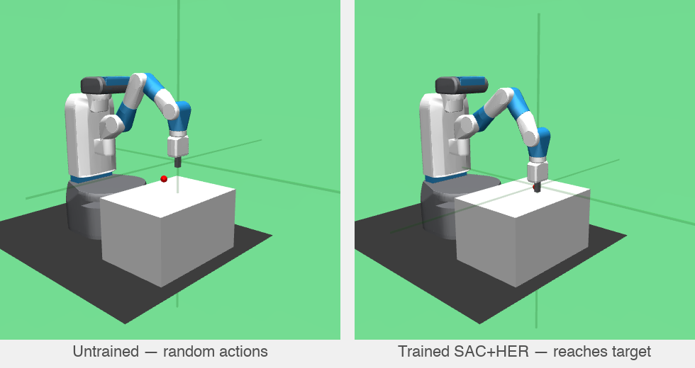

# Chapter 2 — Reinforcement Learning

**Time:** 3–5 days
**Hardware:** GPU helpful (CPU works, training is slower)
**Prerequisites:** Chapter 1 (MuJoCo, FK, IK)

---

## What are we here for

You have a robot that can move. Now you want it to *learn* to reach a target without you
telling it exactly how. That's reinforcement learning: the agent tries things, gets rewards
when it does well, and gradually learns a **policy** — a function that maps what it sees
to what it should do.

RL is not always the right tool (Chapter 3 covers imitation learning, which is often
better for manipulation), but understanding it is essential. Reward shaping and HER (both
explained below) are techniques you'll reuse even when the primary algorithm is imitation
learning. And RL gives you intuition for what "exploration" means, which matters when your
policy fails.

This chapter uses **Stable Baselines 3** (a library of ready-to-use RL algorithms — you
call `SAC(...)` and it handles all the math) and the `gymnasium-robotics` FetchReach
environment — a simulated robot arm whose only job is to move its hand to a target point.

You'll train a reaching policy, compare how different reward designs affect learning speed,
and implement curriculum learning (starting with easy goals, graduating to hard ones).

**Install:**
```bash
pip install "stable-baselines3[extra]" gymnasium gymnasium-robotics pillow
```

**Working directory:** `workspace/vla/ch02/` — copy each code block into a `.py` file
there as you work through the projects.

**Skip if you can answer:**
1. What does `env.step(action)` return? What does each element mean?
2. What is the difference between sparse and dense rewards? When does each work?
3. Your SAC policy doesn't improve after 100k steps. What do you check first?

---

## Projects

| # | Project | What you build |
|---|---------|---------------|
| A | Train SAC with HER | Train a reaching policy and see it succeed |
| B | Reward Design Ablation | Measure how sparse vs. dense vs. HER rewards affect learning speed |
| C | Curriculum Learning | Stage training by distance; gate stages on success rate |

---

## Project A — Train SAC with HER

**Problem:** In RL, the agent takes random actions, gets rewards for doing the right thing, and trains a model to maximise those rewards — hoping it learns the correct behaviour. FetchReach-v4 is a MuJoCo sim of a [Fetch robot arm](https://robotics.farama.org/envs/fetch/reach/) whose only job is to move the gripper to a target point in space.


*Fetch robot arm reaching for a randomly placed target — [gymnasium-robotics FetchReach-v4](https://robotics.farama.org/envs/fetch/reach/)*

The catch: it only gives reward when the gripper gets within 5 cm of the target — and **with truly random actions, that almost never happens**. The agent wanders forever without ever seeing a success.

**Approach:** Train SAC+HER on FetchReach. After training, the agent should reach the target >90% of the time.

### How the environment works

FetchReach-v4 is a pre-built robot environment from [gymnasium-robotics](https://robotics.farama.org/). MuJoCo simulates the physics (same as Chapter 1), gymnasium-robotics defines the Fetch robot model and reward, and **Gymnasium** provides the standard RL contract every library speaks:

```python
obs, info = env.reset()                                       # start episode
obs, reward, terminated, truncated, info = env.step(action)  # take one step
```

- **obs** — a snapshot of the environment: where the gripper is, where the target is, joint states. A `dict` with 3 keys: `observation` (10 robot state values), `desired_goal` (target x,y,z), `achieved_goal` (current gripper x,y,z). Called an *observation* rather than *state* because on a real robot you can't sense everything directly (e.g. internal joint torques).
- **action** — 4 floats in [-1, 1]: gripper velocity in x, y, z + open/close (open/close unused in reach)
- **reward** — `0.0` if within 5 cm of target, `-1.0` otherwise. This is *sparse*: no signal about whether the gripper is getting closer or farther, just pass/fail.
- **terminated** — `True` when goal reached
- **truncated** — `True` when 50-step limit hit

The goal is to learn a **policy**: `action = policy(obs)`. RL trains this by running episodes, collecting (obs, action, reward) tuples, and nudging the policy towards actions that led to more reward.

### SAC and HER

**SAC** (Soft Actor-Critic) is the go-to algorithm for continuous robot control — the policy outputs continuous numbers (e.g. move gripper 0.3 cm in x), not discrete choices (left/right/up), and SAC is built for that. It's stable, sample-efficient, and works out of the box with Stable Baselines 3. SAC has useful internals (replay buffer, entropy regularization, actor-critic architecture) that won't matter for this course — [read more here](https://spinningup.openai.com/en/latest/algorithms/sac.html) if curious.

**HER** (Hindsight Experience Replay) solves the sparse reward problem. To understand it, recall what's in the observation:
- `desired_goal` — the target position as `[x, y, z]` in metres (e.g. `[1.34, 0.82, 0.61]`)
- `achieved_goal` — the gripper's current position, same format `[x, y, z]`

Even when the agent fails to reach `desired_goal`, it *did* reach `achieved_goal` — somewhere. HER takes that failed trajectory and relabels it: pretend `achieved_goal` *was* the goal all along. Now that episode counts as a success for a different goal, giving the agent useful learning signal. Do this for enough failed episodes and the agent learns to reach things — even before it ever reaches the real target. [Read more: HER paper](https://arxiv.org/abs/1707.01495)

HER requires the environment to expose `achieved_goal` and `desired_goal` in the observation, plus a `compute_reward()` method so it can recompute rewards for the relabelled goals. FetchReach has these built in. For a custom task you may not have that structure — in which case you're back to designing a reward function from scratch.

**What if you didn't use HER?** With plain SAC and a sparse reward, the agent almost never gets a +1 — early on, random actions virtually never land within 5 cm of the target by chance. With no reward signal, there's nothing to learn from. The agent doesn't just train slower — it essentially doesn't train at all on this task. You'd need a dense reward (e.g. distance to goal at every step) to make plain SAC work, but then you're hand-crafting the reward function.

HER also isn't always an option. It requires the environment to have a clear `achieved_goal` — a position or state you can point to and say "the agent ended up here." For tasks like "pick and place a specific object" or "open a door," defining what counts as `achieved_goal` at each step isn't straightforward. In those cases you're back to hand-crafting a reward: penalise distance, reward grasp contact, add bonuses for partial progress. Reward design is a core skill in robot RL — Project B shows you concretely what the choice costs you.

### The code

> 🟡 **Know**
> - **Two envs** — one for training, one for evaluation (so eval doesn't corrupt training state)
> - **`EvalCallback`** — pauses training every 5k steps and runs 20 test episodes to measure success rate. Pure observation — doesn't affect training at all. Also saves the best model seen so far.
> - **Episode vs step:** An *episode* is one full attempt — the arm starts, tries to reach the target, and ends after 50 *steps* or on success. A *step* is one simulation tick: observe → act → get reward. HER works on completed episodes.
> - **`n_sampled_goal=4`** — after an episode finishes, HER goes back through every step and asks: where did the gripper actually end up *after* this step, at some later point in the same episode? It picks 4 such later positions and relabels this step as if each one *had been* the goal — manufacturing 4 successes from a failed episode. One real step becomes 5 training examples.
> - **`goal_selection_strategy="future"`** — the 4 positions are sampled randomly from steps *after* the current one in the same episode. How far after doesn't matter — the policy just needs to learn "if the goal is X, move toward X," not how many steps it took to get there. What matters is that they're from the future, not the past — positions before the current step haven't been "reached yet" from the policy's perspective. Other options (`"episode"`, `"random"`) exist but `"future"` works best in practice.
>
> Go through the code, run it, and make sure the above points click as you read each block. No need to know how SAC works under the hood.

`EvalCallback` prints success rate every 5k steps — expect it to jump from 0% to 100% within ~15k steps. Models saved to `workspace/vla/ch02/models/`.

```python workspace/vla/ch02/train_sac_her.py
"""Train SAC+HER on FetchReach-v4 and report success rate."""
import time
from stable_baselines3 import SAC, HerReplayBuffer
from stable_baselines3.common.callbacks import EvalCallback
import gymnasium as gym
import gymnasium_robotics

gym.register_envs(gymnasium_robotics)

TOTAL_STEPS = 25_000   # FetchReach typically hits 100% success by ~15k steps — 25k gives a safe buffer
ENV_ID      = "FetchReach-v4"
MODELS_DIR  = "workspace/vla/ch02/models"

def train() -> None:
    env      = gym.make(ENV_ID)
    eval_env = gym.make(ENV_ID)  # separate env so evaluation doesn't interfere with training state

    eval_cb = EvalCallback(
        eval_env,
        best_model_save_path=f"{MODELS_DIR}/trained",
        eval_freq=5_000,     # evaluate every 5000 steps — watch success rate climb from ~0% to 100%
        n_eval_episodes=20,  # average over 20 episodes for a stable number
        verbose=1,
    )

    model = SAC(
        "MultiInputPolicy", env,  # MultiInputPolicy handles dict observations (obs + goals)
        replay_buffer_class=HerReplayBuffer,   # <-- this is where HER is plugged in
        replay_buffer_kwargs={
            "n_sampled_goal": 4,                   # relabel each transition with 4 fake goals
            "goal_selection_strategy": "future",   # pick goals from later in the same episode
        },
        verbose=0,
    )

    # Save untrained snapshot before learning starts — used by visualise.py
    model.save(f"{MODELS_DIR}/untrained/model")

    start = time.time()
    print(f"Training started at {time.strftime('%H:%M:%S')} — expect ~3–5 min on CPU")
    model.learn(total_timesteps=TOTAL_STEPS, callback=eval_cb)  # <-- the only line that actually trains
    print(f"Done — {(time.time()-start)/60:.1f} min. Model saved to {MODELS_DIR}/trained/")

    model.save(f"{MODELS_DIR}/trained/final_model")
    env.close()
    eval_env.close()

if __name__ == "__main__":
    train()
```

**What to observe:** Watch the success rate climb — that's the only number that matters. Episode reward will be negative throughout (FetchReach gives `-1` every step the goal isn't reached, `0` on success — so a full 50-step failure scores `-50`). The `+/-` is the standard deviation across the 20 eval episodes.

```
Eval num_timesteps=5000   episode_reward=-50.00 +/- 0.00   Success rate: 0.00%
Eval num_timesteps=10000  episode_reward=-27.40 +/- 19.63  Success rate: 40.00%
Eval num_timesteps=15000  episode_reward=-1.50  +/- 0.67   Success rate: 96.00%
```

At 5k steps: all 20 episodes fail identically — reward `-50`, zero variance. At 10k: some succeed early, some don't — scores vary. By 15k: almost all succeed. If success rate plateaus below 50%, check that `gym.register_envs(gymnasium_robotics)` is called before `gym.make()`.

### Visualise the trained policy

Once training is done, use `visualise.py` to watch the policy run in a MuJoCo window. Pass `--model untrained` or `--model trained` to choose which one to run. `render_mode="human"` tells MuJoCo to open a live window and render each `env.step()` in real time.

> 🟢 **Run** — run both commands and watch the difference. Glance at the code for the load-and-run pattern:
> - **`SAC.load(path)`** — loads a saved model from disk
> - **`model.predict(obs, deterministic=True)`** — picks the best action at each step (no exploration)
>
> That's all you need to load and run any model trained with Stable Baselines3.

```bash
# watch the untrained model flail
python workspace/vla/ch02/visualise.py --model untrained

# watch the trained model reach the target
python workspace/vla/ch02/visualise.py --model trained
```

```python workspace/vla/ch02/visualise.py
"""Watch untrained vs trained SAC+HER on FetchReach-v4 in a live MuJoCo window.

Usage:
  python visualise.py --model untrained
  python visualise.py --model trained
"""
import argparse
import gymnasium as gym
import gymnasium_robotics
from stable_baselines3 import SAC

gym.register_envs(gymnasium_robotics)

MODELS_DIR = "workspace/vla/ch02/models"
N_EPISODES = 10
MODEL_PATHS = {
    "untrained": f"{MODELS_DIR}/untrained/model",
    "trained":   f"{MODELS_DIR}/trained/best_model",
}

def run(model_name: str) -> None:
    # render_mode="human" opens a live MuJoCo window — remove it to run headless
    env   = gym.make("FetchReach-v4", render_mode="human")
    model = SAC.load(MODEL_PATHS[model_name], env=env)  # load-and-run pattern: works for any SB3 model

    print(f"\n--- {model_name} policy ---")
    successes = 0
    for ep in range(N_EPISODES):
        obs, _ = env.reset()
        for _ in range(50):
            action, _ = model.predict(obs, deterministic=True)  # deterministic=True: pick best action, no exploration
            obs, _, terminated, truncated, info = env.step(action)
            if terminated or truncated:
                break
        success = info.get("is_success", False)
        successes += success
        print(f"  Episode {ep+1}: {'SUCCESS' if success else 'fail'}")

    print(f"Success rate: {successes}/{N_EPISODES}")
    env.close()

if __name__ == "__main__":
    parser = argparse.ArgumentParser()
    parser.add_argument("--model", choices=["untrained", "trained"], required=True)
    # to save screenshots instead: python visualise.py --model trained --screenshot
    args = parser.parse_args()
    run(args.model)
```


*Left: untrained — random actions, gripper wanders. Right: trained SAC+HER — gripper moves directly to the target.*

**What you've got so far:** a robot arm that learned to reach a target from scratch — no hand-coded motion, no waypoints. The policy figured it out from reward signal alone, using SAC to learn and HER to turn failed episodes into useful training data. That's the core RL loop for manipulation.

---

## Project B — Reward Design Ablation

### Reward designs compared

**Problem:** HER requires the environment to support goal relabelling — not every custom task has that. When it doesn't, you're designing a reward function from scratch: sparse, dense, or something in between. The choice dramatically affects whether the agent learns at all. This project runs all three side by side on the same task so you have a concrete feel for the tradeoffs before you're staring at a blank reward function. (*Ablation* is an ML term for "remove one component and measure the effect" — that's all this is.)

**Approach:** Build a minimal 2D version of the reach task — simpler and faster to run than FetchReach, so the comparison is quick. Train SAC on three reward designs and compare success rates:

- **Sparse:** `0` when goal reached, `-1` every other step. Clean signal — but the agent rarely stumbles on success, so it rarely learns.
- **Dense:** `−distance` every step. Always informative — the agent always knows if it's getting closer. Can teach the wrong behaviour if distance isn't a perfect proxy for the real objective.
- **Sparse + HER:** relabels failed trajectories as successes for different goals. Best of both: clean objective, dense effective signal.

The script trains all three and prints final success rates side by side.

### The code

> 🔴 **Work** — run it, look at the results, then change the `steps` in `run()` to `10_000` and see how the rankings shift. Try adding a fourth condition: dense + HER.

```python workspace/vla/ch02/reward_ablation.py
"""Compare sparse, dense, and HER rewards on a 2D reach task."""
import numpy as np
import gymnasium as gym
from gymnasium import spaces
from stable_baselines3 import SAC, HerReplayBuffer

class Reach2D(gym.Env):
    """
    Minimal 2D reach: agent moves a 2D point to a random goal.
    Simpler than FetchReach — same reward structure, runs in seconds.
    """

    def __init__(self, reward_type: str = "sparse"):
        super().__init__()
        self.reward_type = reward_type
        # HER requires a dict observation space with these exact keys
        self.observation_space = spaces.Dict({
            "observation":   spaces.Box(-1, 1, (2,), np.float32),
            "desired_goal":  spaces.Box(-1, 1, (2,), np.float32),
            "achieved_goal": spaces.Box(-1, 1, (2,), np.float32),
        })
        self.action_space = spaces.Box(-0.1, 0.1, (2,), np.float32)
        self.pos  = np.zeros(2, dtype=np.float32)
        self.goal = np.zeros(2, dtype=np.float32)

    def reset(self, *, seed=None, options=None):
        super().reset(seed=seed)
        self.pos  = self.np_random.uniform(-0.5, 0.5, 2).astype(np.float32)
        self.goal = self.np_random.uniform(-0.5, 0.5, 2).astype(np.float32)
        return self._obs(), {}

    def step(self, action):
        self.pos = np.clip(self.pos + action, -1, 1)
        dist     = float(np.linalg.norm(self.pos - self.goal))
        success  = dist < 0.05
        reward   = -dist if self.reward_type == "dense" else (0.0 if success else -1.0)
        return self._obs(), reward, success, False, {"is_success": success}

    def _obs(self):
        return {"observation":   self.pos.copy(),
                "desired_goal":  self.goal.copy(),
                "achieved_goal": self.pos.copy()}

    def compute_reward(self, achieved, desired, info):
        # HER calls this internally to recompute rewards for relabelled goals
        dist = np.linalg.norm(achieved - desired, axis=-1)
        if self.reward_type == "dense":
            return -dist
        return np.where(dist < 0.05, 0.0, -1.0).astype(np.float32)

def run(reward_type: str, use_her: bool, steps: int = 50_000) -> float:
    env    = Reach2D(reward_type=reward_type)
    kwargs = {}
    if use_her:
        kwargs = {"replay_buffer_class": HerReplayBuffer,
                  "replay_buffer_kwargs": {"n_sampled_goal": 4,
                                           "goal_selection_strategy": "future"}}
    model = SAC("MultiInputPolicy", env, verbose=0, **kwargs)
    model.learn(steps)

    # Evaluate: run 100 episodes with the trained policy, count successes
    successes = 0
    for _ in range(100):
        obs, _ = env.reset()
        for _ in range(50):
            action, _ = model.predict(obs, deterministic=True)
            obs, _, term, trunc, info = env.step(action)
            if term or trunc:
                successes += info.get("is_success", False)
                break
    return successes / 100

if __name__ == "__main__":
    print("Running reward ablation — takes a few minutes...")
    results = {
        "sparse":     run("sparse", use_her=False),
        "dense":      run("dense",  use_her=False),
        "sparse+HER": run("sparse", use_her=True),
    }
    print("\nResults:")
    for name, sr in results.items():
        print(f"  {name:15s}  success rate: {sr:.0%}")
```

**What to observe:** Dense and HER both outperform plain sparse. HER wins because it keeps the reward clean (sparse) while solving the learning signal problem — which is why it's the default for manipulation.

---

## Project C — Curriculum Learning

### The idea

**Problem:** Even SAC+HER can struggle when goals are too hard from the start. If the target is always far away and random exploration almost never gets close, there's still no learning signal early on.

**Approach:** Start with goals very close to the agent (easy). Expand the goal range automatically once success rate crosses 80%. The agent builds skill incrementally instead of drowning in failure from step one.

The script prints `[curriculum] goal range → X.XX` each time difficulty increases — you'll see it step up as the agent improves.

### The code

> 🔴 **Work** — run it, watch the goal range expand. Then try changing the threshold in `CurriculumCallback` from `0.8` to `0.5`. Or start with `goal_range = 0.5` instead of `0.1` — does it still converge?

```python workspace/vla/ch02/curriculum.py
"""Success-gated curriculum: expand goal range as success rate improves."""
import numpy as np
import gymnasium as gym
from gymnasium import spaces
from stable_baselines3 import SAC, HerReplayBuffer
from stable_baselines3.common.callbacks import BaseCallback

class CurriculumReach(gym.Env):
    """2D reach with adjustable goal range — same as Reach2D but difficulty is dynamic."""

    def __init__(self):
        super().__init__()
        self.goal_range = 0.1  # start easy: goals within 0.1 units of origin
        self.observation_space = spaces.Dict({
            "observation":   spaces.Box(-1, 1, (2,), np.float32),
            "desired_goal":  spaces.Box(-1, 1, (2,), np.float32),
            "achieved_goal": spaces.Box(-1, 1, (2,), np.float32),
        })
        self.action_space = spaces.Box(-0.1, 0.1, (2,), np.float32)
        self.pos  = np.zeros(2, dtype=np.float32)
        self.goal = np.zeros(2, dtype=np.float32)
        self.recent_successes: list[bool] = []

    def reset(self, *, seed=None, options=None):
        super().reset(seed=seed)
        self.pos  = np.zeros(2, dtype=np.float32)
        offset    = self.np_random.uniform(-self.goal_range, self.goal_range, 2)
        self.goal = np.clip(offset.astype(np.float32), -1, 1)
        return self._obs(), {}

    def step(self, action):
        self.pos = np.clip(self.pos + action, -1, 1)
        dist     = float(np.linalg.norm(self.pos - self.goal))
        success  = dist < 0.05
        # track last 200 steps to compute a rolling success rate
        self.recent_successes.append(success)
        if len(self.recent_successes) > 200:
            self.recent_successes.pop(0)
        return self._obs(), (0.0 if success else -1.0), success, False, {"is_success": success}

    def _obs(self):
        return {"observation":   self.pos.copy(),
                "desired_goal":  self.goal.copy(),
                "achieved_goal": self.pos.copy()}

    def compute_reward(self, achieved, desired, info):
        dist = np.linalg.norm(achieved - desired, axis=-1)
        return np.where(dist < 0.05, 0.0, -1.0).astype(np.float32)

    def success_rate(self) -> float:
        if not self.recent_successes:
            return 0.0
        return sum(self.recent_successes) / len(self.recent_successes)

class CurriculumCallback(BaseCallback):
    """Called by SB3 after every training step. Expands goal range when agent is ready."""

    def __init__(self, env: CurriculumReach, max_range: float = 0.8):
        super().__init__()
        self.env       = env
        self.max_range = max_range

    def _on_step(self) -> bool:
        if self.env.success_rate() > 0.8 and self.env.goal_range < self.max_range:
            self.env.goal_range = min(self.env.goal_range * 1.5, self.max_range)
            print(f"  [curriculum] goal range → {self.env.goal_range:.2f}")
        return True  # return False to stop training early

if __name__ == "__main__":
    env   = CurriculumReach()
    cb    = CurriculumCallback(env)
    model = SAC(
        "MultiInputPolicy", env, verbose=1,
        replay_buffer_class=HerReplayBuffer,
        replay_buffer_kwargs={"n_sampled_goal": 4, "goal_selection_strategy": "future"},
    )
    model.learn(total_timesteps=100_000, callback=cb)
    print(f"\nFinal goal range: {env.goal_range:.2f}")
```

**What to observe:** Goal range expands in steps as success rate crosses 80%. Without curriculum, the same agent on full range typically converges much slower or not at all.

---

## Self-Check

1. What does `env.step(action)` return?
   **Answer:** A tuple of `(observation, reward, terminated, truncated, info)`. `terminated`
   means the episode ended naturally (goal reached). `truncated` means the time limit was hit.

2. FetchReach uses sparse rewards. Why does this make learning hard?
   **Answer:** With random actions the agent almost never reaches the goal, so almost every
   step gives -1 and the agent receives no signal about what's working.

3. How does HER generate extra learning signal without changing the environment?
   **Answer:** After each failed episode, HER relabels the trajectory — treating whatever
   position the agent actually reached as if it *were* the goal. This creates successful
   transitions from failed rollouts.

4. Your SAC agent trains for 500k steps but success rate stays at 5%. What do you check?
   **Answer:** Check reward scale (mean reward should be ~-1, not -100), verify the goal
   is included in the observation, and try adding HER if not already using it.

5. Why start curriculum with easy goals rather than the full task?
   **Answer:** With hard goals and sparse rewards, early exploration almost never succeeds.
   Easy goals guarantee early successes, giving the agent a gradient signal to build on
   before difficulty increases.

---

## Common Mistakes

- **Forgetting to register gymnasium-robotics:** Call `gym.register_envs(gymnasium_robotics)`
  before `gym.make()` or you'll get `gym.error.NameNotFound`.

- **Using `MlpPolicy` with HER:** SB3 HER requires `MultiInputPolicy` for dict observations.
  `MlpPolicy` expects a flat array and will error.

- **Reward scale too large:** If your dense reward is `-distance * 100`, gradients explode.
  Keep rewards in [-1, 1].

- **Evaluating with the training env:** Use a separate `eval_env` for `EvalCallback`.
  Evaluating in the training env can corrupt replay buffer statistics.

---

## Resources

1. [Stable Baselines 3 docs](https://stable-baselines3.readthedocs.io/) — SAC and HER configuration
2. [HER paper](https://arxiv.org/abs/1707.01495) — read abstract + Section 3 (the algorithm)
3. [Gymnasium docs](https://gymnasium.farama.org/) — environment interface and wrappers
4. [gymnasium-robotics](https://robotics.farama.org/) — FetchReach and other robot envs
5. [SAC — Spinning Up](https://spinningup.openai.com/en/latest/algorithms/sac.html) — SAC internals if you want to go deeper
