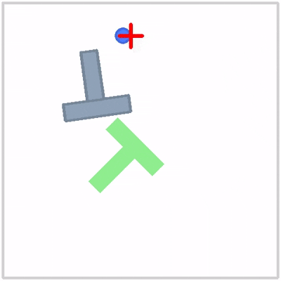
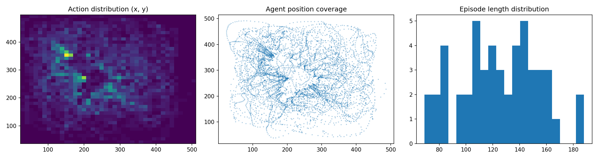
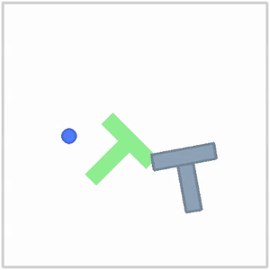

# Chapter 3 — Imitation Learning

**Time:** 1–2 days (GPU) · 2–3 days (Colab or Apple Silicon)
**Hardware:** GPU 8 GB+ recommended · Apple Silicon works but training takes ~14h — use Colab
**Prerequisites:** Chapter 1 (MuJoCo), Chapter 2 (RL basics)

---

## What are we here for

RL needs millions of environment steps and a carefully designed reward function. For manipulation — pick-and-place, insertion, folding — that's often impractical. A faster path: just show the robot what to do. That's **imitation learning (IL)**: train a policy directly from human demonstrations.

This chapter builds the core workflow you'll use in every chapter after this:

1. Load demonstrations in LeRobot's dataset format
2. Train a policy (ACT) on that dataset
3. Evaluate it, watch it fail, and fix the dominant failure mode

That loop — load, train, eval, debug — is exactly what Ch7 runs on a real SO-101 arm. The only difference there is that demonstrations come from a human teleoperating the arm.

Two algorithms dominate robot manipulation IL today:

- **ACT** (Action Chunking with Transformers) — predicts a chunk of future actions at once, reducing compounding errors from single-step behavioral cloning
- **Diffusion Policy** — models the action distribution as a denoising process, which handles multi-modal behavior (multiple valid ways to complete a task)

We won't go deep into how either works internally. This chapter exists to give you two things before Ch4: the intuition for *why imitation learning works and where it breaks*, and hands-on experience with the load → train → eval → debug loop.

Keep the end goal in mind: we're here to build robots that respond to vision and language — point a camera at a scene, say "pick up the red ball", and have the arm do it. ACT and Diffusion Policy can't do that — they have no language understanding and no concept of "red ball". That limitation is exactly what motivates Ch4, where you'll fine-tune SmolVLA on the same loop you build here.

**Install:**
```bash
git clone https://github.com/huggingface/lerobot workspace/ext/lerobot
cd workspace/ext/lerobot
pip install -e ".[pusht,training]"
pip install -e ".[dataset_viz]"   # optional — for browsing the dataset
```

> CPU training is very slow for ACT and Diffusion Policy. Apple Silicon (M1/M2/M3) works via PyTorch MPS and is a reasonable option. For full speed, use a CUDA GPU or [Google Colab](https://colab.research.google.com) (free A100 tier).

**Working directory:** `workspace/vla/ch03/` — copy each code block into the corresponding file as you work through the projects.

**Skip if you can answer:**
1. What is distributional shift, and why does behavioral cloning fail because of it?
2. What problem does ACT's action chunking solve?
3. Your policy gets 60% success. You collect 50 more random demos. What do you expect — and what would you do instead?
4. Your policy trains to low loss but achieves 20% success at eval. What do you check first?

---

## Projects

| # | Project | What you build |
|---|---------|---------------|
| A | Train & Evaluate | Train ACT on the pusht dataset; establish a success rate baseline |
| B | Failure Analysis | Categorize what's going wrong; collect targeted demos; retrain |

---

## Project A — Train & Evaluate

**Problem:** You have demonstrations. Now train a policy and measure how well it actually works.

**Approach:** Use LeRobot's built-in training script — no training code to write. Then evaluate the checkpoint using LeRobot's eval CLI.

### The environment: gym_pusht

`gym_pusht` is a 2D push-T task: a disk (the end-effector proxy) must push a T-shaped block into a target region. It's fast to simulate, visually clear, and widely used for IL benchmarks. The same LeRobot dataset format and training pipeline you use here works on real robot tasks in Ch7 — only the environment changes.



### The dataset: LeRobotDataset

We'll use [`lerobot/pusht`](https://huggingface.co/datasets/lerobot/pusht) — 206 episodes of human teleoperation, each a sequence of (observation, action) pairs recorded at around 10 Hz. The training script downloads it automatically on first run (around 200 MB, cached after).

LeRobot has a standard format for storing robot demonstrations. Each frame in the dataset contains:

| Field | What it is | Shape |
|---|---|---|
| `observation.image` | Top-down RGB camera view — agent (blue disk), T-block (gray), target (green) | `(3, 96, 96)` — channels first |
| `observation.state` | Agent's (x, y) position in the arena | `(2,)` |
| `action` | Target position commanded to the agent — (x, y) in [0, 512] | `(2,)` |

A single frame looks like this:

```
observation.image  → tensor of shape (3, 96, 96), values in [0.0, 1.0]
                     3 RGB channels, 96×96 pixels, top-down view of the arena

observation.state  → [256.3, 189.7]
                     agent (blue disk) is at x=256, y=190 — roughly center of the 512×512 arena

action             → [261.0, 175.4]
                     human commanded the agent to move to this absolute (x, y) position
                     any position in [0, 512] × [0, 512] is a valid action — the full arena
```

The policy learns: *given this image and this state, predict this action*. At inference time you feed it the current frame and it outputs where to move next.

**Why keep `observation.state` if the image already shows the agent?** You're right that the blue disk is visible in the image — a powerful enough vision model could infer position from pixels alone. But pixel-level localization is noisy and slow to learn. Feeding the exact (x, y) directly gives the policy a clean, low-noise signal and speeds up training significantly. In Ch7, the same idea applies: joint angles are fed as state even though a camera could theoretically see the arm.

For a real arm in Ch7, the schema has wrist camera images, joint angles, and gripper torques instead — same format, different fields.

> If you want to browse the dataset frame by frame, LeRobot ships a visualizer built on [Rerun](https://rerun.io/):
> ```bash
> lerobot-dataset-viz --repo-id lerobot/pusht --episode-index 0
> ```
> This opens an interactive timeline — scrub through any episode, see the image, state, and action at each step.

Here's what the dataset looks like across 50 episodes:



Actions spread across the arena, the agent visited most of the 512×512 space, and episode lengths vary — humans succeed faster on easier trials. This is what healthy demonstration data looks like. If you train on data where actions cluster in one corner or coverage is sparse, the policy will reflect that.

### What ACT does

**Behavioral cloning (BC)** predicts the next action given the current observation — supervised learning on demos. The problem: small prediction errors at test time push the robot into states it never saw in training, causing compounding drift (**distributional shift**).

**ACT** fixes this by predicting a *chunk* of future actions (e.g., 100 steps) at once, then executing them open-loop for a short window before re-predicting. Fewer policy queries = fewer opportunities for errors to compound. [ACT paper](https://arxiv.org/abs/2304.13705)

ACT is the algorithm you'll use again in Ch4 as the baseline against SmolVLA, and it's the default starting point for real tasks in Ch7.

### Train

**LeRobot** is HuggingFace's open-source robotics library. It packages the major IL algorithms (ACT, Diffusion Policy, SmolVLA), a standard dataset format, and tooling for training, evaluation, and real robot control — all in one repo. Think of it as the `transformers` library but for robot policies. We cloned it and installed it locally; `workspace/ext/lerobot` is that clone.

LeRobot ships a single training entry point — `lerobot-train` — that handles any policy type. You pass which algorithm to use, which dataset to train on, and where to save the checkpoint. Everything else uses sensible defaults.

Here we're using `--policy.type=act` on `lerobot/pusht` — the simplest possible invocation. The same script supports:

- `--policy.type=diffusion` — swap ACT for Diffusion Policy, same dataset
- `--policy.type=smolvla` — fine-tune a VLA (what Ch4 does)
- Any dataset on HuggingFace Hub via `--dataset.repo_id=<user>/<dataset>`
- Your own locally recorded dataset from a real robot

You could train a policy on real SO-101 arm data with one flag change. That's what Ch7 does.

**How long will this take?**

| Hardware | Steps | Time | Quality |
|---|---|---|---|
| Colab A100 (Pro) | 80 000 | ~30 min | Full — fastest option |
| Colab T4 (free) | 80 000 | ~9 hours | Full — slow but free; leave it running |
| Local CUDA GPU (8 GB+) | 80 000 | ~30 min | Full |
| Apple Silicon MPS | 80 000 | ~14 hours | Full — use Colab instead |
| Apple Silicon MPS | 700 | ~15 min | Pipeline test only — policy won't work well |

**Recommended path:** Run the 700-step version locally to confirm the pipeline works, then do the full 80k run on [Google Colab](https://colab.research.google.com) (free T4). T4 takes ~9 hours — start it, leave it running, come back.

> 🟢 **Run** — loss should decrease steadily; plateau around 80k steps is normal.

Every 200 steps lerobot prints a log line:
```
step:200 smpl:13K ep:103 epch:0.50 loss:5.628 grdn:88.153 lr:1.0e-05 updt_s:0.379
step:1K  smpl:64K ep:514 epch:2.50 loss:1.130 grdn:24.368 lr:1.0e-05 updt_s:0.435
step:5K  smpl:320K ep:3K epch:12.5 loss:0.260 grdn:8.033  lr:1.0e-05 updt_s:0.432
```

- `loss` — the one to watch; should drop fast early then flatten. Typical trajectory: 5.0 → 1.0 → 0.3 → 0.15
- `grdn` — gradient norm; high early, settles as training stabilizes
- `epch` — how many times the dataset has been seen; ACT needs many passes
- `updt_s` — seconds per update step; tells you if training is bottlenecked

If loss stops decreasing before step 10k or spikes back up, something is wrong — re-check the install and re-run.

**Frames, steps, episodes, epochs — and why ACT needs so many passes**

These four terms appear constantly in the logs. Here's how they relate for this dataset:

| Term | What it is | This dataset |
|---|---|---|
| **Frame** | One timestep — one (image, state, action) tuple | 25,650 total frames |
| **Episode** | One full demo from start to success/timeout | 206 episodes, ~125 frames each |
| **Step** | One gradient update — processes `batch_size` frames | you set this: 80,000 steps |
| **Epoch** | One full pass through all frames | ~400 steps = 1 epoch here |

So at the log lines you saw:

```
step:1K   epch:2.5   → each demo seen ~2–3 times    loss:1.130
step:5K   epch:12    → each demo seen ~12 times      loss:0.260
step:20K  epch:50    → each demo seen ~50 times      loss:~0.15
step:80K  epch:200   → each demo seen ~200 times     loss:~0.10
```

**Why does ACT need 200 passes through the data?** ACT predicts a *chunk* of 100 future actions at once — much harder than predicting one step. The policy needs to see each situation many times, from slightly different starting states, before its chunk predictions are precise enough to actually complete the push. Low loss at epoch 2 means "roughly imitating the motion." Low loss at epoch 200 means "precise enough to succeed most of the time."

This is why `pc_success` stays at 0% for the first few thousand steps even as loss drops — the motions are improving but not yet precise enough to cross the success threshold.

**Quick local test (~15 min on MPS):**
```bash workspace/vla/ch03/train_act.sh
lerobot-train \
  --policy.type=act \
  --dataset.repo_id=lerobot/pusht \
  --batch_size=64 \
  --steps=700 \
  --output_dir=workspace/vla/ch03/outputs/act_pusht \
  --policy.push_to_hub=false
```

**Full run (on Colab or CUDA GPU):**
```bash
lerobot-train \
  --policy.type=act \
  --dataset.repo_id=lerobot/pusht \
  --batch_size=64 \
  --steps=80000 \
  --output_dir=workspace/vla/ch03/outputs/act_pusht \
  --policy.push_to_hub=false
```

<details>
<summary><strong>Running on Google Colab (free A100)</strong></summary>

1. Go to [colab.research.google.com](https://colab.research.google.com) → New notebook
2. Runtime → Change runtime type → **T4 GPU** (free tier) or A100 (Colab Pro)
   > Free Colab sessions disconnect after ~12 hours of inactivity. T4 takes ~9 hours — keep the tab open.
3. Paste and run this setup cell:

```python
!git clone https://github.com/huggingface/lerobot
%cd lerobot
!pip install -e ".[pusht,training]" -q
```

4. Then run training — same command, just prefix with `!`:

```python
!lerobot-train \
  --policy.type=act \
  --dataset.repo_id=lerobot/pusht \
  --batch_size=64 \
  --steps=80000 \
  --output_dir=/content/act_pusht \
  --policy.push_to_hub=false
```

5. When done, download the checkpoint:

```python
from google.colab import files
import shutil
shutil.make_archive('/content/act_pusht_ckpt', 'zip', '/content/act_pusht/checkpoints/080000')
files.download('/content/act_pusht_ckpt.zip')
```

Unzip into `workspace/vla/ch03/outputs/act_pusht/checkpoints/080000/` and run eval locally as normal.

</details>

### Evaluate

LeRobot ships `lerobot-eval` — the same pattern as training. Point it at the checkpoint, tell it the environment, and it prints a success rate.

> 🟢 **Run** — record the success rate printed at the end. That's your Project B baseline.

```bash workspace/vla/ch03/eval_act.sh
# Replace 080000 with your final checkpoint step if different
lerobot-eval \
  --policy.type=act \
  --policy.pretrained_path=./workspace/vla/ch03/outputs/act_pusht/checkpoints/080000/pretrained_model \
  --env.type=pusht \
  --eval.n_episodes=50 \
  --eval.batch_size=1 \
  --policy.device=cuda   # or mps (Apple Silicon) or cpu
```

**Reading the output:** The one number that matters is `pc_success` — the fraction of episodes where the T reached the target region.

```
Overall Aggregated Metrics:
{'pc_success': 0.62, 'avg_sum_reward': 84.3, 'avg_max_reward': 0.71, 'n_episodes': 50, ...}
```

- `pc_success: 0.62` → 62% of episodes succeeded — this is your success rate
- `avg_max_reward` → how close the block got to the target on average (0.0–1.0); tracks progress even when `pc_success` is still 0
- `n_episodes` → number of trials run
- Video files are saved to `outputs/eval/` — open them to see what the policy actually did

**What to expect at each checkpoint** (80k total training steps):

| Checkpoint | Training steps | `pc_success` | `avg_max_reward` | What you'll see |
|---|---|---|---|---|
| `000700` | 700 | 0% | ~0.17 | Disk moves toward block, can't push |
| `020000` | 20k | 0% | ~0.25 | Starting to push — block moves but not aligned |
| `060000` | 60k | 0% | ~0.33 | Block getting close — 33% avg coverage, need 95% to succeed |
| `080000` | 80k | 10–60% | ~0.5+ | First successes — highly seed-dependent |

**Why does `pc_success` stay 0% so long?** The pusht success threshold is 95% coverage — the T-block must be almost perfectly aligned with the target. `avg_max_reward` tracks how close you're getting (0.0–1.0 = 0–95% coverage). Watch this number, not just `pc_success` — a policy improving from 0.17 → 0.33 → 0.5 is learning even if success rate is still 0%.

Below 30% `avg_max_reward` at 80k steps — re-run training with `--seed=42` (or any different seed) and compare.

**Why 80k steps?** It's the standard benchmark number used in the LeRobot repo and ACT paper for pusht — not derived from math. In practice `pc_success` may plateau earlier (40–60k) or still be climbing at 80k depending on your seed. Watch the intermediate evals: if success rate hasn't moved between 60k and 80k, you're done; if it's still rising, try 100k.

Here's what a partially trained policy looks like (700 steps, ~15 min on MPS) — the disk finds the block but can't push it into the target:



A fully trained policy (80k steps) pushes the T cleanly into the green region most of the time.

### What about Diffusion Policy?

The other dominant IL algorithm is **Diffusion Policy** — it models the action distribution as a denoising process, which handles **multi-modal** tasks naturally. When there are multiple valid ways to solve something (approach from left or right), behavioral cloning averages the modes and produces invalid in-between actions. Diffusion Policy captures the full distribution. [Diffusion Policy paper](https://arxiv.org/abs/2303.04137)

It trains slower than ACT. In this course ACT is the practical default — it's what Ch4 and Ch7 build on. But if you hit a real task where the robot has several valid approach strategies and ACT keeps producing hesitant, averaged-out motions, that's when to reach for Diffusion Policy.

If you want to see it in action, 20k steps is enough to compare:

```bash workspace/vla/ch03/train_diffusion.sh
lerobot-train \
  --policy.type=diffusion \
  --dataset.repo_id=lerobot/pusht \
  --batch_size=64 \
  --steps=20000 \
  --output_dir=workspace/vla/ch03/outputs/diffusion_pusht \
  --policy.push_to_hub=false
```

Then run the same eval script with `--policy.pretrained_path=workspace/vla/ch03/outputs/diffusion_pusht/checkpoints/020000/pretrained_model` to compare.

---

## Project B — Failure Analysis

**Problem:** Your policy passes some trials and fails others. The failures are not random — they cluster into a few categories. Fixing the dominant one is more efficient than collecting more data indiscriminately.

**Approach:** Run 20 trials, save failure frames, categorize them by hand.

This is the most transferable skill in this chapter. In Ch7 you'll run the exact same loop on the real arm — staring at a robot that fails 30% of the time and asking: *what specifically is going wrong?*

> 🔴 **Work** — after running this, open the saved images in `workspace/vla/ch03/failures/` and count how many failures fit each category. Write down the dominant one. In Ch7 you'll close the loop for real — collecting targeted demos on the arm and retraining.

```python workspace/vla/ch03/failure_analysis.py
"""Run N trials, save failure frames as PNGs, print categorization guide."""
import sys
import os
import torch
import numpy as np
import matplotlib.pyplot as plt
import gymnasium as gym
import gym_pusht

POLICY_TYPE = sys.argv[1] if len(sys.argv) > 1 else "act"
POLICY_PATH = sys.argv[2] if len(sys.argv) > 2 else "workspace/vla/ch03/outputs/act_pusht/checkpoints/080000/pretrained_model"
N_TRIALS    = 20
OUT_DIR     = "workspace/vla/ch03/failures"

# Categories to manually assign when reviewing saved frames
FAILURE_CATEGORIES = [
    "A: never reached the block",
    "B: reached block but couldn't push it",
    "C: pushed block but missed the target region",
    "D: timeout — too slow",
    "E: other",
]


def load_policy(policy_type: str, policy_path: str, device: str):
    if policy_type == "act":
        from lerobot.policies.act.modeling_act import ACTPolicy
        return ACTPolicy.from_pretrained(policy_path).to(device)
    elif policy_type == "diffusion":
        from lerobot.policies.diffusion.modeling_diffusion import DiffusionPolicy
        return DiffusionPolicy.from_pretrained(policy_path).to(device)
    else:
        raise ValueError(f"Unknown policy type: {policy_type}")


def analyze_failures(policy_type: str, policy_path: str, n_trials: int = 20) -> None:
    device = "cuda" if torch.cuda.is_available() else "cpu"
    policy = load_policy(policy_type, policy_path, device)
    policy.eval()

    # render_mode="rgb_array" so we can capture frames for saving
    env = gym.make("gym_pusht/PushT-v0", obs_type="pixels_agent_pos", render_mode="rgb_array")
    os.makedirs(OUT_DIR, exist_ok=True)

    n_failures = 0
    for trial in range(n_trials):
        obs, _ = env.reset()
        frames = [env.render()]  # capture the initial frame
        done   = False

        while not done:
            with torch.no_grad():
                action = policy.select_action({
                    "observation.image": torch.tensor(obs["pixels"]).permute(2, 0, 1).unsqueeze(0).to(device) / 255.0,
                    "observation.state": torch.tensor(obs["agent_pos"]).unsqueeze(0).to(device),
                })
            obs, _, term, trunc, info = env.step(action.cpu().numpy()[0])
            frames.append(env.render())
            done = term or trunc

        if not info.get("is_success", False):
            # Save start, mid, end frames so you can see where the episode went wrong
            for label, frame in [("start", frames[0]), ("mid", frames[len(frames)//2]), ("end", frames[-1])]:
                plt.imsave(f"{OUT_DIR}/trial{trial:03d}_{label}.png", frame)
            n_failures += 1

    env.close()
    print(f"\n{n_failures} failures out of {n_trials} trials ({n_failures/n_trials:.0%} failure rate)")
    print(f"Failure frames saved to {OUT_DIR}/")
    print("\nCount failures by category:")
    for cat in FAILURE_CATEGORIES:
        print(f"  {cat}")
    print("\nNote the top category — in Ch7 you'll collect targeted demos for it on a real arm and retrain.")


if __name__ == "__main__":
    analyze_failures(POLICY_TYPE, POLICY_PATH, N_TRIALS)
```

**What to observe:** Most failures cluster into 1–2 categories. Targeted demos for those categories typically improve success rate more than doubling the random dataset size. If you can't identify a pattern, your success rate is too low — re-check dataset quality first.

ACT and Diffusion Policy are task-specific: they have no language understanding and no concept of "red ball" or "pick up". In Ch4 you'll add both by fine-tuning **SmolVLA** — same LeRobot dataset format, same eval loop, dramatically fewer demos needed.

---

## Self-Check

1. What is distributional shift, and why does it make behavioral cloning fail?
   **Answer:** BC trains only on states from demonstrations. Small errors at test time push the robot into unseen states — the policy makes worse decisions there, causing further drift. Errors compound.

2. What problem does ACT's action chunking solve?
   **Answer:** Querying the policy at every step compounds prediction errors. Chunking predicts a block of future actions at once and executes them open-loop briefly — fewer queries, fewer compounding steps.

3. When would you prefer Diffusion Policy over ACT?
   **Answer:** When the task has multi-modal behavior — multiple valid approaches (e.g., grasp from left or right). ACT averages over modes and produces invalid in-between actions. Diffusion Policy captures the full distribution.

4. Your policy trains to low loss but achieves 20% success at eval. What do you check first?
   **Answer:** Dataset quality — inconsistent demos mean low loss doesn't guarantee good behavior. Then check that eval conditions match training: obs normalization, image size, action scale.

5. You have 70% success rate and want 90%. What's more efficient — more random demos or failure analysis?
   **Answer:** Failure analysis. Identify the dominant failure mode and collect 20–30 targeted demos for it. Random data has diminishing returns at this scale.

---

## Common Mistakes

- **Skipping dataset inspection:** Use `lerobot-dataset-viz` to browse episodes before training. Bad coverage causes failures that look mysterious but are obvious when you look at the data.

- **Using CPU for training:** Hours become days. Use Colab (free A100) if no local GPU.

- **Evaluating on a fixed random seed:** High success on one seed can mask overfitting to initial conditions. Always vary seeds across trials.

- **Treating all failures as equal:** 30% failure rate with 3 distinct modes is three separate problems. Fix the biggest one first.

- **Image normalization mismatch:** `failure_analysis.py` divides pixels by 255.0 before `select_action()`. Some LeRobot versions apply normalization internally — check if success rates look suspiciously low right out of training.

---

## Resources

1. [ACT paper](https://arxiv.org/abs/2304.13705) — read abstract + Section 3 (action chunking)
2. [Diffusion Policy paper](https://arxiv.org/abs/2303.04137) — read abstract + Section 4
3. [LeRobot documentation](https://huggingface.co/docs/lerobot) — training scripts and dataset format
4. [gym_pusht](https://github.com/huggingface/gym_pusht) — the simulation environment used here
