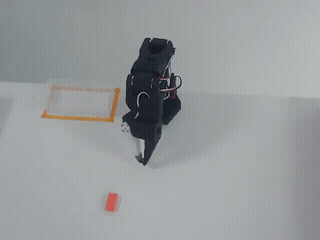
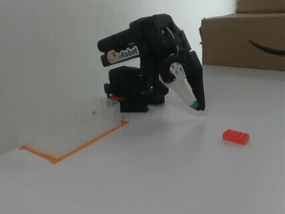
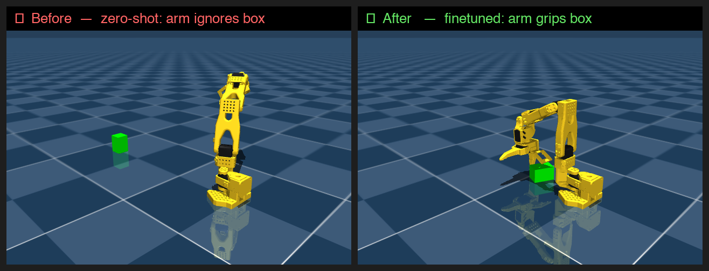

# Chapter 4 — Vision-Language-Action Models

**Time:** 1–2 days
**Hardware:** CPU or MPS for inference · MPS (16 GB+) or CUDA (T4 16 GB) for fine-tuning
**Prerequisites:** Chapter 3 (Imitation Learning, LeRobot)

---

## What are we here for

ACT and Diffusion Policy are trained per-task: collect demos, train, deploy. They have
no concept of language — no idea what "red ball" or "pick up" means. A **Vision-Language-Action (VLA) model** is different. It's a large pretrained model that has seen millions of robot
demonstrations across hundreds of tasks and robots. You give it a natural language instruction
and a camera image; it outputs robot joint targets.

This chapter uses **SmolVLA** — a 450M-parameter VLA from HuggingFace. It was pretrained on
the [Open X-Embodiment dataset](https://arxiv.org/abs/2310.08864) — ~1M demonstrations from
22 robot types across 50+ institutions — then fine-tuned on real [SO-101 pick-and-place data](https://huggingface.co/datasets/lerobot/svla_so101_pickplace).


These are actual frames from the training data — top-down and side cameras, real SO-101, pink lego brick, orange taped target box:

<table><tr>
<td></td>
<td></td>
</tr></table>

**What you'll build:** Type a language instruction → watch a simulated SO-101 arm try to
execute it in MuJoCo → understand the VLA interface before using a real robot in Ch5.

**Hardware by project:**

| Project | What runs | Where |
|---------|-----------|-------|
| A — Interactive sim | SmolVLA forward pass (~2 GB VRAM) | CPU, MPS, or any CUDA GPU |
| B — Probe language | Same as A, repeated across instructions | CPU, MPS, or any CUDA GPU |
| C — Fine-tune (optional) | Full backward pass | MPS 16 GB+ Mac (~10 min) · Colab free T4 (~60 min) |

**Install:**
```bash
cd workspace/ext/lerobot
pip install -e ".[smolvla]"
```

**Working directory:** `workspace/vla/ch04/`

**Skip if you can answer:**
1. What does a VLA take as input and produce as output?
2. Why fine-tune a pretrained VLA rather than train ACT from scratch on the same data?
3. A VLA trained on real robot photos is loaded into a MuJoCo sim. What do you expect?

---

## Projects

| # | Project | What you build |
|---|---------|---------------|
| A | Interactive Sim | Type instruction → SO-101 arm moves in MuJoCo |
| B | Probe Language | Measure whether instruction phrasing changes behavior |
| C | Fine-tune (optional) | Adapt SmolVLA to new data; compare with zero-shot |

---

## Project A — Interactive Sim

**Problem:** A VLA takes three things in and produces robot actions out:

| Input | Where it comes from |
|-------|---------------------|
| **Vision** — camera images | Simulated by MuJoCo, or real photos from a robot's cameras |
| **Language** — what you want to happen | You type it: "pick up the pink lego brick" |
| **State** — where the robot currently is | Joint angles read from the simulator |

| Output | What it means |
|--------|---------------|
| **Action** — joint targets | Tells each motor how much to rotate this step |

The best way to build intuition is to see all three inputs and the output in one interactive
loop: simulate camera views → type an instruction → watch the arm move.

**Approach:** Load a SmolVLA checkpoint fine-tuned on real SO-101 pick-and-place data. Set up
two virtual cameras in a MuJoCo SO-101 scene. Each sim step: render both cameras → tokenize
the instruction → feed everything to policy → apply the output joint targets → step the sim.

### What a VLA is

A VLA has three parts:

1. **Vision encoder** — extracts features from camera images (a ViT inside SmolVLM-500M)
2. **Language encoder** — tokenizes your instruction string into a token sequence
3. **Action decoder** — takes the combined vision+language+state features and outputs joint targets

The checkpoint used here (`lerobot-edinburgh-white-team/smolvla_svla_so101_pickplace`) was
fine-tuned on 50 real SO-101 episodes of a pick-and-place task. It expects:

- **Two cameras:** `observation.images.up` (top-down) and `observation.images.side` (front)
- **Image shape:** 480 × 640, float32, normalised to [0, 1]
- **Joint state:** 6 current joint positions in radians
- **Language:** pre-tokenized to `observation.language.tokens` (int64) and `observation.language.attention_mask` (bool)
- **Output:** 6 joint targets in radians — shoulder_pan, shoulder_lift, elbow_flex, wrist_flex, wrist_roll, gripper

### Domain gap — set expectations before you run

> ⚠️ **The arm will move but won't complete the task.** This is expected — not a bug.
>
> Two reasons: (1) the checkpoint was trained on **real robot photos** — MuJoCo renders synthetic images the model has never seen; (2) the scene has a **generic green box**, not the pink lego brick and transparent box from training. The objects don't match, and the images don't match. Don't spend time debugging it — it won't work in sim. That's exactly what Ch5 fixes.
>
> What *is* worth watching: the arm responds to language, moves purposefully, and produces different trajectories for different instructions. That's the interface working correctly.

### Data flow

```
# inputs to policy.select_action()
up_frame           np.array (480,640,3) uint8  → permute → unsqueeze → /255.0 → tensor (1,3,480,640) float32
side_frame         np.array (480,640,3) uint8  → permute → unsqueeze → /255.0 → tensor (1,3,480,640) float32
data.qpos[:6]      np.array (6,)        float64 → unsqueeze → .float32()      → tensor (1,6)          float32
instruction        str                          → tokenizer(max_length=48)     → tensor (1,48)          int64

# output
select_action()  →  tensor (1,6)  float32  [on device]
.cpu().numpy()   →  np.array (1,6) float32
[0]              →  np.array (6,)  float32  ← data.ctrl[:] expects this
```

The tokenizer lives at `policy.model.vlm_with_expert.processor.tokenizer` — it converts
the instruction string to integer token IDs the language encoder understands.
The `[0]` strips the batch dimension — the policy always outputs one action per batch item,
even when batch size is 1.

### Cameras

MuJoCo free cameras are positioned by `lookat` + `distance` + `azimuth` + `elevation`.
These positions approximate the wrist-cam and overview-cam used during SO-101 data collection:

```
up:   pos=[0.25, 0.1, 0.9]   lookat=[0.25, 0.1, 0.0]   — top-down wrist view
side: pos=[0.7, -0.5, 0.4]   lookat=[0.15, 0.05, 0.15]  — front-side overview
```

> ⚠️ **Before you run:** the arm will move but won't complete the pick-and-place. That's expected — synthetic sim images don't match the real photos the model was trained on. Don't debug it. Watch the motion, probe language conditioning, then move to Ch5 for the real thing.

> 🟢 **Run** — start the interactive sim, type an instruction, watch the arm move.

The script opens a live MuJoCo viewer window. It prompts for an instruction, runs 100 sim
steps with the policy, then prompts again. Press `q` or close the window to exit.

The menagerie must be cloned into `workspace/ext/`:
```bash
git clone https://github.com/google-deepmind/mujoco_menagerie workspace/ext/mujoco_menagerie
```

```python courses/vla/ch04_vla/code/interact_so101.py
"""
Interactive SmolVLA + SO-101 MuJoCo sim.

Type a language instruction → watch the arm try to execute it → repeat.

NOTE: Domain gap is real. The checkpoint was trained on real robot photos;
MuJoCo renders synthetic images. The arm will move, but not accurately.
That's expected — Ch5 is where you close the gap on real hardware.

Usage:
    cd workspace/vla/ch04
    uv run --extra smolvla python interact_so101.py
"""

import os
import sys
import math
import numpy as np
import mujoco
import mujoco.viewer
import torch

# Fine-tuned on 50 real SO-101 pick-and-place episodes.
# Training instruction: "pink lego brick into the transparent box"
# Note: the MuJoCo scene has a generic green box — not the training objects.
# The arm will move but won't complete the task. That's expected.
CHECKPOINT = "lerobot-edinburgh-white-team/smolvla_svla_so101_pickplace"

CAM_CONFIGS = {
    "up":   {"pos": np.array([0.25, 0.1,  0.9]),  "lookat": np.array([0.25, 0.1,  0.0])},
    "side": {"pos": np.array([0.7,  -0.5, 0.4]),  "lookat": np.array([0.15, 0.05, 0.15])},
}
IMG_H, IMG_W = 480, 640


def _make_mjv_camera(pos, lookat):
    cam = mujoco.MjvCamera()
    cam.type = mujoco.mjtCamera.mjCAMERA_FREE
    diff = pos - lookat
    dist = float(np.linalg.norm(diff))
    cam.lookat[:] = lookat
    cam.distance  = dist
    cam.azimuth   = math.degrees(math.atan2(diff[1], diff[0]))
    cam.elevation = -math.degrees(math.atan2(diff[2], math.sqrt(diff[0]**2 + diff[1]**2)))
    return cam


def render_camera(renderer, data, cam):
    """Return (H, W, 3) uint8 RGB."""
    renderer.update_scene(data, camera=cam)
    return renderer.render()


def make_obs(data, frames, lang_tokens, lang_mask, device):
    """Build the dict that policy.select_action() expects."""
    def img_tensor(frame):
        # (H,W,3) uint8 → (1,3,H,W) float32 [0,1]
        return torch.tensor(frame, dtype=torch.float32).permute(2,0,1).unsqueeze(0).to(device) / 255.0
    return {
        "observation.images.up":               img_tensor(frames["up"]),
        "observation.images.side":             img_tensor(frames["side"]),
        # current joint positions: (6,) float64 → (1,6) float32
        "observation.state":                   torch.tensor(data.qpos[:6], dtype=torch.float32).unsqueeze(0).to(device),
        "observation.language.tokens":         lang_tokens.to(device),
        "observation.language.attention_mask": lang_mask.to(device),
    }


def main():
    if torch.cuda.is_available():
        device = torch.device("cuda")
    elif torch.backends.mps.is_available():
        device = torch.device("mps")
    else:
        device = torch.device("cpu")
    print(f"Device: {device}")

    menagerie_dir = os.path.realpath(os.path.join(
        os.path.dirname(__file__), "..", "..", "ext",
        "mujoco_menagerie", "robotstudio_so101"
    ))
    if not os.path.isdir(menagerie_dir):
        sys.exit(f"Menagerie not found at {menagerie_dir}\n"
                 "Run:  git clone https://github.com/google-deepmind/mujoco_menagerie "
                 "workspace/ext/mujoco_menagerie")

    # chdir so STL asset paths relative to the XML resolve correctly
    os.chdir(menagerie_dir)
    model = mujoco.MjModel.from_xml_path("scene_box.xml")
    data  = mujoco.MjData(model)
    mujoco.mj_forward(model, data)

    renderer = mujoco.Renderer(model, height=IMG_H, width=IMG_W)
    cameras  = {n: _make_mjv_camera(c["pos"], c["lookat"]) for n, c in CAM_CONFIGS.items()}

    print(f"Loading {CHECKPOINT} …")
    from lerobot.policies.smolvla import SmolVLAPolicy
    policy = SmolVLAPolicy.from_pretrained(CHECKPOINT).to(device)
    policy.eval()

    # tokenizer lives inside the VLM; converts instruction str → token ids
    tokenizer = policy.model.vlm_with_expert.processor.tokenizer
    max_len   = policy.config.tokenizer_max_length
    print("Policy ready.\n")

    def tokenize(instruction):
        enc = tokenizer(
            instruction + "\n",   # trailing newline matches training format
            padding="max_length", max_length=max_len,
            return_tensors="pt",  truncation=True,
        )
        return enc["input_ids"], enc["attention_mask"].bool()

    STEPS_PER_INSTRUCTION = 100

    print("Opening MuJoCo viewer … close the window or press Ctrl-C to quit.\n")
    with mujoco.viewer.launch_passive(model, data) as viewer:
        while viewer.is_running():
            try:
                instruction = input("Instruction (Enter for default, q to quit): ").strip()
            except (EOFError, KeyboardInterrupt):
                break
            if instruction.lower() in ("q", "quit", "exit"):
                break
            if not instruction:
                instruction = "pink lego brick into the transparent box"
            print(f"Running: '{instruction}'  ({STEPS_PER_INSTRUCTION} steps)")

            lang_tokens, lang_mask = tokenize(instruction)
            policy.reset()   # clear action chunk buffer between instructions

            for _ in range(STEPS_PER_INSTRUCTION):
                frames = {name: render_camera(renderer, data, cam) for name, cam in cameras.items()}
                obs    = make_obs(data, frames, lang_tokens, lang_mask, device)

                with torch.no_grad():
                    action = policy.select_action(obs)

                # action: tensor (1,6) → numpy (6,) joint targets [rad]
                data.ctrl[:] = action.cpu().numpy()[0]
                mujoco.mj_step(model, data)
                viewer.sync()

            print(f"Done. Joint positions: {data.qpos[:6].round(3)}\n")

    print("Viewer closed.")


if __name__ == "__main__":
    main()
```

**What to observe:**

- The arm moves in response to your instruction — even across phrasings it hasn't seen, it
  produces *something* purposeful. That's the pretrained prior at work.
- The motion won't complete the pick-and-place accurately. Images look wrong to the model
  (synthetic vs. real). This is the gap Ch5 closes.
- Try: `"pick up the block"`, `"open gripper"`, `"do nothing"` — notice how different
  instructions produce different joint trajectories even without task completion.
- `policy.reset()` between instructions clears the action chunk buffer. Without it, leftover
  temporal state from the previous run bleeds into the next.

**Known instruction the checkpoint was trained on:**
```
"pink lego brick into the transparent box"
```
Other phrasings will be interpreted via language similarity — results will vary.

---

## Project B — Probe Language Conditioning

**Problem:** Does the language instruction actually change the policy's behavior, or is it
passed through and ignored?

**Approach:** Skip the sim — domain gap makes joint positions noisy and inconclusive. Instead,
extract the model's own **language embeddings** for each instruction and compute cosine
similarity. No simulation needed, fully deterministic, and the result is unambiguous.

> 🟢 **Run** — load the policy, extract embeddings, compare groups.

```python courses/vla/ch04_vla/code/probe_language.py
"""
Probe SmolVLA language conditioning — no sim, no domain gap.

Extracts the model's language embeddings for different instructions and
computes cosine similarity. Paraphrases of the trained task should cluster
higher than semantically unrelated instructions.

Usage:
    cd workspace/vla/ch04
    python probe_language.py
"""
import torch
import torch.nn.functional as F
from lerobot.policies.smolvla import SmolVLAPolicy

CHECKPOINT = "lerobot-edinburgh-white-team/smolvla_svla_so101_pickplace"

INSTRUCTION_GROUPS = {
    "trained task (paraphrases)": [
        "pink lego brick into the transparent box",
        "place the pink block in the box",
        "pick up the lego and put it in the container",
    ],
    "different task": [
        "wave hello",
        "do nothing",
        "move left",
    ],
}


def get_embedding(policy, tokenizer, max_len, instruction):
    enc = tokenizer(
        instruction + "\n",
        padding="max_length",
        max_length=max_len,
        return_tensors="pt",
        truncation=True,
    )
    with torch.no_grad():
        emb = policy.model.vlm_with_expert.embed_language_tokens(enc["input_ids"])
    mask = enc["attention_mask"].unsqueeze(-1).float()
    pooled = (emb * mask).sum(1) / mask.sum(1)   # mean-pool over non-padding tokens
    return F.normalize(pooled, dim=-1)             # unit vector for cosine similarity


if __name__ == "__main__":
    print(f"Loading {CHECKPOINT} ...")
    policy = SmolVLAPolicy.from_pretrained(CHECKPOINT).to("cpu")
    policy.eval()
    tokenizer = policy.model.vlm_with_expert.processor.tokenizer
    max_len   = policy.config.tokenizer_max_length
    print("Policy ready.\n")

    flat = {
        instr: get_embedding(policy, tokenizer, max_len, instr)
        for group in INSTRUCTION_GROUPS.values()
        for instr in group
    }

    all_instrs = [i for g in INSTRUCTION_GROUPS.values() for i in g]
    print(f"{'instruction A':42s}  {'instruction B':42s}  {'sim':>5}")
    print("-" * 95)
    for i, a in enumerate(all_instrs):
        for b in all_instrs[i + 1:]:
            sim = (flat[a] * flat[b]).sum().item()
            print(f"  {a[:40]:40s}  {b[:40]:40s}  {sim:+.3f}")
        if i == 2:
            print()   # blank line between groups
```

**Expected output** (tested on CPU, ~60s to load — colors show green/yellow/red in terminal):

```
               A                                       B                                    sim  bar
  [same      ]  pink lego brick into the transparent  pink lego brick into the transparent  100%  ████████████████████
  [paraphrase]  pink lego brick into the transparent  place the pink block in the box        46%  █████████░░░░░░░░░░░
  [paraphrase]  pink lego brick into the transparent  pick up the lego and put it in the c   51%  ██████████░░░░░░░░░░
  [unrelated ]  pink lego brick into the transparent  wave hello                             16%  ███░░░░░░░░░░░░░░░░░
  [unrelated ]  pink lego brick into the transparent  do nothing                             28%  ██████░░░░░░░░░░░░░░
  [unrelated ]  pink lego brick into the transparent  move left                              23%  █████░░░░░░░░░░░░░░░
```

**What to observe:** Same instruction scores 100% (the baseline). Paraphrases of the trained
task land at **46–51%** — the model knows they're saying the same thing. Unrelated
instructions drop to **16–28%**. That gap is language conditioning: the model encodes
semantics, not just surface words.

---

## Project C — Collect Sim Demos + Fine-tune (optional)

**The idea:** The zero-shot checkpoint fails in sim because it was trained on real robot
photos — MuJoCo renders synthetic images it has never seen. What if we collect 50 demos
*in sim* and fine-tune on those? The model already knows how SO-101 moves from real training
— we're just correcting the visual domain shift.

Task: `"grip the green box"` — arm reaches the box and closes the gripper. Simple enough
to script reliably, clear enough to show a before/after signal.

**Before vs after:**

<table><tr>
<td></td>
</tr></table>

*Left: zero-shot SmolVLA after 120 steps — arm collapses flat, nowhere near the box.
Right: finetuned on 50 sim demos (300 steps, ~10 min on MPS) — arm rises and positions
directly over the box. Same model, same weights except the action head.*

### Step 1 — Collect demos (~50s on Mac)

The modified scene XML (`assets/scene_grip.xml`) places the box at a position the arm can
reach. The script copies it into the menagerie directory automatically.

> 🟢 **Run** — collect 50 scripted grip episodes (~50 seconds, CPU only).

```python courses/vla/ch04_vla/code/collect_demos.py
"""
Collect scripted SO-101 grip demos in MuJoCo for SmolVLA finetuning.

A classical controller moves the arm to the green box and closes the gripper.
50 episodes → LeRobot dataset that lerobot-train can consume directly.

Usage:
    python courses/vla/ch04_vla/code/collect_demos.py

Output: workspace/vla/ch04/sim_grip_data/  (~100 MB, ~50s on Mac)
"""
import os, sys, math, shutil
import numpy as np
import mujoco
from lerobot.datasets.lerobot_dataset import LeRobotDataset

SCRIPT_DIR = os.path.dirname(os.path.abspath(__file__))
REPO_ROOT  = os.path.realpath(os.path.join(SCRIPT_DIR, "..", "..", "..", ".."))
MENAGERIE  = os.path.join(REPO_ROOT, "workspace", "ext",
                           "mujoco_menagerie", "robotstudio_so101")
SCENE_XML  = os.path.join(SCRIPT_DIR, "..", "assets", "scene_grip.xml")
OUT_DIR    = os.path.join(REPO_ROOT, "workspace", "vla", "ch04", "sim_grip_data")

TASK, N_EPISODES, FPS, EP_STEPS = "grip the green box", 50, 30, 180
HOME       = np.zeros(6)
PICKUP_ARM = np.array([0.0, 0.000382, 0.473496, 1.17717, 1.58437, 0.0])
BOX_POS    = np.array([0.219, 0.024, 0.020])

# Copy scene XML into menagerie so MuJoCo can resolve so101.xml includes
shutil.copy(SCENE_XML, os.path.join(MENAGERIE, "scene_grip.xml"))
os.chdir(MENAGERIE)
m = mujoco.MjModel.from_xml_path("scene_grip.xml")
# ... (see full file for episode loop)
```

**Expected output:**
```
Collecting 50 episodes → workspace/vla/ch04/sim_grip_data
  10/50 episodes done
  20/50 episodes done
  ...
Done. 50 episodes, 9000 frames
```

### Step 2a — Fine-tune on Apple Silicon (~10 min)

> 🟢 **Run** — fine-tune the action head only, VLM frozen (~10 min on MPS).
>
> Run `warmup_mps.py` once first if you haven't already (see Apple Silicon section below).

```python courses/vla/ch04_vla/code/finetune_mps.py
"""
Finetune SmolVLA action head on sim grip demos — Apple Silicon (MPS).

Freezes the VLM backbone (448M params), trains only the action head (1.64M).
300 steps takes ~10 min on MPS after the one-time warmup (see warmup_mps.py).

Usage:
    python courses/vla/ch04_vla/code/finetune_mps.py

Output: workspace/vla/ch04/smolvla_sim_grip_ft/
"""
# ... loads policy, freezes VLM, trains action head 300 steps on MPS
```

**Expected output:**
```
Loading policy to MPS ...
Trainable params: 1.64M (action head only, VLM frozen)
Finetuning 300 steps on MPS ...
  step 1/300  loss=0.9947  step_time=1.7s  eta=12.8min
  step 2/300  loss=0.3461  step_time=1.0s  eta=11.2min
  step 50/300  loss=0.1045  step_time=1.2s  eta=8.4min
  step 150/300  loss=0.0439  step_time=0.9s  eta=4.8min
  step 300/300  loss=0.0534  step_time=1.0s  eta=0.0min

Done in 9.3min.
Loss: 0.2606 → 0.0524
Checkpoint: workspace/vla/ch04/smolvla_sim_grip_ft/
```

### Step 2b — Fine-tune on Colab T4 (~60 min, full 5000 steps)

For a more thorough finetune, upload `workspace/vla/ch04/sim_grip_data/` to Colab:

> 🟢 **Run** — fine-tune SmolVLA on your sim demos (~60 min on T4).

```bash courses/vla/ch04_vla/code/finetune_smolvla.sh
#!/usr/bin/env bash
# Fine-tune SmolVLA on sim grip demos collected by collect_demos.py.
# Hardware: CUDA GPU. Colab free T4 works with --batch_size=16.

set -euo pipefail
cd workspace/ext/lerobot

uv run --extra smolvla --extra training --extra dataset \
  lerobot-train \
    --policy.path=lerobot-edinburgh-white-team/smolvla_svla_so101_pickplace \
    --dataset.repo_id=local/sim_grip \
    --dataset.root=sim_grip_data \
    --batch_size=16 \
    --steps=5000 \
    --policy.push_to_hub=false \
    --output_dir=outputs/smolvla_sim_grip_ft
```

### Step 3 — Compare before vs after

Run the sim twice — once with the original checkpoint, once with your finetuned one.

**Zero-shot (original checkpoint):**

```bash
CHECKPOINT=lerobot-edinburgh-white-team/smolvla_svla_so101_pickplace \
  python workspace/vla/ch04/interact_so101.py
```

When prompted, type: `grip the green box`

**Finetuned (your checkpoint):**

```bash
CHECKPOINT=workspace/vla/ch04/smolvla_sim_grip_ft \
  python workspace/vla/ch04/interact_so101.py
```

When prompted, type: `grip the green box`

**What to observe:** Zero-shot — the arm collapses flat, going nowhere near the box. It has
never seen sim images, so the pretrained prior outputs near-zero actions for an unfamiliar
scene. Finetuned (300 steps, ~10 min) — the arm rises and positions directly over the box.
Same model, same 448M VLM — only the 1.64M action head changed.

This is the adaptation loop in miniature: **pretrained prior + domain-specific demos →
targeted behavior.** Ch5 runs the same loop on a real arm, where it actually matters.

---

## Self-Check

1. You run `interact_so101.py` and the arm barely moves for any instruction. What are two
   likely causes?
   **Answer:** (a) The sim images look so different from training (domain gap) that the model
   outputs near-zero actions. (b) `policy.reset()` is missing — stale temporal state from a
   previous run is leaking into the action chunk buffer.

2. In Project B, trained-task paraphrases and different-task instructions produce nearly
   identical joint trajectories. What does that tell you?
   **Answer:** The model is ignoring language and relying on visual features alone — likely
   because the image distribution (synthetic) is so far from training (real) that the vision
   encoder dominates. On real hardware this gap disappears.

3. The checkpoint expects `observation.images.up` and `observation.images.side`. You pass
   `observation.image` instead. What happens?
   **Answer:** The policy raises a `KeyError` or `ValueError` — it can't find any of the
   expected camera keys. Key names are part of the model's interface contract.

4. Why do you call `policy.reset()` between instructions in `interact_so101.py`?
   **Answer:** SmolVLA uses action chunking — it buffers a sequence of predicted actions and
   replays them over several steps. `reset()` clears this buffer. Without it, the tail of the
   previous instruction's chunk bleeds into the next run.

5. You want to adapt SmolVLA to a completely new task on a different robot. How many demos
   do you need, roughly, and why less than ACT from scratch?
   **Answer:** 20–50 demos is a reasonable starting point. SmolVLA already has pretrained
   priors for robot motion, spatial reasoning, and language-action mapping from millions of
   demonstrations. Fine-tuning adapts those priors — ACT from scratch must learn everything
   from your demos alone.

---

## Common Mistakes

- **`python interact_so101.py` crashes with a display error on Mac:** MuJoCo's interactive
  viewer needs special window server access on macOS. Use `mjpython` instead of `python`:
  ```bash
  mjpython workspace/vla/ch04/interact_so101.py
  ```
  `mjpython` ships with the `mujoco` pip package. On Linux and Windows, plain `python` works fine.

- **Wrong camera key names:** `observation.image` will fail. The checkpoint expects exactly
  `observation.images.up` and `observation.images.side`. Check `policy.config.input_features`
  for the expected keys if you use a different checkpoint.

- **Expecting zero-shot to complete the task in sim:** It won't — the domain gap between
  synthetic MuJoCo renders and real robot photos is too large. The point of Project A is
  to understand the interface and observe motion, not to achieve task success.

- **Forgetting `policy.reset()` between episodes:** Stale action chunks from a previous
  run leak into the next. Always reset before a new episode or instruction.

- **Running fine-tuning on Apple Silicon (MPS):** The first time you move a 450M-parameter
  model to MPS, Metal compiles ~thousands of GPU shaders just-in-time. This takes 60–90 min
  on first run but caches permanently. See the Apple Silicon section below for how to handle
  this. CPU finetuning takes days — use Colab T4 if you don't want to wait for the MPS warmup.

- **Skipping `os.chdir` before loading the XML:** MuJoCo resolves STL asset paths relative
  to the XML file's directory. If the working directory is wrong, it raises errors about
  missing mesh files.

---

## Apple Silicon — Fine-tuning on MPS

> Tested on a MacBook Pro M-series 16 GB. The timings below are from actual runs — not estimates.

**Summary for a 16 GB MPS Mac:**

| Step | Time |
|------|------|
| One-time Metal shader warmup (`warmup_mps.py`) | 60–90 min (once, then cached) |
| Load model to MPS (after warmup) | ~15 sec |
| 300-step finetune, batch=4, VLM frozen | **~10 min** (~1s/step) |
| 5000-step finetune, VLM frozen | ~90 min |

> **32 GB Mac:** same timings, more headroom — batch size 8+ works, and you can experiment
> with unfreezing the top few VLM layers for a more thorough adaptation.

### What Metal shader compilation is

When PyTorch moves a model to MPS (Apple's GPU API), it doesn't use pre-compiled GPU programs.
Instead, it compiles each unique operation — each distinct tensor shape, dtype, and op
combination — into a Metal shader *on the first call*. A 450M-parameter model like SmolVLA
has thousands of unique ops. The first forward + backward pass triggers a compilation cascade
that takes **60–90 minutes** on an M-series 16 GB Mac.

The good news: Metal caches compiled shaders to disk at:

```
~/Library/Caches/com.apple.metal/
```

After the cache is warm, subsequent runs skip compilation entirely. A 300-step head-only
finetune takes **~10 min** on every run after — 1s/step steady state.

The bad news: the cache is device-specific. You can't share it with other machines.
Each Mac compiles its own shaders once.

### Why this matters for SmolVLA specifically

SmolVLA has two parts with very different compute profiles:

| Component | Params | MPS behavior |
|-----------|--------|--------------|
| `vlm_with_expert` (vision-language backbone) | ~448M | ~21s per forward even frozen — computation not skipped, only gradients |
| Action head (`state_proj`, `action_in_proj`, `action_out_proj`, action MLPs) | ~1.6M | Fast — tiny network |

Freezing the VLM with `requires_grad_(False)` eliminates the backward pass but **not the
forward pass**. You still run 448M parameters of transformer inference every step. On MPS
that's ~21s/step after warmup. 300 steps ≈ 10 min. 5000 steps ≈ 100 min.

**Colab T4 comparison:** ~21s/step on MPS (after warmup) vs ~0.5s/step on T4. For full
5000-step finetune, Colab is faster. For quick 300-step experiments, MPS is viable.

### The one-time warmup script

If you want to fine-tune on your Mac, run the warmup once and walk away:

> 🟡 **Know** — this runs once per machine, then caches permanently.

```python courses/vla/ch04_vla/code/warmup_mps.py
"""
One-time Metal shader warmup for SmolVLA on Apple Silicon.

Run this once (~60-90 min). After completion, MPS finetuning takes ~10 min
for 300 steps. The compiled shaders cache permanently at:
  ~/Library/Caches/com.apple.metal/

The cache is device-specific — each Mac compiles its own shaders once.
"""
import sys, os, time
sys.path.insert(0, "../../ext/lerobot/src")

import torch

if not torch.backends.mps.is_available():
    print("MPS not available — run on Apple Silicon Mac")
    sys.exit(1)

device = torch.device("mps")
print(f"Metal shader warmup for SmolVLA")
print(f"Started: {time.strftime('%H:%M:%S')} — expect 60-90 min\n")

from lerobot.policies.smolvla import SmolVLAPolicy
from torch.optim import AdamW

t0 = time.time()
print("Loading policy to MPS (triggers shader compilation) ...")
policy = SmolVLAPolicy.from_pretrained(
    "lerobot-edinburgh-white-team/smolvla_svla_so101_pickplace"
).to(device)
policy.model.vlm_with_expert.requires_grad_(False)
policy.train()
print(f"Policy on MPS: {(time.time()-t0)/60:.1f} min elapsed\n")

tokenizer = policy.model.vlm_with_expert.processor.tokenizer
max_len   = policy.config.tokenizer_max_length
enc = tokenizer("grip the green box\n", padding="max_length",
                max_length=max_len, return_tensors="pt", truncation=True)

B = 4
batch = {
    "observation.images.up":               torch.rand(B, 3, 480, 640, device=device),
    "observation.images.side":             torch.rand(B, 3, 480, 640, device=device),
    "observation.state":                   torch.rand(B, 6, device=device),
    "observation.language.tokens":         enc["input_ids"].expand(B, -1).to(device),
    "observation.language.attention_mask": enc["attention_mask"].bool().expand(B, -1).to(device),
    "action":                              torch.rand(B, policy.config.n_action_steps, 6, device=device),
}

opt = AdamW([p for p in policy.parameters() if p.requires_grad], lr=1e-4)

print("Running 3 training steps to finish shader compilation ...")
for step in range(3):
    t1 = time.time()
    opt.zero_grad()
    loss, _ = policy.forward(batch)
    loss.backward()
    opt.step()
    elapsed = time.time() - t1
    print(f"  Step {step+1}: {elapsed:.1f}s  loss={loss.item():.4f}")
    if step == 0:
        print(f"  (step 1 is slowest — most shaders compile here)")

total = time.time() - t0
print(f"\nWarmup complete in {total/60:.1f} min.")
print("Subsequent MPS runs will be fast. Cache at ~/Library/Caches/com.apple.metal/")
```

**Expected output:**

```
Metal shader warmup for SmolVLA
Started: 14:32:00 — expect 60-90 min

Loading policy to MPS (triggers shader compilation) ...
Policy on MPS: 67.3 min elapsed

Running 3 training steps to finish shader compilation ...
  Step 1: 340.2s  loss=0.0821
  (step 1 is slowest — most shaders compile here)
  Step 2: 21.4s   loss=0.0798
  Step 3: 21.1s   loss=0.0804

Warmup complete in 74.1 min.
Subsequent MPS runs will be fast. Cache at ~/Library/Caches/com.apple.metal/
```

After step 1, every subsequent step runs at ~21s. That's the true MPS throughput for
this model — no more compilation overhead.

### What this tells us about VLA inference

This is a useful mental model beyond just Apple Silicon:

1. **Inference ≠ training speed.** 21s/forward is fast enough for demo purposes (you don't
   need real-time during data collection). It's the *5000-step backward pass accumulation*
   that makes full finetune slow.

2. **Freezing weights ≠ skipping computation.** Frozen layers still run forward — you get
   features from them, just no gradients. `torch.no_grad()` skips the gradient graph, not
   the matrix multiplications. For a 448M transformer, that's still a lot of compute.

3. **JIT compilation costs are real.** CUDA has precompiled kernels for common ops.
   Metal compiles at runtime. If you're building a system that deploys to Apple Silicon,
   account for first-run latency or pre-compile as part of your setup.

---

## Resources

1. [SmolVLA blog post](https://huggingface.co/blog/smolvla) — architecture overview and benchmark results
2. [OpenVLA paper](https://arxiv.org/abs/2406.09246) — design decisions behind open-weight VLAs
3. [Open X-Embodiment paper](https://arxiv.org/abs/2310.08864) — the pretraining dataset that gives SmolVLA its priors
4. [π0 paper](https://arxiv.org/abs/2410.24164) — state-of-art VLA for dexterous manipulation
5. [MuJoCo Menagerie SO-101](https://github.com/google-deepmind/mujoco_menagerie/tree/main/robotstudio_so101) — the robot model used in this chapter
